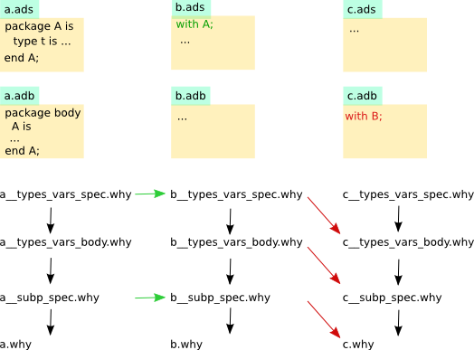

The gnat2why Tool
==================

General description
-------------------

Gnat2why is the tool that translates an Ada compilation unit into Why. Similar
to a compiler, Gnat2why is called on a single Ada input file. It will generate
a number of Why files, with a main Why file that has the same name as the Ada
file, but with the extension ``__package.why``. In this section, we do not
describe the translation itself, only the parts of the design of gnat2why
which are relevant for the interaction with other tools, in particular
``gnatprove`` and ``why``.

More precise description
------------------------

``gnat2why`` is called either on a body or a specification of a compilation
unit. Internally, ``gnat2why`` ignores all declarations which are not in ALFA,
and separates the declarations of a compilation unit in four buckets for:

* the types and variables defined in the spec of the unit;
* the types and variables defined in the body of the unit;
* the subprograms declared in the spec of the unit;
* the subprograms defined in the body of the unit.

Some of the buckets may be empty, if the unit has no body, or no spec, or does
not define corresponding entities.

Each bucket now contains a list of declarations that are in the ALFA subset.
``gnat2why`` now translates each bucket to a list of Why declarations, and
generates four files, each corresponding to a bucket (assuming <file> to be
the basename of the Ada unit):

* <file>__types_vars_spec.why
* <file>__types_vars_body.why
* <file>__subp_spec.why
* <file>__package.why

The suffixes are self explaining, and the last file corresponds to the
subprogram definitions in the body.

``gnat2why`` also generates a file ``standard.why``, which is a translation of
the GNAT standard package.

``gnat2why`` generates two other files, both of which are helpful for the
source location of verification conditions. The file ``<file>.labels``
contains a list of labels (simply character strings) that correspond to Ada
program points that should provoke verification conditions. The file
``<file>.locs`` maps each of these labels to a source location in the Ada
file.

Generated Why files import other Why files (an import in Why corresponds to a
textual inclusion). The inclusion of Why files depends on the ``with`` clauses
of the corresponding Ada units, and is explained in the following figure:

   Black arrows represent inclusion due to the splitting of a single unit during
   the translation process. Green arrows correspond to ``with`` clauses appearing
   in Ada specs. Red arrows correspond to ``with`` clauses appearing in Ada
   bodies.

Motivation to generate four Why files
^^^^^^^^^^^^^^^^^^^^^^^^^^^^^^^^^^^^^

It is necessary to keep the separation between bodies and specs of Ada in the
generated Why. Including only the specification part of the generated Why
files allows to simulate the visibility rules of Ada and avoids including Why
code that may generate proof obligations, that would thus be computed multiple
times by Why. The separation between subprograms on one side and types and
variables on the other side comes from the computation of effects. If a
subprogram has an effect on a private variable (defined in the body of a
package), this effect has to appear in the contract of the corresponding Why
function, so the Why definition of the variable has to be in the
scope of the Why definition of the function. Here comes an example. We declare
a function in the spec of some package A::

   package A is
      function X return Integer;
   end A;

The body of this package looks as follows::

   package body A is
      Cnt : Integer := 0;

      function X return Integer is
      begin
         Cnt := Cnt + 1;
         return Cnt;
      end X;
   end A;

In Why, the declaration of X looks as follows (in the file
``a__subp__spec.why``)::

   parameter a__x : unit -> {} unit writes a__cnt {}

All variables are prefixed by the package name. The effect on the variable
``Cnt`` must be explicitely mentioned when declaring ``X``. This means that
the variable must have been declared before. This happens in file
``a__types_vars_body.why``::

   parameter a__cnt : integer ref

This is the reason why, in addition to splitting the spec and the body, we
also need to split betwen subprograms on one side and types and variables on
the other side. This amounts to four files in total.

Finally, subprograms in other packages may indirectly affect private variables
of other packages, in our example by calling the function ``X``. Therefore,
their contracts may also mention those private variables, As a consequence,
the ``subp_spec.why`` file of such packages also has to include the
``types_vars_body.why`` files of with'ed packages (the second red arrow in our
figure).

To be fixed
-----------

* ``gnat2why`` should not generate the file ``standard.why``. This file, and
  the translation of the entire Ada runtime, should be provided by us, as a
  "standard library" for gnat2why.

