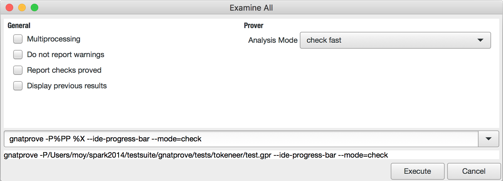
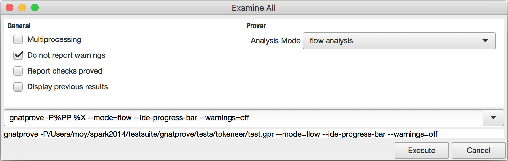
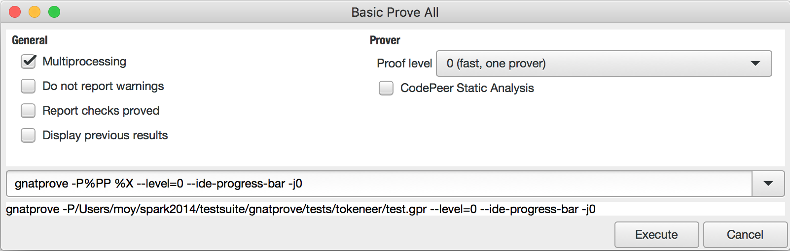
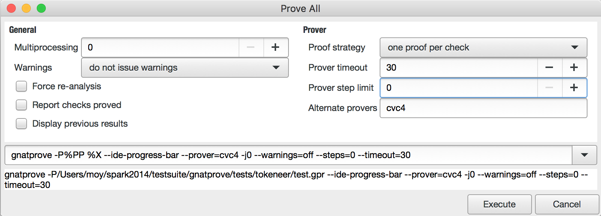

Objectives and Contents
=======================

This document was written to facilitate the adoption of SPARK. It targets
team leaders and technology experts, who will find a description of the
various levels of software assurance at which the technology can be used
along with the associated costs and benefits. It also targets software
developers (these are assumed to have some knowledge of the Ada language and
AdaCore technology), who will find detailed guidance on how to adopt SPARK
at the various assurance levels.

Section :ref:`Levels of Software Assurance` presents the four assurance levels
described in this document. It starts with a brief introduction of the Ada
programming language and its SPARK subset and then presents the levels (Stone,
Bronze, Silver and Gold) that can be achieved with the use of SPARK language
and toolset, using techniques varying from merely applying the language subset
up to using the most powerful analyses. The lowest levels are the simplest to
adopt and can bring significant benefits. The highest levels require more
effort to adopt and bring the strongest guarantees. This section is particularly
relevant to team leaders and technology experts who want to understand how
SPARK can be useful in their projects.

Sections :ref:`Stone Level` to :ref:`Gold Level` present the details of the
four levels of software assurance. Each section starts with a short
description of three key aspects of adopting SPARK at that level:

* `Benefits` - What is gained from adopting SPARK?
* `Impact on Process` - How should the process (i.e., the software life cycle
  development and verification activities) be adapted to use SPARK?
* `Costs and Limitations` - What are the main costs and limitations for
  adopting SPARK?

Each section then goes on to describe how to progressively adopt SPARK
at that level in an Ada project. Finally, the :ref:`Example` section
shows the concrete application of this adoption approach to an existing,
production-ready bounded stack abstraction. These sections are
particularly relevant to software developers who need to use SPARK at a
given level.

Although this document focuses on adopting SPARK for use on existing Ada
code, the same guidelines can be used for adopting SPARK at the beginning
of a project. The main difference in that case is that one would not want
to start at the lowest level but already take into account the final
targeted level starting with the initial design phase.

This version of the document is based on the SPARK Pro 19 and GNAT Studio 19
versions. Further references are given at the end of this document.

.. _Levels of Software Assurance:

Levels of Software Assurance
============================

Ada
---

.. index:: Ada language
.. index:: C language
.. index:: C++ language
.. index:: MISRA C
.. index:: MISRA C++

Ada is a language for long-lived critical systems. Programming in Ada makes
it easier to prevent the introduction of errors, thanks to the stronger
language rules than in many comparative languages (C and C++ in particular,
including their safer variants like MISRA C and MISRA C++) which make it
possible to detect many kinds of errors (such as type mismatches) at
compile time. In addition to the language's compile-time checks, Ada also
requires run-time checking for a variety of error conditions, such as
out-of-bounds array indexing. Violating such a check leads to an exception
rather than undefined behavior.

.. index:: Contract-based programming
.. index:: Precondition
.. index:: Postcondition

Another advantage of programming in Ada is its facility for
capturing program specifications in the source code,
from simple properties of data like ranges of values to rich data
invariants expressed with arbitrary boolean expressions. An important
element is the ability to provide contracts on
subprograms, consisting of preconditions and postconditions.  Contracts are
a central part Ada, introduced in the Ada 2012 standard.

A precondition is a property that is supposed to be true when a subprogram is
called. In typical software development in Ada or other languages,
preconditions are either given in the program as comments accompanying
subprogram declarations or as defensive code inside subprograms to detect
improper calling conditions. When using Ada 2012,
a developer can express preconditions as boolean properties, and the compiler
can insert run-time
checks to ensure that preconditions are true when the subprogram is called.

A postcondition is a property that is supposed to be true when a subprogram
returns. In typical software development, postconditions are also either
given in the program as comments accompanying subprogram declarations or as
assertions inside subprograms to detect implementation errors, but can also
be provided as defensive code to detect improper values returned at the
call site. When using Ada 2012, a developer can express
postconditions as boolean properties which should be true when a subprogram
returns and the compiler can insert run-time checks to ensure that
postconditions are true when the subprogram returns.

.. index:: Static analysis

The main use of preconditions and postconditions, like other language
features in Ada for embedding program specifications inside the program, is
to allow detecting violations of these program specifications during
testing. Another increasingly important use of these language features is
to facilitate the detection of errors by static analyzers, which analyze
the source code of programs without actually executing them. Without such
specifications in the program, static analyzers can only detect violations
of language dynamic constraints (e.g., division by zero or buffer
overflow). However, the presence of pre- and postconditions in the program
allows static analyzers to target the verification of these higher level
properties. Specifications also constrain the state space that the static
analyzer has to consider during analysis, which leads to faster running
time and higher precision.

.. index:: SPARK (overview)

SPARK
-----

Static analyzers fall into two broad categories: bug finders and
verifiers. Bug finders detect violations of properties. Verifiers guarantee
the absence of violations of properties. Because they target opposite
goals, bug finders and verifiers usually have different architectures, are
based on different technologies, and require different
methodologies. Typically, bug finders require little upfront work, but may
generate many false alarms which need to be manually triaged and addressed,
while verifiers require some upfront work, but generate fewer false alarms
thanks to the use of more powerful techniques. AdaCore develops and
distributes both a bug finder (CodePeer) and a verifier (SPARK).

SPARK is a verifier co-developed by AdaCore and Altran and distributed by
AdaCore. The main web page for the SPARK Pro product is
http://www.adacore.com/sparkpro/. SPARK analysis can give strong guarantees
that a program:

* does not read uninitialized data,
* accesses global data only as intended,
* does not contain concurrency errors (deadlocks and data races),
* does not contain run-time errors (e.g., division by zero or buffer overflow),
* respects key integrity properties (e.g., interaction between components or global invariants),
* is a correct implementation of software requirements expressed as contracts.

SPARK can analyze either a complete program or those parts that are marked
as being subject to analysis, but it can only be
applied to code that follows some restrictions designed to facilitate formal
verification. In particular, handling of exceptions is not allowed and use of
pointers should follow a strict ownership policy aiming at preventing aliasing
of data allocated in the heap (pointers to the stack are not allowed). Pointers
and exceptions are both features
that, if supported completely, make formal
verification, as done by SPARK, infeasible, either because of limitations
of state-of-the-art technology or because of the disproportionate effort
required from users to apply formal verification in such situations. The
large subset of Ada that is analyzed by SPARK is also called the SPARK
language subset.

SPARK builds on the strengths of Ada to provide even more guarantees
statically rather than dynamically. As summarized in the following table,
Ada provides strict syntax and strong typing at compile time plus dynamic
checking of run-time errors and program contracts. SPARK allows
such checking to be performed statically. In addition, it enforces the use of a safer
language subset and detects data flow errors statically.

.. csv-table::
   :header: "", "Ada", "SPARK"
   :widths: 1, 1, 1

   "Contract programming", "dynamic", "dynamic / static"
   "Run-time errors",      "dynamic", "dynamic / static"
   "Data flow errors",     "--",      "static"
   "Strong typing",        "static",  "static"
   "Safer language subset","--",      "static"
   "Strict clear syntax",  "static",  "static"

.. index:: Formal program verification
.. index:: Frama-C
.. index:: DO-178C / ED-12C
.. index:: EN 50128
.. index:: CENELEC EN 50128

The main benefit of formal program verification, as performed by SPARK (or by
Frama-C or the TrustInSoft Analyzer for C code) is that it allows verifying
properties that are difficult or very costly to verify by other methods, such
as testing or reviews. That difficulty may stem from the complexity
of the software, the complexity of the requirements, and/or the unknown
capabilities of attackers. Formal verification allows giving guarantees that
some properties are always verified, however complex the context. The latest
versions of international certification standards for avionics (DO-178C / ED-12C) and
railway systems (CENELEC EN 50128:2011) have recognized these benefits by increasing the
role that formal methods can play in the development and verification of critical software.

.. index:: Levels of SPARK use
.. index:: Stone level (of SPARK use)
.. index:: Bronze level (of SPARK use)
.. index:: Silver level (of SPARK use)
.. index:: Gold level (of SPARK use)
.. index:: Platinum level (of SPARK use)

Levels of SPARK Use
-------------------

The scope and level of SPARK analysis depend on the objectives being
pursued by the adoption of SPARK. The scope of analysis may be the totality
of a project, only some units, or only parts of units. The level of
analysis may range from simple guarantees provided by flow analysis to
complex properties being proved.  These can be divided into five easily
remembered levels:

#. `Stone level` - valid SPARK
#. `Bronze level` - initialization and correct data flow
#. `Silver level` - absence of run-time errors (AoRTE)
#. `Gold level` - proof of key integrity properties
#. `Platinum level` - full functional proof of requirements

Platinum level is defined here for completeness, but is not further
discussed in this document since it is not recommended during initial
adoption of SPARK. Each level builds on the previous one, so that the code
subject to the Gold level should be a subset of the code subject to Silver
level, which itself is a subset of the code subject to Bronze level, which
is in general the same as the code subject to Stone level. We advise using:

* Stone level only as an intermediate level during adoption,
* Bronze level for as large a part of the code as possible,
* Silver level as the default target for critical software (subject to costs
  and limitations),
* Gold level only for a subset of the code subject to specific key integrity
  (safety/security) properties.

Our starting point is a program in Ada, which could be thought of as the
Brick level: thanks to the use of Ada programming language, this level
already provides some confidence: it is the highest level in The Three
Little Pigs fable! And indeed languages with weaker semantics could be
thought of as Straw and Sticks levels. However, the adoption of SPARK
allows us to get stronger guarantees, should the wolf in the fable adopt
more aggressive means of attack than simply blowing.

A pitfall when using tools for automating human tasks is to end up "pleasing
the tools" rather than working around the tool limitations. Both flow analysis
and proof, the two technologies used in SPARK, have known limitations. Users
should refrain from changing the program for the benefit of only getting fewer
messages from the tools. When relevant, users should justify tool messages
through appropriate pragmas. See the sections on :ref:`Justifying Unproved Check Messages`
and :ref:`Flow Analysis Warnings` for more details.

.. index:: GNATprove

In the following, we use "SPARK" to denote the SPARK language, and "GNATprove"
to denote the formal verification tool in SPARK product.

GNATprove can be run at the different levels mentioned in this document, either
through the Integrated Development Environments (IDE) Eclipse (GNATbench
plugin) or GNAT Studio, or on the command line. In the following, we
describe the use of GNAT Studio, but the use of Eclipse is based on similar menus. Use
of the command-line interface at a given level is facilitated by convenient
synonyms:

* use switch ``--mode=stone`` for Stone level (synonym of ``--mode=check_all``)
* use switch ``--mode=bronze`` for Bronze level (synonym of ``--mode=flow``)
* use switch ``--mode=silver`` for Silver level (synonym of ``--mode=all``)
* use switch ``--mode=gold`` for Gold level (synonym of ``--mode=all``)

Note that levels Silver and Gold are activated with the same switches. Indeed,
the difference between these levels is not on how GNATprove is run, but on the
objectives of verification. This is explained in the section on :ref:`Gold
Level`.

.. index:: Stone level (of SPARK use)

.. _Stone Level:

Stone Level - Valid SPARK
=========================

.. index:: SPARK_Mode
.. index:: GNATmetric

The goal of reaching this level is to identify as much code as possible as
belonging to the SPARK subset. The user is responsible for identifying
candidate SPARK code by applying the marker ``SPARK_Mode`` to flag SPARK
code to GNATprove, which is responsible for checking that the code marked
with ``SPARK_Mode`` is indeed valid SPARK code. Note that valid SPARK
code may still be incorrect in many ways, such as raising run-time
exceptions. Being valid merely means that the code respects the legality
rules that define the SPARK subset in the SPARK Reference Manual (see
http://docs.adacore.com/spark2014-docs/html/lrm/). The number of lines of
SPARK code in a program can be computed (along with other metrics such as
the total number of lines of code) by the metrics computation tool GNATmetric.

.. rubric:: Benefits

The stricter SPARK rules are enforced on a (hopefully) large part of the
program, which leads to higher quality and maintainability, as error-prone
features such as side-effects in functions are avoided, and others, such as use
of pointers to the stack, are isolated to non-SPARK parts of the program.
Individual and
peer review processes can be reduced on the SPARK parts of the program, since
analysis automatically eliminates some categories of defects. The parts of the
program that don't respect the SPARK rules are carefully isolated so they can
be more thoroughly reviewed and tested.

.. rubric:: Impact on Process

After the initial pass of applying the SPARK rules to the program, ongoing
maintenance of SPARK code is similar to ongoing maintenance of Ada code, with a
few additional rules, such as the need to avoid side effects in
functions. These additional rules are checked automatically by running
GNATprove on the modified program, which can be done either by the developer
before committing changes or by an automatic system (continuous builder,
regression testsuite, etc.)

.. rubric:: Costs and Limitations

Pointer-heavy code needs to be rewritten to follow the ownership policy or
to hide pointers from SPARK analysis, which may be difficult. The initial
pass may require large, but shallow, rewrites in order to transform the
code, for example to rewrite functions with side effects into procedures.

Initial Setup
-------------

.. index:: GNATprove

GNATprove can only be run on the sources of a GNAT project (a file with
extension 'gpr' describing source files and switches to the GNAT compiler
and other tools in the GNAT tool suite). As an installation check,
start by applying GNATprove to the project without any ``SPARK_Mode``
markers:

.. code-block:: none

  > gnatprove -P my_project.gpr --mode=check -j0

.. index:: -j0 switch (GNATprove)
.. index:: --mode switch (GNATprove)

The ``-j0`` switch analyzes files from the project in parallel, using as
many cores as available, and the ``--mode=check`` switch runs GNATprove
in fast checking mode. GNATprove should output the following messages:

.. code-block:: none

  Phase 1 of 2: generation of Global contracts ...
  Phase 2 of 2: fast partial checking of SPARK legality rules ...

.. index:: GPR_PROJECT_PATH environment variable

If you installed SPARK in a different repository from GNAT, you may get errors
about project files not found if your project depends on XML/Ada, GNATCOLL, or
any other project distributed with GNAT. In that case, you should update the
environment variable ``GPR_PROJECT_PATH`` as indicated in the SPARK User's
Guide: http://docs.adacore.com/spark2014-docs/html/ug/en/install.html

.. index:: SPARK_Mode

After you successfully run GNATprove without errors, choose a simple unit
in the project, preferably a leaf unit that doesn't depend on other units,
and apply the ``SPARK_Mode`` marker to it by adding the following pragma at
the start of both the spec file (typically a file with extension 'ads') and
the body file (typically a file with extension 'adb' for this unit:

.. code-block:: ada

   pragma SPARK_Mode;

Then apply GNATprove to the project again:

.. code-block:: none

  > gnatprove -P my_project.gpr --mode=check -j0

GNATprove should output the following messages, stating that SPARK legality
rules were checked on the unit marked, possibly followed by a number of
error messages pointing to locations in the code where SPARK rules were
violated:

.. code-block:: none

  Phase 1 of 2: generation of Global contracts ...
  Phase 2 of 2: checking of SPARK legality rules ...

If you applied SPARK_Mode to a spec file without body (e.g., a unit defining
only constants), GNATprove will notify you that no body was actually
analyzed:

.. code-block:: none

  Phase 1 of 2: generation of Global contracts ...
  Phase 2 of 2: flow analysis and proof ...
  warning: no bodies have been analyzed by GNATprove
  enable analysis of a body using SPARK_Mode

.. index:: GNAT Studio

At this point, you should switch to using GNAT Studio, the
integrated development environment provided with GNAT, in order to more
easily interact with GNATprove. For example, GNAT Studio provides basic facilities
for code navigation and location of errors that facilitate the adoption of
SPARK. Open GNAT Studio on your project:

.. code-block:: none

  > gnatstudio -P my_project.gpr

There should be a SPARK menu available. Repeat the previous action within GNAT Studio
by selecting the :menuselection:`SPARK --> Examine All` menu, select the
:guilabel:`check fast` mode in the popup window, and click :guilabel:`Execute`. The
following snapshot shows the popup window from GNAT Studio with these settings:

GNATprove should output the same messages as before. If error messages are
generated, they should now be located on the code that violates SPARK
rules.

At this point, you have managed to run GNATprove successfully on your
project. The next step is to evaluate how much code can be identified as
SPARK code. The easiest way to do that is to start by applying the marker
``SPARK_Mode`` to all files, using a script like the following shell script:

.. code-block:: shell

  # mark.sh
  for file in $@; do
     echo 'pragma SPARK_Mode;' > temp
     cat $file >> temp
     mv temp $file
  done

or the following Python script:

.. code-block:: python

  # mark.py
  import sys
  for filename in sys.argv[1:]:
      with open(filename, 'r+') as f:
          content = f.read()
          f.seek(0, 0)
          f.write('pragma SPARK_Mode;\n' + content)

These scripts, when called on a list of files as command-line arguments,
insert a line with the pragma SPARK_Mode at the beginning of each file. The
list of files from a project can be obtained by calling GPRls when the
project has main files (that is, it generates executables instead of
libraries):

.. code-block:: none

  > gprls -P my_project.gpr --closure

or by calling GPRbuild with suitable arguments as follows:

.. code-block:: none

  > gprbuild -q -f -c -P my_project.gpr -gnatd.n | grep -v adainclude | sort | uniq

One you've obtained the list of Ada source files in the project by one of
the two methods mentioned previously, you can systematically apply the
``SPARK_Mode`` marker to all the files with the small shell or Python script
shown above:

.. code-block:: none

  > cat list_of_sources.txt | mark.sh

or:

.. code-block:: none

  > cat list_of_sources.txt | python mark.py

Then, open GNAT Studio on your project again and rerun the SPARK validity checker by
again selecting menu :menuselection:`SPARK --> Examine All`, select the
:guilabel:`check fast` mode in the popup window that opens, and click
:guilabel:`Execute`. This mode doesn't issue all possible violations of SPARK
rules, but it runs much faster, so you should run in this mode initially.
GNATprove should output error messages located on code that violates
SPARK rules. The section :ref:`Dealing with SPARK Violations` explains how to
address these violations by either modifying the code or excluding it from
analysis.

After all the messages have been addressed, you should again rerun the
SPARK validity checker, this time in a mode where all possible violations are
issued.  Do this by again selecting menu :menuselection:`SPARK --> Examine All`,
but now select the :guilabel:`check all` mode in the popup window that
opens, and again click :guilabel:`Execute`.  Again, GNATprove should output
error messages located on code that violates SPARK rules, which should also be
addressed as detailed in section :ref:`Dealing with SPARK Violations`.

A warning frequently issued by GNATprove at this stage looks like the
following:

.. code-block:: none

  warning: no Global contract available for "F"
  warning: assuming "F" has no effect on global items

This warning simply informs you that GNATprove could not compute a summary of
the global variables read and written by subprogram ``F``, either because it
comes from an externally built library (such as the GNAT standard library, or
XML/Ada) or because the implementation for ``F`` is not available to the
analysis (for example if the code was not yet developed, the subprogram is
imported, or the file with the implementation of ``F`` was excluded from
analysis). You can provide this information to GNATprove by adding a Global
contract to the declaration of ``F`` (see the section :ref:`Global Contract`).
Alternatively, you can suppress this specific warning by adding the
following pragma either in the files that trigger this warning or in a global
configuration pragma file:

.. index:: pragma Warnings
.. index:: --warnings switch (GNATprove)

.. code-block:: ada

   pragma Warnings (Off, "no Global Contract available",
                    Reason => "External subprograms have no effect on globals");

Note that, if required, you can suppress all warnings from GNATprove with
the ``--warnings=off`` switch.

.. index:: SPARK violations (how to handle)
.. index:: GNATprove (dealing with SPARK violations)

.. _Dealing with SPARK Violations:

Dealing with SPARK Violations
-----------------------------

For each violation reported by GNATprove, you must decide whether to modify
the code to make it respect the constraints of the SPARK subset or to
exclude the code from analysis. If you make the first choice, GNATprove
will be able to analyze the modified code; for the second choice, the code
will be ignored during the analysis. It is thus preferable for you to
modify the code whenever possible and to exclude code from analysis only as
a last resort.

.. index:: Excluding code from analysis

Excluding Code From Analysis
^^^^^^^^^^^^^^^^^^^^^^^^^^^^

There are several ways to exclude code from analysis. Depending on
the location of the violation, it may be more appropriate to exclude the
enclosing subprogram or package or the complete enclosing unit.

.. rubric:: Excluding a Subprogram from Analysis

.. index:: SPARK_Mode

When a violation occurs in a subprogram body, you can exclude that specific
subprogram body from analysis by annotating it with a ``SPARK_Mode`` aspect with
value ``Off`` as follows:

.. code-block:: ada

   procedure Proc_To_Exclude (..) with SPARK_Mode => Off is ...
   function Func_To_Exclude (..) return T with SPARK_Mode => Off is ...

When the violation occurs in the subprogram spec, you must exclude both the
spec and body from analysis by annotating both with a ``SPARK_Mode`` aspect with
value ``Off``. The annotation on the subprogram body is given above and the
annotation on the subprogram spec is similar:

.. code-block:: ada

   procedure Proc_To_Exclude (..) with SPARK_Mode => Off;
   function Func_To_Exclude (..) return T with SPARK_Mode => Off;

Both top-level subprograms and nested subprograms declared inside other
subprograms can be excluded from analysis. When only the subprogram body is
excluded from analysis, the subprogram can still be called in SPARK code. When
you exclude both the subprogram spec and body from analysis, you must also
exclude all code that calls the subprogram.

.. rubric:: Excluding a Package from Analysis

Just as with subprograms, both top-level packages and nested packages declared
inside subprograms can be excluded from analysis. The case of local packages
declared inside packages is similar to the case of subprograms, so in the
following we only consider package units.

.. index:: SPARK_Mode

When a violation occurs in a package body, either in a subprogram or package in
this package body, you can exclude just that subprogram or package from
analysis. Alternatively, or if the violation occurs in an object declaration
that is immediately contained by the package body, you can exclude the complete
package body from analysis by removing the pragma ``SPARK_Mode`` that was
inserted at the start of the file. In that mode, you can still analyze
subprograms and packages declared inside the package body by annotating them
with a ``SPARK_Mode`` aspect with value ``On`` as follows:

.. code-block:: ada

   --  no pragma SPARK_Mode here
   package body Pack_To_Exclude is ...
      procedure Proc_To_Analyze (..) with SPARK_Mode => On is ...
      package body Pack_To_Analyze with SPARK_Mode => On is ...
   end Pack_To_Exclude;

When the violation occurs in the package spec, there are three possibilities:
First, the violation can occur inside the declaration of a subprogram or
package in the package spec. In that case, you can exclude just that subprogram
or package from analysis by excluding both its spec and the corresponding body
from analysis by annotating them with a ``SPARK_Mode`` aspect with value
``Off`` as follows:

.. code-block:: ada

   pragma SPARK_Mode;
   package Pack_To_Analyze is
      procedure Proc_To_Exclude (..) with SPARK_Mode => Off;
      package Pack_To_Exclude with SPARK_Mode => Off is ...
   end Pack_To_Analyze;

   pragma SPARK_Mode;
   package body Pack_To_Analyze is ...
      procedure Proc_To_Exclude (..) with SPARK_Mode => Off is ...
      package body Pack_To_Exclude with SPARK_Mode => Off is ...
   end Pack_To_Analyze;

Second, the violation can occur directly inside the private part of the package
spec. In that case, you can exclude the private part of the package from
analysis by inserting a pragma ``SPARK_Mode`` with value ``Off`` at the start
of the private part and removing the pragma ``SPARK_Mode`` that was inserted at
the start of the file containing the package body. In that mode, entities
declared in the visible part of the package spec, such as types, variables, and
subprograms, can still be used in SPARK code in other units, provided these
declarations do not violate SPARK rules. In addition, it's possible to analyze
subprograms or packages declared inside the package by annotating them with a
``SPARK_Mode`` aspect with value ``On`` as follows:

.. code-block:: ada

   pragma SPARK_Mode;
   package Pack_To_Use is ...
      --  declarations that can be used in SPARK code
   private
      pragma SPARK_Mode (Off);
      --  declarations that cannot be used in SPARK code
   end Pack_To_Use;

   --  no pragma SPARK_Mode here
   package body Pack_To_Use is ...
      procedure Proc_To_Analyze (..) with SPARK_Mode => On is ...
      package body Pack_To_Analyze with SPARK_Mode => On is ...
   end Pack_To_Use;

Finally, the violation can occur directly inside the package spec. In that
case, you can exclude the complete package from analysis by removing the pragma
``SPARK_Mode`` that was inserted at the start of the files for both the package
spec and the package body. In that mode, entities declared in the package spec,
such as types, variables, and subprograms, can still be used in SPARK code in
other units, provided these declarations do not violate SPARK rules. In
addition, it's also possible to analyze subprograms or packages declared inside
the package, by annotating them with a ``SPARK_Mode`` aspect with value ``On``
as follows:

.. code-block:: ada

   --  no pragma SPARK_Mode here
   package Pack_To_Exclude is ...
      procedure Proc_To_Analyze (..) with SPARK_Mode => On;
      package Pack_To_Analyze with SPARK_Mode => On is ...
   end Pack_To_Exclude;

   --  no pragma SPARK_Mode here
   package body Pack_To_Exclude is ...
      procedure Proc_To_Analyze (..) with SPARK_Mode => On is ...
      package body Pack_To_Analyze with SPARK_Mode => On is ...
   end Pack_To_Exclude;

Note that the second and last cases above are not exclusive: the violations of
the second case are in fact included in those of the last case. In the second
case, all declarations in the visible part of the package are analyzed as well
as their bodies when explicitly marked with a ``SPARK_Mode`` aspect. In the
last case, only those declarations and bodies explicitly marked with a
``SPARK_Mode`` aspect are analyzed.

.. index:: Modifying code to remove SPARK violations

Modifying Code to Remove SPARK Violations
^^^^^^^^^^^^^^^^^^^^^^^^^^^^^^^^^^^^^^^^^

In many cases, code can be modified so that SPARK violations are either
removed completely or are moved to some part of the code that does not
prevent most of the code from being analyzed. In general, this is good
because SPARK violations identify features that may be
more difficult to maintain (such as side effects in functions) or
to understand (such as aliasing through pointers). Below, we consider typical
SPARK violations found in Ada code and show how to address each by modifying the
code. When code modification is not possible or is too complex/costly, the
code with the violation should be excluded from analysis by following the
recommendations of the previous section. The following table lists the main
restrictions of SPARK that lead to violations in Ada code and how they are
typically addressed, as detailed in the rest of this section.

.. csv-table::
   :header: "", "How to remove the violation", "How to hide the violation"
   :stub-columns: 1
   :widths: 2, 3, 3

   "Refactor use of access type", "Use references, addresses, or indexes in an array or a collection, refactor to follow ownership policy", "Use a private type, defined as access type in a private section marked ``SPARK_Mode Off``"
   "Side effect in function", "Transform function to a procedure with additional parameter for result", "Mark function body with ``SPARK_Mode Off`` and function spec with ``Global => null`` to hide side-effect"
   "Exception handler", "Use result value to notify caller of error when recovery is required", "Split subprogram into functionality without exception handler, and wrapper with exception handler marked with ``SPARK_Mode Off``"

In the following, we consider the error messages that are issued in each case.

.. rubric:: attribute "Access" is not allowed in SPARK

See 'general access type is not allowed in SPARK'

.. rubric:: access to subprogram type is not allowed in SPARK

Calls to subprograms through an access-to-subprogram variable can be isolated
inside a wrapper subprogram as follows:

.. code-block:: ada

   Callback : Sub_T;

   procedure Wrap (Arg1, Arg2 : T);

   procedure Wrap (Arg1, Arg2 : T)
     with SPARK_Mode => Off
   is
   begin
      Callback.all (Arg1, Arg2);
   end Wrap;

Similarly for passing a subprogram as an an
access-to-subprogram parameter; this can be isolated inside a wrapper
subprogram as follows:

.. code-block:: ada

   procedure Proc (Arg1, Arg2 : T);
   procedure Call_Sub (Sub : Sub_T);
   procedure Wrap;

   procedure Wrap
     with SPARK_Mode => Off
   is
   begin
      Call_Sub (Proc'Access);
   end Wrap;

The wrapper can even be made generic if some common processing needs to be performed
before and/or after the call. In that case, Ada rules prevent directly taking
the address of the subprogram (procedure or function) inside the
generic, so a local wrapper should be used and its address taken:

.. code-block:: ada

   procedure Proc (Arg1, Arg2 : T);
   procedure Call_Sub (Sub : Sub_T);
   procedure Wrap;

   generic
     with procedure P (Arg1, Arg2 : T);
   procedure Wrap;

   procedure Wrap
     with SPARK_Mode => Off
   is
      procedure Local_Wrap (Arg1, Arg2 : T) is
      begin
         P (Arg1, Arg2);
      end Local_Wrap;
   begin
      --  pre-treatments here
      Call_Sub (Local_Wrap'Access);
      --  post-treatments here
   end Wrap;

   procedure Wrap_Proc is new Wrap (Proc);

Depending on how type ``Sub_T`` is defined, the attribute ``Unchecked_Access`` may
need to be used instead of the attribute ``Access`` in the code above.

.. rubric:: function with "in out" parameter is not allowed in SPARK

.. index:: Function with "in out" parameter

This error is issued for a function with an 'in out' parameter. For example:

.. code-block:: ada

   function Increment_And_Add (X, Y : in out Integer) return Integer is
      --<<--  VIOLATION
   begin
      X := X + 1;
      Y := Y + 1;
      return X + Y;
   end Increment_And_Add;

The function can be transformed into a procedure by adding an 'out'
parameter for the returned value, as follows:

.. code-block:: ada

   procedure Increment_And_Add (X, Y : in out Integer; Result : out Integer) is
   begin
      X := X + 1;
      Y := Y + 1;
      Result := X + Y;
   end Increment_And_Add;

.. rubric:: function with output global "X" is not allowed in SPARK

.. index:: Function with side effect

This error is issued for a function with a side effect on a non-local variable.
For example:

.. code-block:: ada

   Count : Integer := 0;

   function Increment return Integer is
   begin
      Count := Count + 1;  --<<--  VIOLATION
      return Count;
   end Increment;

The function can be transformed into a procedure by adding an 'out'
parameter for the returned value, as follows:

.. code-block:: ada

   procedure Increment (Result : out Integer) is
   begin
      Count := Count + 1;
      Result := Count;
   end Increment;

Alternatively, when a side effect has no influence on the properties to
be verified, it can be masked to the analysis. For example, consider a
procedure ``Log`` that writes global data, causing all of its callers to have
side effects:

.. code-block:: ada

   Last : Integer := 0;

   procedure Log (X : Integer) is
   begin
      Last := X;
   end Log;

   function Increment_And_Log (X : Integer) return Integer is
   begin
      Log (X);  --<<--  VIOLATION
      return X + 1;
   end Increment_And_Log;

A legitimate solution here is to mask the side effects in procedure ``Log`` for
the analysis, by annotating the spec of ``Log`` with an aspect ``Global`` with
value ``null`` and by excluding the body of ``Log`` from analysis:

.. code-block:: ada

   procedure Log (X : Integer)
     with Global => null;

   Last : Integer := 0;

   procedure Log (X : Integer)
     with SPARK_Mode => Off
   is
   begin
      Last := X;
   end Log;

   function Increment_And_Log (X : Integer) return Integer is
   begin
      Log (X);
      return X + 1;
   end Increment_And_Log;

.. rubric:: general access type is not allowed in SPARK

.. index:: access types, Pointers

These errors are issued on uses of general access types, that is, pointers which
are allowed to designate objects allocated on the stack. These access types are
identified by the keywords ``all`` or ``constant``. For example:

.. code-block:: ada

   type Int_Acc is access all Integer;  --<<--  VIOLATION
   type Int_Cst is access constant Integer;  --<<--  VIOLATION

   Data1 : Integer;
   Data2 : Boolean;
   Data3 : Int_Acc;

   procedure Operate is
   begin
      Data1 := 42;
      Data2 := False;
      Data3.all := 42;
   end Operate;

Uses of access types that are not allowed by SPARK can sometimes be
rewritten, either to remove the access completely (using ``in out`` parameters
for example) or to fit the ownership
policy of SPARK (allocate data on the heap and ensure that each allocated
block has a single owner at every program point). It may not be possible if
the program needs to reference values declared on the stack through pointers
or when dealing with data-structures involving cyclic references for example.

In some cases, the use of access types can be moved from the subprogram into
a helper subprogram, which is then excluded from analysis. For example, we can
modify the code above as follows, where both the declaration of global variable
``Data3`` (an access value) and the assignment to ``Data3.all`` are grouped in a
package body ``Memory_Accesses`` that is excluded from analysis, while the
package spec for ``Memory_Accesses`` can be used in SPARK code:

.. code-block:: ada

   Data1 : Integer;
   Data2 : Boolean;

   package Memory_Accesses is
      procedure Write_Data3 (V : Integer);
   end Memory_Accesses;

   package body Memory_Accesses
     with SPARK_Mode => Off
   is
      type Int_Acc is access all Integer;
      Data3 : Int_Acc;

      procedure Write_Data3 (V : Integer) is
      begin
        Data3.all := V;
      end Write_Data3;
   end Memory_Accesses;

   procedure Operate is
   begin
      Data1 := 42;
      Data2 := False;
      Memory_Accesses.Write_Data3 (42);
   end Operate;

In other cases, the access type needs to be visible from client code, but
the fact that it's implemented as a general access type need not be visible to
client code. Here's an example:

.. code-block:: ada

   type Ptr is access all Integer;  --<<--  VIOLATION

   procedure Operate (Data1, Data2, Data3 : Ptr) is
   begin
      Data1.all := Data2.all;
      Data2.all := Data2.all + Data3.all;
      Data3.all := 42;
   end Operate;

Here the general access type can be declared as a private type in either a local
package or a package defined in a different unit, whose private part (and
possibly also its package body) is excluded from analysis. For example, we
can modify the code above as follows, where the type ``Ptr`` together with
accessors to query and update objects of type ``Ptr`` are grouped in package
``Ptr_Accesses``:

.. code-block:: ada

   package Ptr_Accesses is
      type Ptr is limited private;
      function Get (X : Ptr) return Integer;
      procedure Set (X : Ptr; V : Integer);
   private
      pragma SPARK_Mode (Off);
      type Ptr is access all Integer;
   end Ptr_Accesses;

   package body Ptr_Accesses
     with SPARK_Mode => Off
   is
      function Get (X : Ptr) return Integer is (X.all);
      procedure Set (X : Ptr; V : Integer) is
      begin
         X.all := V;
      end Set;
   end Ptr_Accesses;

   procedure Operate (Data1, Data2, Data3 : Ptr_Accesses.Ptr) is
      use Ptr_Accesses;
   begin
      Set (Data1, Get (Data2));
      Set (Data2, Get (Data2) + Get (Data3));
      Set (Data3, 42);
   end Operate;

Note that we have chosen to make ``Ptr`` a limited type. It will help to prevent
harmful aliasing by disallowing copies of objects of type ``Ptr``.

.. rubric:: handler is not allowed in SPARK

.. index:: Exception handlers

This error is issued for exception handlers. For example:

.. code-block:: ada

   Not_Found : exception;

   procedure Find_Before_Delim
     (S        : String;
      C, Delim : Character;
      Found    : out Boolean;
      Position : out Positive)
   is
   begin
      for J in S'Range loop
         if S(J) = Delim then
            raise Not_Found;
         elsif S(J) = C then
            Position := J;
            Found := True;
            return;
         end if;
      end loop;
      raise Not_Found;
   exception             --<<--  VIOLATION
      when Not_Found =>
         Position := 1;
         Found := False;
   end Find_Before_Delim;

A subprogram with an exception handler can usually be split between core
functionality, which may raise exceptions but does not contain any exception
handlers and thus can be analyzed, and a wrapper calling the core functionality,
which contains the exception handler and is excluded from analysis. For
example, we can modify the code above to perform the search for a character in
function ``Find_Before_Delim``, which raises an exception if the desired
character is not found before either the delimiter or the end of the string,
and a procedure ``Find_Before_Delim``, which wraps the call to function
``Find_Before_Delim``, as follows:

.. code-block:: ada

   Not_Found : exception;

   function Find_Before_Delim (S : String; C, Delim : Character) return Positive is
   begin
      for J in S'Range loop
         if S(J) = Delim then
            raise Not_Found;
         elsif S(J) = C then
            return J;
         end if;
      end loop;
      raise Not_Found;
   end Find_Before_Delim;

   procedure Find_Before_Delim
     (S        : String;
      C, Delim : Character;
      Found    : out Boolean;
      Position : out Positive)
     with SPARK_Mode => Off
   is
   begin
      Position := Find_Before_Delim (S, C, Delim);
      Found := True;
   exception
      when Not_Found =>
         Position := 1;
         Found := False;
   end Find_Before_Delim;

.. rubric:: insufficient permission for "X"

.. index:: Insufficient permission

This error is issued on code dealing with pointers. The use of access types is
restricted in SPARK by an ownership policy aiming at preventing aliases between
allocated memory reachable through different objects. This is enforced by
GNATprove using a notion of `permission`. At each program point, objects of a
type containing pointers are associated to a permission. The permission
associated to an object, or a part of an object, can be modified during the
execution of the program. The rules of SPARK ensure that at any given program
point, either there is only one view of the object with permission `Read-Write`
or there are several views, but with permission `Read-Only`.

When an operation
is attempted on an object ``X`` which does not have the adequate permission,
GNATprove will raise an error ``insufficient permission for "X"``. In general,
this error is followed by a continuation message explaining why the permission
is insufficient. For example, in the following code, GNATprove complains about
the permission of ``X`` in the last assertion:

.. code-block:: ada

  procedure Ownership_Transfer is
     type Int_Ptr is access Integer;
     X : Int_Ptr := new Integer'(1);
     Y : Int_Ptr;
  begin
     pragma Assert (X.all = 1);
     Y := X;
     Y.all := 2;
     pragma Assert (X.all = 2);             --<<--  VIOLATION
  end Ownership_Transfer;

GNATprove outputs the following messages:

.. code-block:: none

  ownership_transfer.adb:9:21: insufficient permission on dereference from "X"
  ownership_transfer.adb:9:21: object was moved at line 7

The continuation line explains that ``X`` was moved by the assignment into
``Y``. Indeed, when ``X`` is assigned into ``Y``, the permission
associated to ``X`` is changed, so that it is no longer
possible to read the allocated memory now reachable through ``Y`` from ``X``.

When such errors occur in a piece of code, there are two possibilities. The
first one is to hide the pointers from SPARK using SPARK_Mode, see the
explanations for general access types for more details. The second is to
transform the code to comply with the ownership policy of SPARK. In our example,
we should no longer try to access the allocated memory through ``X`` and rather
use ``Y``. It may also be necessary to assign ``null`` to moved objects so
that they are back to a readable state:

.. code-block:: ada

  procedure Ownership_Transfer is
     type Int_Ptr is access Integer;
     X : Int_Ptr := new Integer'(1);
     Y : Int_Ptr;
  begin
     pragma Assert (X.all = 1);
     Y := X;
     Y.all := 2;
     pragma Assert (Y.all = 2);
     X := null;
     pragma Assert (X = null);
  end Ownership_Transfer;

.. rubric:: side effects of function "F" are not modeled in SPARK

.. index Function with side effect

This error is issued for a call to a function with side effects on non-local variables.
Note that a corresponding error
'function with output global "X" is not allowed in SPARK'
will also be issued for function ``F`` if it's marked
``SPARK_Mode`` with value ``On`` (either directly or in a region of code marked
as such). For example, on the following code, calling the function
``Increment_And_Log`` seen previously:

.. code-block:: ada

   procedure Call_Increment_And_Log is
      X : Integer;
   begin
      X := Increment_And_Log (10);  --<<--  VIOLATION
   end Call_Increment_And_Log;

The called function can be transformed into a procedure as seen
previously. If it's not marked ``SPARK_Mode`` with value ``On``, a legitimate
solution might be to mask its side effects for the analysis, by annotating
its spec with a ``Global`` aspect with value ``null``.

.. _Bronze Level:

.. index:: Bronze level (of SPARK use)
.. index:: Initialization, Uninitialized data
.. index:: Flow analysis

Bronze Level - Initialization and Correct Data Flow
===================================================

The goal of reaching this level is to make sure that no uninitialized data
can ever be read and, optionally, to prevent unintended access to global
variables. This also ensures no possible interference between parameters
and global variables; i.e., the same variable isn't passed multiple
times to a subprogram, either as a parameter or global variable.

.. rubric:: Benefits

The SPARK code is guaranteed to be free from a number of defects: no reads
of uninitialized variables, no possible interference between parameters and
global variables, no unintended access to global variables.

.. index:: Global contract

When ``Global`` contracts are used to specify which global variables are read
and/or written by subprograms, maintenance is facilitated by a clear
documentation of intent. This is checked automatically by GNATprove,
so that any mismatch between the implementation and the specification is
reported.

.. rubric:: Impact on Process

An initial pass is required where flow analysis is enabled and the
resulting messages are resolved either by rewriting code or justifying any
false alarms. Once this is complete, ongoing maintenance can preserve the
same guarantees at a low cost. A few simple idioms can be used to avoid
most false alarms, and the remaining false alarms can be easily justified.

.. rubric:: Costs and Limitations

.. index:: False alarm

The initial pass may require a substantial effort to deal with the false
alarms, depending on the coding style adopted up to that point. The analysis
may take a long time, up to an hour on large programs, but it is guaranteed to
terminate. Flow analysis is, by construction, limited to local understanding of
the code, with no knowledge of values (only code paths) and handling of
composite variables is only through calls, rather than component by component,
which may lead to false alarms.

Running GNATprove in Flow Analysis Mode
---------------------------------------

.. index:: ! Flow analysis

Two distinct static analyses are performed by GNATprove. Flow analysis is
the faster and requires no user-supplied annotations. It tracks the flow
of information between variables on a per subprogram basis. In particular,
it allows finding every potential use of uninitialized data. The second
analysis technique, proof, will be described in the sections on Silver and Gold
levels.

To run GNATprove in flow analysis mode on your project, select the
:menuselection:`SPARK --> Examine All` menu. In the GNAT Studio panel, select the
:guilabel:`flow analysis` mode, check the :guilabel:`Do not report warnings`
box, uncheck the :guilabel:`Report checks proved` box, and click
:guilabel:`Execute`. The following snapshot shows the popup window from GNAT Studio
with these settings:

GNATprove should output the following messages, possibly followed by a
number of messages pointing to potential problems in your program:

.. code-block:: none

  Phase 1 of 2: generation of Global contracts ...
  Phase 2 of 2: analysis of data and information flow ...

The following messages output by GNATprove are check messages and should
have the form:

.. code-block:: none

  medium: "V" might not be initialized

Listed first is the severity of the check, which is one of *low*, *medium*, or
*high*.  It reflects both the likelihood that the reported problem is indeed a
bug and the criticality if it is a bug. Following the colon is the type of
check message, here a potential read of an uninitialized variable. They'll be
located at the point in your code where the error can occur.  The corresponding
line in GNAT Studio will be highlighted in red.

.. index:: Aliasing

Flow analysis can issue several types of check messages. In this document, we
concentrate on the two most common ones. Initialization checks relate to uses
of uninitialized data and are described in section :ref:`Initialization Checks`.
Section :ref:`Aliasing` discusses check messages related to aliasing
of subprogram parameters and global variables. Other check messages can also be
issued when volatile variables or tasking constructs are used. You can find
more information about these additional checks in
http://docs.adacore.com/spark2014-docs/html/ug/en/source/how_to_view_gnatprove_output.html#description-of-messages.

Once you have addressed each check message, you can rerun flow analysis with
the :guilabel:`Report checks proved` box checked to see the verification
successfully performed by GNATprove.  This time, it should only issue 'info'
messages, highlighted in green in GNAT Studio, like the following:

.. code-block:: none

  info: initialization of "V" proved

.. index:: Dead code (detected by Flow analysis)
.. index:: Unused variables (detected by Flow analysis)

Flow analysis can also generate warnings about dead code, unused
variables or incorrect parameter modes. To achieve this level, it may be
useful to look at these warnings. We explain how this can be done in
section :ref:`Flow Analysis Warnings`.

As further optional steps at this level, critical parts of the program can
be annotated to make sure they don't make unintended accesses to global
data. This activity is explained in section :ref:`Global Annotations`.

.. _Initialization Checks:

Initialization Checks
---------------------

.. index:: ! Initialization

Initialization checks are the most common check messages issued by
GNATprove in flow analysis mode. Indeed, each time a variable is read or
returned by a subprogram, GNATprove performs a check to make sure it has
been initialized. A failed initialization check message can have one of the
two forms:

.. code-block:: none

  high: "V" is not initialized

or:

.. code-block:: none

  medium: "V" might not be initialized

Choose a unit in which GNATprove reports an unproved initialization check and
open it in GNAT Studio. You can launch flow analysis on only this unit by opening the
:menuselection:`SPARK --> Examine File` menu, selecting the :guilabel:`flow analysis`
mode in the GNAT Studio panel, checking the :guilabel:`Do not report warnings` box,
unchecking the :guilabel:`Report checks proved` box, and
clicking :guilabel:`Execute`. To investigate an unproved initialization check,
click on the corresponding check message in the GNAT Studio :guilabel:`Locations`
tab. The editor should move to the corresponding location in your program.

.. index:: False alarm

Not all unproved initialization checks denote actual reads of uninitialized
variables: SPARK features a stronger initialization policy than Ada and the
verification of initialization of variables in GNATprove has some
limitations. Determining whether an initialization check issued by GNATprove
is a real error involves code review and is usually straightforward. While
actual reads of uninitialized data must be corrected, check messages that don't
correspond to actual errors (called 'false alarms' or 'false positives') can be
either 'justified', that is, annotated with a proper justification (see section
:ref:`Justifying Unproved Check Messages`), or worked around. The rest of
this section reviews the most common cases where GNATprove may produce
unproved initialization checks, and then describes how the code can be changed to
avoid false alarms or, alternately, explains how they can be justified.

SPARK Strong Data Initialization Policy
^^^^^^^^^^^^^^^^^^^^^^^^^^^^^^^^^^^^^^^

.. index:: Initialization

GNATprove verifies data initialization modularly on a per-subprogram basis. To
allow this verification, the SPARK language requires a stronger data
initialization policy than standard Ada: you should initialize every global
variable that is read by a subprogram and every variable passed to the subprogram
as an 'in' or 'in out' parameter .

.. code-block:: ada

   procedure P (X : in out Integer) is
   begin
       X := X + 1;  --<<--  ok
   end P;
   X : Integer;
   P (X);  --<<--  high: "X" is not initialized

Parameters of mode 'out' are considered to always be uninitialized on
subprogram entry so their value should not be read prior to initialization:

.. code-block:: ada

   procedure P (X : out Integer) is
   begin
       X := X + 1;  --<<--  high: "X" is not initialized
   end P;
   X : Integer;
   P (X);  --<<--  ok

The expression returned from a function and the parameters of mode 'out' of a
procedure should be initialized on the subprogram's return:

.. code-block:: ada

   procedure P (X : out Integer) is  --<<--  high: "X" is not initialized in P
   begin
      null;
   end P;

If a global variable is completely initialized by a subprogram, it's
considered as an output of the subprogram and SPARK does not require it to
be initialized at subprogram entry:

.. code-block:: ada

   G : Integer;
   procedure P is  --<<--  info: initialization of "G" proved
   begin
      G := 0;
   end P;

You can find more information about SPARK's data initialization policy in
the SPARK User's Guide:
http://docs.adacore.com/spark2014-docs/html/ug/en/source/language_restrictions.html#data-initialization-policy.

In some cases, this initialization policy may be too constraining. For
example, consider the following ``Search`` procedure:

.. code-block:: ada

   procedure Search (A      : Nat_Array;
                     E      : Natural;
                     Found  : out Boolean;
                     Result : out Positive)
   is
   begin
      for I in A'Range loop
         if A (I) = E then
            Found := True;
            Result := I;
            return;
         end if;
      end loop;
      Found := False;
   end Search;

This code is perfectly safe as long as the value of ``Result`` is only
read when ``Found`` is ``True``. Nevertheless, flow analysis issues an
unproved check on ``Result``'s declaration:

.. code-block:: none

  medium: "Result" might not be initialized in "Search"

.. index:: False alarm

You can consider this check message as a false alarm and can easily either
justify it (see section on :ref:`Justifying Unproved Check Messages`) or work
around it, depending on what is more appropriate. A safer alternative, however,
is to always initialize ``Result`` on all paths through ``Search``.

Handling of Composite Objects as a Whole
^^^^^^^^^^^^^^^^^^^^^^^^^^^^^^^^^^^^^^^^

.. index:: Initialization of composite objects
.. index:: Record initialization

It follows from the SPARK initialization policy that 'out' parameters of a
composite type must be completely defined by the subprogram. One
consequence is that it is not possible to fully initialize a
record object by successively initializing each component through procedure
calls:

.. code-block:: ada

   type R is record
      F1 : Integer;
      F2 : Integer;
   end record;

   procedure Init_F1 (X : out R) is
     --<<--  high: "X.F2" is not initialized in "Init_F1"
   begin
      X.F1 := 0;
   end Init_F1;

   procedure Init_F2 (X : in out R) is
   begin
      X.F2 := 0;
   end Init_F2;

   X : R;
   Init_F1 (X);
   Init_F2 (X);

Imprecise Handling of Arrays
^^^^^^^^^^^^^^^^^^^^^^^^^^^^

.. index:: Array initialization

Though record objects are treated as composites for interprocedural data
initialization, the initialization status of each record component
is tracked independently inside a single subprogram. For example, a record
can be initialized by successive assignments into each of its components:

.. code-block:: ada

   X : R;
   X.F1 := 0;
   X.F2 := 0;
   P (X);  --<<--  info: initialization of "Y.F1" proved
           --<<--  info: initialization of "Y.F2" proved

The same isn't true for arrays because checking that each index of an array
has been initialized in general requires dynamic evaluation of expressions
(to compute which indexes have been assigned to). As a consequence,
GNATprove considers an update of an array variable as a read of this
variable and issues an unproved initialization check every time an
assignment is done into a potentially uninitialized array. It then assumes
that the whole array has been initialized for the rest of the
analysis. Specifically, initializing an array element-by-element will
result in an unproved initialization check:

.. code-block:: ada

   A : Nat_Array (1 .. 3);
   A (1) := 1;  --<<--  medium: "A" might not be initialized
   A (2) := 2;  --<<--  info: initialization of "A" proved

However, GNATprove detects the common pattern of initializing an array in a
loop that iterates over the entire range of the array index values, for
example:

.. code-block:: ada

   type Index_T is range 1 .. 10;
   type Array_T is array (Index_T) of Integer;

   procedure Example (A : out Array_T) is
   begin
      for I in Index_T loop
         if I < 5 then
            A (I) := 0;
         else
            A (I) := 1;
         end if;
      end loop;
   end Example;

Here flow analysis will detect that the entire array ``A`` is initialized
and not issue spurious checks for the assignment statements.

Value Dependency
^^^^^^^^^^^^^^^^

Flow analysis is not value dependent, meaning that it is not influenced by the
actual value of expressions. As a consequence, it's not able to determine that
some paths of a program are impossible, so it may issue unproved checks on such
a path. For example, in the following program, GNATprove cannot verify that
``X1`` is initialized in the assignment to ``X2`` even though the two 'if'
statements share the same condition:

.. code-block:: ada

   X1 : Integer;
   X2 : Integer;
   if X < C then
      X1 := 0;
   end if;
   if X < C then
      X2 := X1;  --<<--  medium: "X1" might not be initialized
   end if;

Rewriting the Code to Avoid False Alarms
^^^^^^^^^^^^^^^^^^^^^^^^^^^^^^^^^^^^^^^^

.. index:: False alarm

In cases where the code can be modified, it may be a good idea to rewrite it so
that GNATprove can successfully verify data initialization. In the following,
we list these modifications, starting from the least intrusive and ending with
the most intrusive. It's best to initialize variables at their declaration, and this
is the recommended work-around whenever possible since it only requires
modifying the variable declaration and is not very error-prone. However, it is
not applicable to variables of a private type and may be difficult for complex
data and inefficient for large structures.

.. code-block:: ada

   A : Nat_Array (1 .. 3) := (others => 0);
   A (1) := 1;  --<<--  info: initialization of "A" proved
   A (2) := 2;  --<<--  info: initialization of "A" proved

.. index:: Default_Value aspect
.. index:: Default_Component_Value aspect

Another option is to add a default to the variable's type, though this is
more intrusive as it impacts every variable of that type with default
initialization.  For example, if the initializing expression is complex
and there are thousands of variables of this type which are
initialized by default, this may impact the overall running time of the
application. On the other hand, it's especially useful for private
types, for which the previous work-around is not applicable. A default
initial value can be defined for scalar types using ``Default_Value``, for
array types using ``Default_Component_Value``, and for record types by
introducing a default for each record component:

.. code-block:: ada

   type My_Int is new Integer with Default_Value => 0;
   type Nat_Array is array (Positive range <>) of Natural with
      Default_Component_Value => 0;
   type R is record
      F1 : Integer := 0;
      F2 : My_Int;
   end record;

.. index:: Default_Initial_Condition aspect

You can also annotate a private type with the ``Default_Initial_Condition``
aspect, which defines a property that should hold whenever a variable
of this type is initialized by default. When no property is provided, it
defaults to ``True`` and implies that the type can be safely initialized by
default. This provides a way to specify that objects of that type should be
considered as fully initialized by default, even if not all components of that
type are initialized by default. For example, in the case of type ``Stack``
below, the object ``S`` of type ``Stack`` is seen as initialized even though
the component ``Content`` of ``Stack`` is not initialized by default. If the
full view of the type is in SPARK, a single initialization check will be issued
for such a type at the type's declaration. For example, GNATprove issues a
message to point out that type ``Stack`` is not fully initialized by default,
even if its ``Default_Initial_Condition`` aspect makes this promise:

.. code-block:: ada

   type Stack is private with Default_Initial_Condition;
   type Stack is record
      Size    : Natural := 0;
      Content : Nat_Array (1 .. Max);
   end record;  --<<--  medium: type "Stack" is not fully initialized

   S : Stack;
   P (S);  --<<--  info: initialization of "S.Size" proved
           --<<--  info: initialization of "S.Content" proved

.. index:: Initialization

Yet another option is to refactor code to respect the SPARK data
initialization policy. Specifically, initialize every component of a
record object in a single procedure and always initialize subprogram
outputs. Alternatively, partial initialization (only on some program paths)
can be implemented through a variant record:

.. code-block:: ada

   type Optional_Result (Found : Boolean) is record
      case Found is
         when False => null;
         when True  => Content : Positive;
      end case;
   end record;

   procedure Search (A      : Nat_Array;
                     E      : Natural;
                     Result : out Optional_Result)
   is
   begin
      for I in A'Range loop
         if A (I) = E then
            Result := (Found => True, Content => I);
            return;
         end if;
      end loop;
      Result := (Found => False);
   end Search;

.. _Justifying Unproved Check Messages:

Justifying Unproved Check Messages
^^^^^^^^^^^^^^^^^^^^^^^^^^^^^^^^^^

.. index:: pragma Annotate

You can selectively accept check messages, like those emitted for data
initialization, by supplying an appropriate justification. When you do that,
the tool silently assumes the data affected by the justified check has been
initialized and won't warn again about its uses. To annotate a check, add a
``pragma Annotate`` in the source code on the line following the failed
initialization check:

.. code-block:: ada

   pragma Annotate (GNATprove, Category, Pattern, Reason);

A ``pragma Annotate`` expects exactly four arguments. The first is fixed and
should always be ``GNATprove``. The second argument, named ``Category``, can be
either ``False_Positive`` or ``Intentional``. ``False_Positive`` should be used
when the data is initialized by the program but GNATprove is unable to verify
it, while ``Intentional`` should be used when the variable is not initialized,
but for some reason this is not a problem; some examples will be given
later. The third argument, named ``Pattern``, should be a part of the check
message. For initialization checks, '"X" might not be initialized' or
'"X" is not initialized', depending on the message, is appropriate. Finally, the last
argument is the most important. It captures why the check was
accepted. It should allow reviewing the justification easily, and it's
good practice to identify the author of the
justification, using the format '<initials> <reason>'; for example,
'YM variable cannot be zero here'.

A complete description of how checks can be justified is given in the
SPARK User's Guide:
http://docs.adacore.com/spark2014-docs/html/ug/en/source/how_to_use_gnatprove_in_a_team.html#justifying-check-messages.

On the code below, GNATprove is unable to verify that the array ``A`` is
initialized by successive initialization of its elements:

.. code-block:: ada

   A : Nat_Array (1 .. 3);
   A (1) := 1;
   pragma Annotate
     (GNATprove,
      False_Positive,
      """A"" might not be initialized",
      String'("A is properly initialized by these " &
              "three successive assignments"));
   A (2) := 2;
   A (3) := 3;

Since the array ``A`` is correctly initialized by the code above, the
annotation falls in the category ``False_Positive``. Note that the ``pragma Annotate``
must be located just after the line for which the check message is
issued. The ``String'(...)`` qualification for the justification argument is
required for technical reasons.

Because SPARK enforces a stronger initialization policy than Ada, you may want
to justify a check message for a variable that may not be completely
initialized. In this case, you should be especially careful to precisely state
the reasons why the check message is acceptable since the code may change later
and SPARK would not spot any invalid usage of the annotated variable. For
example, when we accept the check message stating that ``Result`` may not be
initialized by ``Search``, we must explain precisely what is required both from
the implementation and from the callers to make the review valid:

.. code-block:: ada

   procedure Search (A      : Nat_Array;
                     E      : Natural;
                     Found  : out Boolean;
                     Result : out Positive);
   pragma Annotate
     (GNATprove,
      Intentional,
      """Result"" might not be initialized",
      String'("Result is always initialized when Found is True and never"
              & " read otherwise");

As another example, we can assume every instance of a stack is initialized
by default only under some assumptions that should be recorded in the
justification message:

.. code-block:: ada

   type Stack is private with Default_Initial_Condition;
   type Stack is record
      Size    : Natural := 0;
      Content : Nat_Array (1 .. Max);
   end record;
   pragma Annotate
     (GNATprove,
      Intentional,
      """Stack"" is not fully initialized",
      String'("The only indexes that can be accessed in a stack are"
              & " those no greater than Size. The elements at these indexes will always"
              & " have been initialized."));

On existing, thoroughly tested code, unconditional reads of uninitialized
data are rather unlikely. Nevertheless, there may be a path through the
program where an uninitialized variable can be read. Before justifying an
unproved initialization check, it's important to understand why it's not
proved and what are the assumptions conveyed to the tool when justifying
it. The result of this analysis should then be specified in the Reason
argument of ``pragma Annotate`` to simplify later reviews.

.. _Aliasing:

Aliasing
--------

.. index:: ! Aliasing
.. index:: access types, Pointers

Detecting Possible Aliasing
^^^^^^^^^^^^^^^^^^^^^^^^^^^

In SPARK, an assignment to one variable cannot change the value of another
variable. This is enforced by forbidding the use of access types ('pointers')
and by restricting aliasing between parameters and global variables so that
only benign aliasing is accepted (i.e. aliasing that does not cause
interference).

A check message concerning a possible aliasing has the form:

.. code-block:: none

  high: formal parameter "X" and global "Y" are aliased (SPARK RM 6.4.2)

This message is warning that, for the call at the given location, the variable
``Y`` supplied for the formal parameter ``X`` of the subprogram was already
visible in the subprogram. As a result, assignments to ``Y`` in the subprogram
will affect the value of ``X`` and vice versa. This is detected as
an error by GNATprove, which always assumes variables to be distinct.

As stated in the check message, the precise rules for aliasing are detailed
in SPARK Reference Manual section 6.4.2. They can be summarized as follows:

Two out parameters should never be aliased. Notice that trivial cases
of parameter aliasing are already forbidden by Ada and reported as errors
by the compiler, such as the call of the following subprogram:

.. code-block:: ada

   procedure Swap (X, Y : in out Integer);

   Swap (Z, Z);  --<<--  writable actual for "X" overlaps with actual for "Y"

An 'in' and an 'out' parameter should not be aliased:

.. code-block:: ada

   procedure Move_X_To_Y (X : in T; Y : out T);

   Move_X_To_Y (Z, Z);
      --<<--  high: formal parameters "X" and "Y" are aliased (SPARK RM 6.4.2)

As an exception, SPARK allows aliasing between an 'in' and an 'out' parameter
if the 'in' parameter is always passed by copy. For example, if we change ``T``
to ``Integer`` in the previous example (so that the arguments are always passed
by copy), GNATprove no longer outputs any unproved check message:

.. code-block:: ada

   procedure Move_X_To_Y (X : in Integer; Y : out Integer);

   Move_X_To_Y (Z, Z);  --<<--  ok

However, an 'out' parameter should never be aliased with a global variable
referenced by the subprogram. This is really the same as aliasing between
output parameters, but the compiler doesn't track uses of global variables
and thus does not report the error:

.. code-block:: ada

   procedure Swap_With_Y (X : in out Integer);

   Swap_With_Y (Y);
      --<<--  high: formal parameter "X" and global "Y" are aliased (SPARK RM 6.4.2)

Note that aliasing between an 'out' parameter and a global variable is also
forbidden even if the global variable is never written:

.. code-block:: ada

   procedure Move_X_To_Y (Y : out Integer);

   Move_X_To_Y (X);
      --<<--  high: formal parameter "Y" and global "X" are aliased (SPARK RM 6.4.2)

An 'in' parameter should not be aliased with a global variable written by
the subprogram:

.. code-block:: ada

   procedure Move_X_To_Y (X : in T);

   Move_X_To_Y (Y);
      --<<--  high: formal parameter "X" and global "Y" are aliased (SPARK RM 6.4.2)

Just like aliasing between parameters, aliasing is allowed if the 'in'
parameter is always passed by copy:

.. code-block:: ada

   procedure Move_X_To_Y (X : in Integer);

   Move_X_To_Y (Y);  --<<--  ok

Note that aliasing can also occur between parts of composite variables such
as components of records or elements of arrays. You can find more
information about aliasing in the SPARK User's Guide:
http://docs.adacore.com/spark2014-docs/html/ug/en/source/language_restrictions.html#absence-of-interferences.

Dealing with Unproved Aliasing Checks
^^^^^^^^^^^^^^^^^^^^^^^^^^^^^^^^^^^^^

.. index:: Unproved aliasing checks
.. index:: Aliasing

Complying with SPARK rules concerning aliasing usually requires refactoring
the code. This is, in general, a good idea because aliasing can be the
source of errors that are difficult to find since they only occur in some
cases. When calling a subprogram with aliased parameters, there's a good
chance of failing in a case the implementer of the subprogram has not
considered and thus producing an inappropriate result. Furthermore, the
behavior of a subprogram call when its parameters are aliased depends on how
parameters are passed (by copy or by reference) and on the order in which
the by-copy parameters, if any, are copied back. Since these are not
specified by the Ada language, it may introduce either compiler or platform
dependencies in the behavior of the program.

In some situations GNATprove's analysis is not precise enough and the tool
issues an unproved check message even when there is no
possible aliasing. This can occur, for example, for aliasing between
a subprogram input parameter and an output global variable referenced by
the subprogram if the parameter is not of a by-copy type (a type mandated
to be passed by value by the Ada standard) but for which the
developer knows that, in their environment, the compiler indeed passes it by
copy. In this case, the check message can be justified similarly to
initialization checks:

.. index:: pragma Annotate

.. code-block:: ada

   type T is record
      F : Integer;
   end record with
      Convention => C_Pass_By_Copy;

   procedure Move_X_To_Y (X : in T);

   Move_X_To_Y (Y);
   pragma Annotate
     (GNATprove,
      False_Positive,
      "formal parameter ""X"" and global ""Y"" are aliased",
      String'("My compiler follows Ada RM-B-3 68 implementation advice"
              & " and passes variables of type T by copy as it uses the"
              & " C_Pass_By_Copy convention"));

.. index:: False alarm

GNATprove restrictions explained in the section about initialization checks can
also lead to false alarms, in particular for aliasing between parts of
composite objects. In the following example, ``Only_Read_F2_Of_X`` only
references the component ``F2`` in ``X``. But, since GNATprove handles
composite global variables as a whole, it still emits an unproved aliasing
check in this case, which can be justified as follows:

.. code-block:: ada

   procedure Only_Read_F2_Of_X (Y : out Integer);

   Only_Read_F2_Of_X (X.F1);
   pragma Annotate
     (GNATprove,
      False_Positive,
      "formal parameter ""Y"" and global ""X"" are aliased",
      String'("Only_Read_F2_Of_X only references the component F2 in X"
              & " so no aliasing can be introduced with X.F1"));

In the same way, because it is not value dependent, flow analysis emits an
unproved aliasing check when two (distinct) indices of an array are given
as output parameters to a subprogram. This can be justified as follows:

.. code-block:: ada

   pragma Assert (I = 2);
   Swap (A (1), A (I));
   pragma Annotate
     (GNATprove,
      False_Positive,
      "formal parameters ""X"" and ""Y"" might be aliased",
      String'("As I is equal to 2 prior to the call, A (1) and A (I) are"
              & " never aliased."));

.. _Flow Analysis Warnings:

Flow Analysis Warnings
----------------------

.. index:: Flow analysis
.. index:: Warnings

Other than check messages, flow analysis can also issue warnings, which usually
flag suspicious code that may be the sign of an error in the program. They
should be inspected, but can be suppressed when they're deemed spurious,
without risk of missing a critical issue for the soundness of the analysis. To
see these warnings, run the tool in flow analysis mode with warnings
enabled. Select :menuselection:`SPARK --> Examine All` menu, in the GNAT Studio panel,
select the :guilabel:`flow` mode, uncheck the :guilabel:`Do not report warnings`
and :guilabel:`Report checks proved` boxes, and click
:guilabel:`Execute`.

GNATprove warnings, like the compiler warnings, are associated with a
source location and prefixed with the word 'warning':

.. code-block:: none

  warning: subprogram "Test" has no effect

.. index:: --warnings switch (GNATprove)

You can suppress GNATprove warnings globally by using the switch
``--warnings=off``, which is equivalent to checking the :guilabel:`Do not report warnings`
box in GNAT Studio, or locally by using ``pragma Warnings``. For
example, the above warning can be suppressed by switching off local warnings
with the above message around the declaration of the procedure ``Test`` as
follows:

.. index:: pragma Warnings

.. code-block:: ada

   pragma Warnings
     (Off,
      "subprogram ""Test"" has no effect",
      Reason => "Written to demonstrate GNATprove's capabilities");

   procedure Test;

   pragma Warnings (On, "subprogram ""Test"" has no effect");

As noted earlier, a common practice is to identify the
author of the pragma, using the format '<initials> <reason>'; for example
``CD subprogram is only a test``.

How warnings can be suppressed in GNATprove is described in the SPARK
User's Guide:
http://docs.adacore.com/spark2014-docs/html/ug/en/source/how_to_use_gnatprove_in_a_team.html#suppressing-warnings.

The rest of this section lists warnings that may be issued by GNATprove and
explains the meaning of each.

.. rubric:: initialization of X has no effect

.. index:: Initialization

Flow analysis tracks the flow of information between variables. While doing so,
it can detect cases where the initial value of a variable is never used to
compute the value of any object. It reports this situation with a warning:

.. code-block:: ada

   function Init_Result_Twice return Integer is
      Result : Integer := 0;
         --<<--  warning initialization of Result has no effect
   begin
      Result := 1;
      return Result;
   end Init_Result_Twice;

.. rubric:: unused assignment

.. index:: Unused assignment

Flow analysis also detects assignments which store into a variable a value
that is never subsequently read:

.. code-block:: ada

   procedure Write_X_Twice (X : out Integer) is
   begin
      X := 1;  --<<--  warning: unused assignment
      X := 2;
   end Write_X_Twice;

Note that flow analysis is not value dependent. As a consequence, it cannot
detect cases when an assignment is useless because it stores the same value
that that the target variable currently holds:

.. code-block:: ada

   procedure Write_X_To_Same (X : in out Integer) is
      Y : Integer;
   begin
      Y := X;
      X := Y;  --<<--  no warning
   end Write_X_To_Same;

.. rubric:: "X" is not modified, could be IN

.. index:: Parameter mode misuse

Flow analysis also checks the modes of subprogram parameters. It warns on
'in out' parameters whose value is never modified:

.. code-block:: ada

   procedure Do_Not_Modify_X (X, Y : in out Integer) is
       --<<--  warning: "X" is not modified, could be IN
   begin
      Y := Y + X;
   end Do_Not_Modify_X;

.. rubric:: unused initial value of "X"

Flow analysis also detects an 'in' or 'in out' parameter whose initial value is
never read by the program:

.. code-block:: ada

   procedure Initialize_X (X : in out Integer) is
      --<<--  warning: unused initial value of "X"
   begin
      X := 1;
   end Initialize_X;

.. rubric:: statement has no effect

.. index:: Statement with no effect

Flow analysis can detect a statement which has no effect on any output of
the subprogram:

.. code-block:: ada

   procedure Initialize_X (X : out Integer) is
      Y : Integer;
   begin
      Set_To_One (Y);  --<<--  statement has no effect
      X := 1;
   end Initialize_X;

.. rubric:: subprogram "S" has no effect

.. index:: Subprogram with no effect

When a subprogram as a whole has no output or effect, it's also reported by
GNATprove:

.. code-block:: ada

   procedure Do_Nothing is
      --<<--  warning: subprogram "Do_Nothing" has no effect
   begin
      null;
   end Do_Nothing;

.. _Global Annotations:

Global Annotations
------------------

.. index:: ! Global contract

.. _Global Contract:

Global Contract
^^^^^^^^^^^^^^^

In addition to what's been presented so far, you may want to use flow
analysis to verify specific data-dependency relations. This can be done by
providing the tool with additional ``Global`` contracts stating the set of
global variables accessed by a subprogram. You only need to supply
contracts that you want to verify. Other contracts will be automatically
inferred by the tool. The simplest form of data dependency contract states
that a subprogram is not allowed to either read or modify global variables:

.. code-block:: ada

   procedure Increment (X : in out Integer) with
      Global => null;

This construct uses the Ada 2012 aspect syntax. You must place it on the
subprogram declaration if any, otherwise on the subprogram body. You can
use an alternative notation based on pragmas if compatibility with earlier
versions of Ada is required:

.. code-block:: ada

   procedure Increment (X : in out Integer);
   pragma Global (null);

This annotation is the most common one as most subprograms don't use global
state. In its more complete form, the ``Global`` contract allows specifying
precisely the set of variables that are read, updated, and initialized by
the subprogram:

.. code-block:: ada

   procedure P with
      Global =>
         (Input  => (X1, X2, X3),
         --  variables read but not written by P (same as 'in' parameters)
          In_Out => (Y1, Y2, Y3),
         --  variables read and written by P (same as 'in out' parameters)
          Output => (Z1, Z2, Z3));
         --  variables initialized by P (same as 'out' parameters)

The use of ``Global`` contracts is not mandatory. However, whenever a contract
is provided, it must be correct and complete: that is, it must mention every
global variable accessed by the subprogram with the correct mode. Similar to
subprogram parameter modes, data-dependency contracts are checked by the tool
in flow analysis mode and checks and warnings are issued in case of
nonconformance. To verify manually supplied data-dependency contracts, run
GNATprove in flow analysis mode by selecting the :menuselection:`SPARK --> Examine File`
menu, selecting the :guilabel:`flow` mode in the GNAT Studio panel,
checking the :guilabel:`Do not report warnings` box, unchecking the
:guilabel:`Report checks proved` box, and clicking :guilabel:`Execute`.

Global contracts are described more completely in the SPARK User's Guide:
http://docs.adacore.com/spark2014-docs/html/ug/en/source/subprogram_contracts.html#data-dependencies.

Constants with Variable Inputs
^^^^^^^^^^^^^^^^^^^^^^^^^^^^^^

.. index:: Constant with variable input
.. index:: Global contract

When a subprogram accesses a constant whose value depends on variable inputs
(that is, on the value of variables or of other constants with variable
inputs), it must be listed in the ``Global`` contract of the subprogram, if
any. This may come as a surprise to users. However, this is required to
properly verify every flow of information between variables of the program. As
an example, in the following program the dependency of ``Set_X_To_C`` on the
value of ``Y`` is expressed by the constant with the variable input ``C``
appearing in its ``Global`` contract:

.. code-block:: ada

   Y : Integer := 0;
   procedure Set_X_To_Y (X : out Integer) with
      Global => (Input => Y)  --<<--  Y is an input of Set_X_To_Y
   is
      C : constant Integer := Y;
      procedure Set_X_To_C with
         Global => (Input => C, Output => X)
         --<<--  the dependency on Y is visible through the dependency on C
      is
      begin
         X := C;
      end Set_X_To_C;
   begin
      Set_X_To_C;
   end Set_X_To_Y;

You can find more information about constants with variable inputs in the
SPARK User's Guide:
http://docs.adacore.com/spark2014-docs/html/ug/en/source/package_contracts.html#special-cases-of-state-abstraction.

Abstract State
^^^^^^^^^^^^^^

.. index:: Abstract state aspect

Sometimes, you may want to annotate a subprogram that accesses a variable that
isn't visible from the subprogram declaration because it's declared inside some
package private part or body. In such a case, you must give a name to the
variable through an abstract state declaration. This name can then be used to
refer to the variable from within ``Global`` contracts (but not from within
regular code or assertions). More precisely, an abstract state can be declared
for the hidden state of a package using an ``Abstract_State`` aspect (or the
equivalent pragma):

.. code-block:: ada

   package P with
      Abstract_State => State
   is
      V : Integer;  --  V is visible in P so cannot be part of State

      procedure Update_All with
        Global => (Output => (V, State));
      --  The Global contract mentions V explicitly but uses State to
      --  refer to H and B.

   private
      H : Integer with  --  H is hidden in P, it must be part of State
        Part_Of => State;
   end P;

   package body P with
      Refined_State => (State => (H, B))
   is
      B : Integer; --  B is hidden in P, it must be part of State

      procedure Update_All is
      begin
         V := 0;
         H := 0;
         B := 0;
      end Update_All;
   end P;

An ``Abstract_State`` annotation is not required, though it may be necessary to
annotate some subprograms with ``Global`` contracts. However, when it's
provided, it must be correct and complete: it must list precisely all the
hidden variables declared in the package. Several abstract states can be
defined for the same package to allow more precise ``Global`` contracts on
subprograms accessing only subsets of the package's hidden variables:

.. code-block:: ada

   package P with
      Abstract_State => (State1, State2)
   is
      procedure Update_Only_H with
        Global => (Output => (State1));
      --  If only one abstract state was defined for B and H, the Global
      --  contract would be less precise.

   private
      H : Integer with
        Part_Of => State1;
   end P;

   package body P with
      Refined_State => (State1 => H, State2 => B)
   is
      B : Integer := 0;

      procedure Update_Only_H is
      begin
         H := 0;
      end Update_Only_H;
   end P;

.. index:: Refined_State aspect
.. index:: Part_Of aspect

When you provide an abstract state, you must refine it into its
constituents in the package body using the ``Refined_State`` aspect or
pragma. Furthermore, to be able to analyze the package specification
independently, every private variable must be linked to an abstract state
using the ``Part_Of`` aspect. You can find information about state abstraction
in the SPARK User's Guide:
http://docs.adacore.com/spark2014-docs/html/ug/en/source/package_contracts.html#state-abstraction.

.. _Depends Annotations:

Depends Annotations
-------------------

.. index:: Depends contract

Another functionality for flow analysis is
to verify specific flow-dependency relations. This can be done by providing the
tool with additional ``Depends`` contracts stating how outputs of a subprogram
depend on its inputs. You need to only supply those contracts that you want to
verify. The simplest form of flow-dependency contract states that all the
outputs of a subprogram depend on all its inputs:

.. code-block:: ada

   procedure Increment (X : in out Integer) with
      Depends => (X => X);

This is the default contract that will be automatically inferred by the tool,
if no explicit contract is specified. This construct uses the Ada 2012
aspect syntax. You must place it on the subprogram declaration if any,
otherwise on the subprogram body. You can use an alternative notation based on
pragmas if compatibility with earlier versions of Ada is required:

.. code-block:: ada

   procedure Increment (X : in out Integer);
   pragma Depends ((X => X));

Note the double parentheses that are needed here, as the argument of the pragma
has the syntax of an aggregate. This annotation is usually not useful on
functions, as SPARK functions have only one output (its result), which in
general depends on all its inputs. In its more complete form, the ``Depends``
contract allows specifying precisely the inputs for which each output depends:

.. code-block:: ada

   procedure P with
      Depends =>
         (X1 => +(X2, X3),
         --  X1 output value depends on the input values of itself, X2 and X3
          (Y1, Y2) => null,
         --  Y1 and Y2 are outputs whose value does not depend on any input
          null => (Z1, Z2, Z3));
         --  the input values of Z1, Z2 and Z3 are ignored

The use of ``Depends`` contracts is not mandatory. However, if such a contract
is provided then it must be correct and complete; that is, it must specify each
flow dependency between inputs (both global variables and parameters) and
outputs (both global variables and parameters). Similar to subprogram
parameter modes, flow-dependency contracts are checked by the tool in flow
analysis mode, and checks and warnings are issued in case of nonconformance. To
verify manually supplied flow-dependency contracts, run GNATprove in flow
analysis mode by selecting the :menuselection:`SPARK --> Examine File` menu,
selecting the :guilabel:`flow` mode in the GNAT Studio panel, checking the
:guilabel:`Do not report warnings` box, unchecking the :guilabel:`Report checks proved`
box, and clicking :guilabel:`Execute`.

Depends contracts are described more completely in the SPARK User's Guide:
http://docs.adacore.com/spark2014-docs/html/ug/en/source/subprogram_contracts.html#flow-dependencies

The Difference Between Outputs and Input-Outputs
^^^^^^^^^^^^^^^^^^^^^^^^^^^^^^^^^^^^^^^^^^^^^^^^^

.. index:: out parameter
.. index:: Output global variable
.. index:: in out parameter
.. index:: In_Out global variable

Modes on parameters and data-dependency contracts in SPARK have a stricter
meaning than in Ada. In SPARK, a parameter ``out`` or a global variable
``Output`` should be completely initialized before returning from the
subprogram. Thus, a parameter that is only partially initialized, or
initialized only on some paths through the subprogram, should be marked ``in out``
(for a parameter) or ``In_Out`` (for a global variable) to be compatible
with SPARK data initialization policy. For more details, see the SPARK User's
Guide:
http://docs.adacore.com/spark2014-docs/html/ug/en/source/language_restrictions.html#data-initialization-policy

Implicit Inputs
^^^^^^^^^^^^^^^

Outputs (both parameters and global variables) may have an implicit input part
depending on their type:

* an unconstrained array ``A`` has implicit input bounds ``A'First`` and ``A'Last``
* a discriminated record ``R`` has implicit input discriminants, for example
  ``R.Discr``

.. index:: Depends contract

Thus, an output array ``A`` and an output discriminated record ``R`` may appear
in input position inside a flow-dependency contract, to denote the input value
of the bounds (for the array) or the discriminants (for the record). As a
result, in most cases the flow-dependency contract should state that such an
output depends on its value as input, even when all the (non-discriminant)
components of the array or the record are written to inside the subprogram:

.. code-block:: ada

   procedure Erase (S : out String) with
      Depends => (S => S)
   is
   begin
      S := (others => ' ');
   end Erase;

Note that such implicit inputs can also be referred to in :ref:`Preconditions`.

.. _Silver Level:

Silver Level - Absence of Run-time Errors (AoRTE)
=================================================

.. index:: ! Silver level (of SPARK use)
.. index:: ! Absence of Run-Time Errors, AORTE
.. index:: Buffer overflow
.. index:: Integer overflow
.. index:: -gnatp switch (compiler)

The goal of this level is to ensure that the program does not raise an
exception at run time. Among other things, this guarantees that the control
flow of the program cannot be circumvented by exploiting a buffer overflow,
or integer overflow. This also ensures that
the program cannot crash or behave erratically when compiled without
support for run-time checking (compiler switch ``-gnatp``) because of
operations that would have triggered a run-time exception.

.. index:: Constraint_Error
.. index:: Assertion_Error

GNATprove can be used to prove the complete absence of possible run-time
errors corresponding to the explicit raising of exceptions in the
program, raising the exception ``Constraint_Error`` at run time, and
failures of assertions (corresponding to raising exception ``Assertion_Error`` at
run time).

.. index:: Precondition
.. index:: Defensive code

A special kind of run-time error that can be proved at this level is the
absence of exceptions from defensive code. This requires users to add
subprogram preconditions (see section :ref:`Preconditions` for details) that
correspond to the conditions checked in defensive code. For example, defensive
code that checks the range of inputs is modeled by a precondition of the
form ``Input_X in Low_Bound .. High_Bound``. These conditions are then checked by
GNATprove at each call.

.. rubric:: Benefits

The SPARK code is guaranteed to be free from run-time errors (Absence of
Run Time Errors - AoRTE) plus all the defects already detected at Bronze
level: no reads of uninitialized variables, no possible interference
between parameters and/or global variables, and no unintended access to
global variables. Thus, the quality of the program can be guaranteed to
achieve higher levels of integrity than would be possible in other
programming languages.

All the messages about possible run-time errors can be carefully reviewed
and justified (for example by relying on external system constraints such
as the maximum time between resets) and these justifications can be later
reviewed as part of quality inspections.

.. index:: -gnatp switch (compiler)
.. index:: C language

The proof of AoRTE can be used to compile the final executable without
run-time exceptions (compiler switch ``-gnatp``), which results in very
efficient code comparable to what can be achieved in C or assembly.

.. index:: DO-178C / ED-12C
.. index:: EN 50128
.. index:: CENELEC EN 50128
.. index:: IEC 61508
.. index:: ECSS-Q-ST-80C
.. index:: IEC 60880
.. index:: IEC 62304
.. index:: ISO 26262
.. index:: Qualification (for GNATprove)

The proof of AoRTE can be used to comply with the objectives of
certification standards in various domains (DO-178B/C in avionics, EN 50128 in
railway, IEC 61508 in many safety-related industries, ECSS-Q-ST-80C in
space, IEC 60880 in nuclear, IEC 62304 in medical, ISO 26262 in
automotive). To date, the use of SPARK has been qualified in an EN 50128
context. Qualification plans for DO-178 have been developed by AdaCore.
Qualification material in any context can be developed by AdaCore as
part of a contract.

.. rubric:: Impact on Process

.. index:: Precondition
.. index:: Postcondition
.. index:: False alarm

An initial pass is required where proof of AoRTE is applied to the program,
and the resulting messages are resolved by either rewriting code or
justifying any false alarms. Once this is complete, as for the Bronze
level, ongoing maintenance can retain the same guarantees at reasonable
cost. Using precise types and simple subprogram contracts (preconditions
and postconditions) is sufficient to avoid most false alarms, and any
remaining false alarms can be easily justified.

.. index:: Loop invariant

Special treatment is required for loops, which may need the addition of
loop invariants to prove AoRTE inside and after the loop. The detailed
process for adding loop contracts is described in the SPARK User's Guide, as well as
examples of common patterns of loops and their corresponding loop
invariants.

.. rubric:: Costs and Limitations

The initial pass may require a substantial effort to resolve all false
alarms, depending on the coding style adopted previously. The analysis may
take a long time, up to a few hours, on large programs but is guaranteed to
terminate. Proof is, by construction, limited to local understanding of the
code, which requires using sufficiently precise types of variables, and
some preconditions and postconditions on subprograms to communicate
relevant properties to their callers.

Even if a property is provable, automatic provers may nevertheless not be
able to prove it, due to limitations of the heuristic techniques used in
automatic provers. In practice, these limitations mostly show up on
non-linear integer arithmetic (such as division and modulo) and
floating-point arithmetic.

Running GNATprove in Proof Mode
-------------------------------

.. index:: Proof mode (for GNATprove)

Proof is the second static analysis performed by GNATprove, after the flow
analysis seen at Bronze level. Unlike flow analysis, proof may take more or
less time to run, depending on the selected proof level. The higher the
proof level, the more precise the results and the longer the analysis.

Launch GNATprove in proof mode on your project by selecting the
:menuselection:`SPARK --> Prove All` menu. In the GNAT Studio panel, select
:guilabel:`0` as the value of :guilabel:`Proof level`, check the
:guilabel:`Multiprocessing` box, uncheck the :guilabel:`Report checks proved`
box, and click :guilabel:`Execute`. The following snapshot shows the popup
window from GNAT Studio with these settings:

GNATprove should output the following messages, possibly followed by a
number of messages pointing to potential problems in your program:

.. code-block:: none

  Phase 1 of 2: generation of Global contracts ...
  Phase 2 of 2: flow analysis and proof ...

The following messages output by GNATprove are check messages and should
have the form:

.. code-block:: none

  medium: overflow check might fail

.. index:: Check messages (from GNATprove)

Similar to the messages previously described, the severity of the check
is shown first. It is one of ``low``, ``medium``, or ``high`` and reflects both the
likelihood of the reported problem being a bug and the criticality of the
bug, if it exists. Following the colon is the type of the check message,
here a potential arithmetic overflow. Each message is located in your code
at the point where the error can occur and the corresponding line in GNAT Studio
editor is highlighted in red.

GNATprove can issue several kinds of check messages. In this document, we
concentrate on the five most common errors: division by zero, array index out of bounds,
arithmetic overflow, value out of range, and incorrect discriminant. They are
described in section :ref:`Run-time Checks`. Other specific check messages can
also be issued when tagged types or tasking constructs are used. You can
find more information about these additional checks in the SPARK User's
Guide:
http://docs.adacore.com/spark2014-docs/html/ug/en/source/how_to_view_gnatprove_output.html#description-of-messages.

Proving AoRTE requires interacting with GNATprove inside GNAT Studio to either fix
the code, add annotations, succeed in proving the check, or to justify that the
message is not a real problem. This process is explained in section
:ref:`Investigating Unproved Run-time Checks`.

Once each unproved check message has been addressed in some way, you can run
proof mode again with the box :guilabel:`Report checks proved` checked to see
the verifications successfully performed by GNATprove. It should only issue
'info' messages, highlighted in green in GNAT Studio, like the following:

.. code-block:: none

  info: overflow check proved

.. _Run-time Checks:

Run-time Checks
---------------

.. rubric:: divide by zero

.. index:: Divide-by-zero check

This checks that the second operand of a division, mod or rem operation is
not equal to zero. It's applicable to all integer and real types for
division and to all integer types for mod and rem. Here's an example of
such checks:

.. code-block:: ada

   type Oper is (D, M, R);
   type Unsigned is mod 2**32;
   Small : constant := 1.0 / 2.0**7;
   type Fixed is delta Small range -1.0 .. 1.0 - Small
     with Size => 8;

   procedure Oper_Integer (Op : Oper; X, Y : Integer; U : out Integer) is
   begin
      case Op is
         when D => U := X / Y;    --<<-- medium: divide by zero might fail
         when M => U := X mod Y;  --<<-- medium: divide by zero might fail
         when R => U := X rem Y;  --<<-- medium: divide by zero might fail
      end case;
   end Oper_Integer;

   procedure Oper_Unsigned (Op : Oper; X, Y : Unsigned; U : out Unsigned) is
   begin
      case Op is
         when D => U := X / Y;    --<<-- medium: divide by zero might fail
         when M => U := X mod Y;  --<<-- medium: divide by zero might fail
         when R => U := X rem Y;  --<<-- medium: divide by zero might fail
      end case;
   end Oper_Unsigned;

   procedure Div_Float (X, Y : Float; U : out Float) is
   begin
      U := X / Y;  --<<-- medium: divide by zero might fail
   end Div_Float;

   procedure Div_Fixed (X, Y : Fixed; U : out Fixed) is
   begin
      U := X / Y;  --<<-- medium: divide by zero might fail
   end Div_Fixed;

A special case of possible division by zero is the exponentiation of a
float value of 0.0 by a negative exponent since the result of this
operation is defined as the inverse of the exponentiation of its argument
(hence 0.0) by the absolute value of the exponent. Here's an example of
such checks:

.. code-block:: ada

   procedure Exp_Float (X : Float; Y : Integer; U : out Float) is
   begin
      U := X ** Y;  --<<-- medium: divide by zero might fail
   end Exp_Float;

.. rubric:: index check

.. index:: Index check

This checks that a given index used to access an array is within the bounds
of the array. This applies to both reads and writes to an array. Here's an
example of such checks:

.. code-block:: ada

   function Get (S : String; J : Positive) return Character is
   begin
      return S(J);  --<<-- medium: array index check might fail
   end Get;

   procedure Set (S : in out String; J : Positive; C : Character) is
   begin
      S(J) := C;  --<<-- medium: array index check might fail
   end Set;

.. rubric:: overflow check

.. index:: Overflow check

This checks that the result of a given arithmetic operation is within the
bounds of its base type, which corresponds to the bounds of the underlying
machine type. It's applicable to all signed integer types (but not modular
integer types) and real types, for most arithmetic operations (unary
negation, absolute value, addition, subtraction, multiplication, division,
exponentiation). Here's an example of such checks:

.. code-block:: ada

   type Oper is (Minus, AbsVal, Add, Sub, Mult, Div, Exp);
   type Unsigned is mod 2**32;
   Small : constant := 1.0 / 2.0**7;
   type Fixed is delta Small range -1.0 .. 1.0 - Small
     with Size => 8;

   procedure Oper_Integer (Op : Oper; X, Y : Integer; E : Natural; U : out Integer) is
   begin
      case Op is
         when Minus  => U := -X;  --<<-- medium: overflow check might fail
         when AbsVal => U := abs X;  --<<-- medium: overflow check might fail
         when Add    => U := X + Y;  --<<-- medium: overflow check might fail
         when Sub    => U := X - Y;  --<<-- medium: overflow check might fail
         when Mult   => U := X * Y;  --<<-- medium: overflow check might fail
         when Div    => U := X / Y;  --<<-- medium: overflow check might fail
         when Exp    => U := X ** E;  --<<-- medium: overflow check might fail
      end case;
   end Oper_Integer;

   procedure Oper_Float (Op : Oper; X, Y : Float; E : Natural; U : out Float) is
   begin
      case Op is
         when Minus  => U := -X;
         when AbsVal => U := abs X;
         when Add    => U := X + Y;  --<<-- medium: overflow check might fail
         when Sub    => U := X - Y;  --<<-- medium: overflow check might fail
         when Mult   => U := X * Y;  --<<-- medium: overflow check might fail
         when Div    => U := X / Y;  --<<-- medium: overflow check might fail
         when Exp    => U := X ** E;  --<<-- medium: overflow check might fail
      end case;
   end Oper_Float;

   procedure Oper_Fixed (Op : Oper; X, Y : Fixed; E : Natural; U : out Fixed) is
   begin
      case Op is
         when Minus  => U := -X;  --<<-- medium: overflow check might fail
         when AbsVal => U := abs X;  --<<-- medium: overflow check might fail
         when Add    => U := X + Y;  --<<-- medium: overflow check might fail
         when Sub    => U := X - Y;  --<<-- medium: overflow check might fail
         when Mult   => U := X * Y;  --<<-- medium: overflow check might fail
         when Div    => U := X / Y;  --<<-- medium: overflow check might fail
         when Exp    => null;
      end case;
   end Oper_Fixed;

Note that there is no overflow check when negating a floating-point value
or taking its absolute value since floating-point base types (32 bits or 64
bits) have symmetric ranges. On the other hand, negating a signed integer
or taking its absolute value may result in an overflow if the argument
value is the minimal machine integer for this type because signed machine
integers are don't have symmetric ranges (they have one less positive value
than negative values).  Fixed-point types are based on a machine
integer representation, so they can also overflow on negation and absolute
value.

.. rubric:: range check

.. index:: Range check

This checks that a given value is within the bounds of its expected scalar
subtype. It's applicable to all scalar types, including signed and modulo
integers, enumerations and real types. Here's an example of such checks:

.. code-block:: ada

   type Enum is (A, B, C, D, E);
   subtype BCD is Enum range B .. D;

   type Unsigned is mod 2**32;
   subtype Small_Unsigned is Unsigned range 0 .. 10;

   Small : constant := 1.0 / 2.0**7;
   type Fixed is delta Small range -1.0 .. 1.0 - Small
     with Size => 8;
   subtype Natural_Fixed is Fixed range 0.0 .. Fixed'Last;

   subtype Natural_Float is Float range 0.0 .. Float'Last;

   procedure Convert_Enum (X : Enum; U : out BCD) is
   begin
      U := X;  --<<-- medium: range check might fail
   end Convert_Enum;

   procedure Convert_Integer (X : Integer; U : out Natural) is
   begin
      U := X;  --<<-- medium: range check might fail
   end Convert_Integer;

   procedure Convert_Unsigned (X : Unsigned; U : out Small_Unsigned) is
   begin
      U := X;  --<<-- medium: range check might fail
   end Convert_Unsigned;

   procedure Convert_Float (X : Float; U : out Natural_Float) is
   begin
      U := X;  --<<-- medium: range check might fail
   end Convert_Float;

   procedure Convert_Fixed (X : Fixed; U : out Natural_Fixed) is
   begin
      U := X;  --<<-- medium: range check might fail
   end Convert_Fixed;

.. rubric:: discriminant check

.. index:: Discriminant check

This checks that the discriminant of the given discriminated record has the
expected value. For variant records, this check is performed for a simple
access, either read or write, to a record component. Here's an example of
such checks:

.. code-block:: ada

   type Rec (B : Boolean) is record
      case B is
         when True =>
            X : Integer;
         when False =>
            Y : Float;
      end case;
   end record;

   function Get_X (R : Rec) return Integer is
   begin
      return R.X;  --<<-- medium: discriminant check might fail
   end Get_X;

   procedure Set_X (R : in out Rec; V : Integer) is
   begin
      R.X := V;  --<<-- medium: discriminant check might fail
   end Set_X;

.. rubric:: length check

.. index:: Length check

This checks that an array is of the expected length when performing an
assignment of the whole array, a type conversion to a constrained array type,
or when using binary logical operators ``and``, ``or``, ``xor`` over arrays of
Boolean elements. In the assignment case, the source and target arrays should
be of the same length:

.. code-block:: ada

   procedure Assign (S : String; T : out String) is
   begin
      T := S;  --<<-- medium: length check might fail
   end Assign;

In the type conversion case, the source array should be of the same length as
the target array type:

.. code-block:: ada

   type Small_String is new String (1 .. 5);

   function Get_Small (S : String) return Small_String is
   begin
      return Small_String(S);  --<<-- medium: length check might fail
   end Get_Small;

In the logical operation case, both operands should be of the same
length:

.. code-block:: ada

   type Oper is (Logical_And, Logical_Or, Logical_Xor);
   type Mask is array (Natural range <>) of Boolean;

   procedure Oper_Mask (Op : Oper; X : in out Mask; Y : Mask) is
   begin
      case Op is
         when Logical_And => X := X and Y;  --<<-- medium: length check might fail
         when Logical_Or  => X := X or Y;   --<<-- medium: length check might fail
         when Logical_Xor => X := X xor Y;  --<<-- medium: length check might fail
      end case;
   end Oper_Mask;

.. rubric:: pointer dereference check

.. index:: Pointer dereference check

This checks that a pointer is not null when trying to dereference it, whether
to read or to write the underlying memory:

.. code-block:: ada

   type Int_Ptr is access Integer;

   procedure Dereference (X : in out Int_Ptr) is
      Tmp : Integer;
   begin
      Tmp := X.all;  --<<-- medium: pointer dereference check might fail
      X.all := 0;    --<<-- medium: pointer dereference check might fail
   end Dereference;

.. rubric:: null exclusion check

.. index:: Null exclusion check

This checks that a pointer is not null in an assignment or type conversion or
type qualification where the target type is specified as not null:

.. code-block:: ada

   type Nullable_Int_Ptr is access Integer;
   subtype Int_Ptr is not null Nullable_Int_Ptr;
   type Oper is (Assign, Convert, Qualify);

   procedure Not_Null (Op : Oper; X : in out Int_Ptr; Y : in out Nullable_Int_Ptr) is
      Tmp : Integer;
   begin
      case Op is
         when Assign  => X := Y;            --<<-- medium: null exclusion check might fail
         when Convert => X := Int_Ptr(Y);   --<<-- medium: null exclusion check might fail
         when Qualify => X := Int_Ptr'(Y);  --<<-- medium: null exclusion check might fail
      end case;
      Y := null;
   end Not_Null;

.. _Investigating Unproved Run-time Checks:

Investigating Unproved Run-time Checks
--------------------------------------

.. index:: Unproved run-time checks

You should expect many messages about possible run-time errors to be issued the
first time you analyze a program, for two main reasons: First, the analysis
done by GNATprove relies on the information provided in the program to compute
all possible values of variables. This information lies chiefly in the types
and contracts added by programmers. If types are not precise enough and/or
necessary contracts are not inserted, GNATprove cannot prove AoRTE.  Second,
the initial analysis performed at proof level 0 is the fastest but also the
least powerful, so it is expected that by moving to higher levels of proof one
gets more run-time checks proved automatically. Nevertheless, you should start
at this level because many checks are not initially provable due to imprecise
types and missing contracts. As you add precise types and contracts to the
program, you can perform analyses at higher proof
levels 1 and 2 to get more run-time checks proved automatically.

Proving AoRTE requires interacting with GNATprove inside GNAT Studio. Thus, we
suggest that you select a unit (preferably one with few dependencies over
other unproved units, ideally a leaf unit not depending on other unproved
units) with some unproved checks. Open GNAT Studio on your project, display this
unit inside GNAT Studio, and place the focus on this unit. Inside this unit, select a
subprogram (preferably one with few calls to other unproved subprograms,
ideally a leaf subprogram not calling other unproved subprograms) with some
unproved checks. This is the first subprogram you will analyze at Silver
level.

For each unproved run-time check in this subprogram, you should follow the
following steps:

#. Find out the reasons why the run-time check can't fail. If you don't
   understand why a run-time check can never fail, GNATprove can't either. You
   may discover at this stage that the run-time check can indeed fail, in which
   case you must first correct the program so that this isn't possible anymore.

#. Determine if the reason(s) that the check always succeeds are known
   locally. GNATprove analysis is modular, meaning it only looks at locally
   available information to determine whether a check succeeds or not. This
   information consists mostly of the types of parameters and global variables,
   the precondition of the subprogram, and the postconditions of the subprogram
   it calls. If the information is not locally available, you should change
   types and/or add contracts to make it locally available to the analysis. See
   the paragraphs below on 'More Precise Types' and 'Useful Contracts'.

   .. index:: Loop invariant

#. If the run-time check depends on the value of a variable being modified in a
   loop, you may need to add a loop invariant, i.e. a specific annotation in
   the form of a ``pragma Loop_Invariant`` inside the loop, which summarizes the
   effect of the loop on the variable value. See the specific section of the
   SPARK User's Guide on that topic:
   http://docs.adacore.com/spark2014-docs/html/ug/en/source/how_to_write_loop_invariants.html.

#. Once you're confident this check should be provable, run SPARK in proof mode
   on the specific line with the check by right-clicking on the line in the
   editor panel inside GNAT Studio, selecting :menuselection:`SPARK --> Prove Line`
   from the contextual menu, selecting :guilabel:`2` as value for
   :guilabel:`Proof level` and checking the :guilabel:`Report checks proved`
   box, both in the GNAT Studio panel, and clicking :guilabel:`Execute`. GNATprove
   should either output a message confirming that the check is proved or the
   same message as before. In the latter case, you will need to interact with
   GNATprove to investigate why the check still isn't proved.

#. It may sometimes be difficult to distinguish cases where information is
   missing (for the provers to prove the check) from cases where the provers are
   incapable of proving the check even with the necessary information. There
   are multiple actions you can take that may help distinguishing those cases,
   as documented in a specific section of the SPARK User's Guide on that topic
   (see subsections on 'Investigating Unprovable Properties' and
   'Investigating Prover Shortcomings'):
   http://docs.adacore.com/spark2014-docs/html/ug/en/source/how_to_investigate_unproved_checks.html.
   Usually, the best action to narrow down the issue is to insert assertions
   in the code that test whether the check can be proved at some specific point
   in the program. For example, if a check message is issued about a possible
   division by zero on expression ``X/Y``, and the implementation contains many
   branches and paths before this point, try adding assertions that ``Y /= 0`` in
   the various branches. This may point to a specific path in the program which
   causes the issue or it may help provers to manage to prove both the
   assertion and the check. In such a case, it's good practice to retain in the
   code only those essential assertions that help produce the automatic proof
   and to remove other intermediate assertions that you inserted during your
   interaction with the prover.

   .. index:: pragma Annotate

#. If the check turns out to be unprovable due to limitations in the proving
   technology, you will have to justify its presence by inserting a ``pragma Annotate``
   after the line where the check message is reported so that future
   runs of GNATprove will not report it again . See SPARK User's Guide at
   http://docs.adacore.com/spark2014-docs/html/ug/en/source/how_to_use_gnatprove_in_a_team.html#justifying-check-messages.

Below we describe how you can change types to be more precise for analysis
and how you can add contracts that will make it possible to prove AoRTE.

.. rubric:: More Precise Types

.. index:: Scalar ranges

GNATprove's analysis crucially depends on the ranges of scalar types. If the
program uses standard scalar types such as ``Integer`` and ``Float``, nothing
is known about the range of the data manipulated; as a result, most arithmetic
operations will lead to an overflow check message. In particular, data that is
used to index arrays or as the right-hand-side of division operations (which
includes mod and rem operators) should be known to be respectively in range of
the array and not zero, generally just by looking at their type.

When standard types such as ``Integer`` and ``Float`` are used, you will need
to introduce more specific types or subtypes like ``Temperature`` or ``Length``,
with suitable ranges. These may be either new types like:

.. code-block:: ada

   type Temperature is digits 6 range -100.0 .. 300.0;
   type Length is range 0 .. 65_535;

derived types like:

.. code-block:: ada

   type Temperature is new Float range -100.0 .. 300.0;
   type Length is new Integer range 0 .. 65_535;

or subtypes like:

.. code-block:: ada

   subtype Temperature is Float range -100.0 .. 300.0;
   subtype Length is Integer range 0 .. 65_535;

When new types are introduced, you may either add a suitable range to
these types or introduce derived types or subtypes with suitable range as
above.

.. rubric:: Useful Contracts

.. index:: Precondition

Aside from types, it might be important to specify in which context a
subprogram may be called. This is known as the precondition of the
subprogram. All the examples of check messages seen in section :ref:`Run-time Checks`
could be proved if suitable preconditions are added to the enclosing
subprogram. For example, consider procedure ``Convert_Integer``, which assigns an
integer ``X`` to a natural ``U``:

.. code-block:: ada

   procedure Convert_Integer (X : Integer; U : out Natural) is
   begin
      U := X;  --<<--  medium: range check might fail
   end Convert_Integer;

In order for GNATprove to prove that the conversion cannot lead to a range
check failure, it needs to know that ``X`` is non-negative when calling
``Convert_Integer``, which can be expressed as a precondition as follows:

.. code-block:: ada

   procedure Convert_Integer (X : Integer; U : out Natural)
     with Pre => X >= 0
   is
   begin
      U := X;
   end Convert_Integer;

With such a precondition, the range check inside ``Convert_Integer`` is
proved by GNATprove. As a result of inserting preconditions for
subprograms, GNATprove checks that the corresponding conditions hold when
calling these subprograms. When these conditions cannot be proved,
GNATprove issues check messages that need to be handled like run-time check
messages. As a result, the same precondition may be pushed up multiple
levels of callers to a point where the condition is known to hold.

When a subprogram calls another subprogram, it may also be important to
specify what can be guaranteed about the result of that call. For example,
consider procedure ``Call_Convert_Integer``, which calls the previously seen
procedure ``Convert_Integer``:

.. code-block:: ada

   procedure Call_Convert_Integer (Y : in out Natural) is
      Z : Natural;
   begin
      Convert_Integer (Y, Z);
      Y := Y - Z;  --<<--  medium: range check might fail
   end Call_Convert_Integer;

.. index:: Postcondition

When GNATprove analyzes ``Call_Convert_Integer``, the only locally available
information about the value of ``Z`` after the call to ``Convert_Integer`` is
its type. This isn't sufficient to guarantee that the subtraction on the
following line results in a non-negative result, so GNATprove issues a message
about a possible range check failure on this code. In order for GNATprove to
prove that the subtraction cannot lead to a range check failure, it needs to
know that ``Z`` is equal to ``Y`` after calling ``Convert_Integer``, which can
be expressed as a postcondition as follows:

.. code-block:: ada

   procedure Convert_Integer (X : Integer; U : out Natural)
     with Pre  => X >= 0,
          Post => X = U
   is
   begin
      U := X;
   end Convert_Integer;

With such a postcondition, the range check inside ``Call_Convert_Integer`` is
proved by GNATprove. Because of the postconditions added to subprograms,
GNATprove checks that the corresponding conditions hold when returning from
these subprograms. When these conditions cannot be proved, GNATprove issues
check messages that need to be handled similarly to run-time check
messages.

.. _Gold Level:

Gold Level - Proof of Key Integrity Properties
==============================================

.. index:: ! Gold level (of SPARK use)

The goal of the Gold level is to ensure key integrity properties such as
maintaining critical data invariants throughout execution and guaranteeing that
transitions between states follow a specified safety automaton. Typically
these properties derive from software requirements. Together with the
Silver level, these goals ensure program integrity, that is, the program
executes within safe boundaries: the control flow of the program is
correctly programmed and cannot be circumvented through run-time errors
and data cannot be corrupted.

SPARK has a number of useful features for specifying both data
invariants and control flow constraints:

.. index:: Type predicate
.. index:: Precondition
.. index:: Postcondition

* Type predicates reflect properties that should always be true of any object of
  the type.
* Preconditions reflect properties that should always hold on subprogram entry.
* Postconditions reflect properties that should always hold on subprogram exit.

.. index:: Proof mode (for GNATprove)
.. index:: Info message (from GNATprove)
.. index:: Check message (from GNATprove)
.. index:: Unit testing

These features can be verified statically by running GNATprove in proof
mode, similarly to what was done at the Silver level. At every point where
a violation of the property may occur, GNATprove issues either an 'info'
message, verifying that the property always holds, or a 'check' message
about a possible violation. Of course, a benefit of proving properties is
that they don't need to be tested, which can be used to reduce or
completely eliminate unit testing.

.. index:: Integration testing
.. index:: -gnata switch (compiler)
.. index:: pragma Assertion_Policy

These features can also be used to augment integration testing with dynamic
verification of key integrity properties. To enable
this additional verification during execution, you can use either the
compilation switch ``-gnata`` (which enables verification of all invariants and
contracts at run time) or ``pragma Assertion_Policy`` (which enables a subset
of the verification) either inside the code (so that it applies to the
code that follows in the current unit) or in a pragma configuration file
(so that it applies to the entire program).

.. rubric:: Benefits

The SPARK code is guaranteed to respect key integrity properties as well as
being free from all the defects already detected at the Bronze and Silver
levels: no reads of uninitialized variables, no possible interference
between parameters and global variables, no unintended access to global
variables, and no run-time errors. This is a unique feature of SPARK that
is not found in other programming languages. In particular, such guarantees
may be used in a safety case to make reliability claims.

.. index:: DO-178C / ED-12C
.. index:: EN 50128, CENELEC EN 50128
.. index:: IEC 61508
.. index:: Proof (as alternative to unit testing)

The effort in achieving this level of confidence based on proof is
relatively low compared to the effort required to achieve the same level
based on testing. Indeed, confidence based on testing has to rely on an
extensive testing strategy. Certification standards
define criteria for approaching comprehensive testing, such as Modified
Condition / Decision Coverage (MC/DC), which are expensive to
achieve. Some certification standards allow the use of proof as a
replacement for certain forms of testing, in particular DO-178C in avionics, EN 50128 in
railway and IEC 61508 for functional safety. Obtaining proofs, as done in
SPARK, can thus be used as a cost-effective alternative to unit testing.

.. rubric:: Impact on Process

.. index:: Contract-based programming

In a high-DAL certification context where proof replaces testing and
independence is required between certain development/verification activities,
one person can define the architecture and low-level requirements
(package specs) and another person can develop the corresponding bodies
and use GNATprove for verification. Using a common syntax/semantics
-- Ada 2012 contracts -- for both the specs/requirements and the code
facilitates communication between the two activities and makes it easier
for the same person(s) to play different roles at different times.

Depending on the complexity of the property being proven, it may be more or
less costly to add the necessary contracts on types and subprograms and to
achieve complete automatic proof by interacting with the tool. This
typically requires some experience with the tool, which can be gained by
training and practice. Thus not all developers should be
tasked with developing such contracts and proofs, but instead a few
developers should be designated for this task.

.. index:: Loop invariant

As with the proof of AoRTE at Silver level, special treatment is required
for loops, such as the addition of loop invariants to prove
properties inside and after the loop. Details are
presented in the SPARK User's Guide, together with examples of loops and their
corresponding loop invariants.

.. rubric:: Costs and Limitations

The analysis may take a long time, up to a few hours, on large programs,
but it is guaranteed to terminate. It may also take more or less time
depending on the proof strategy adopted (as indicated by the switches
passed to GNATprove). Proof is, by construction, limited to local
understanding of the code, which requires using sufficiently precise types
of variables and some preconditions and postconditions on subprograms to
communicate relevant properties to their callers.

.. index:: Limitations of provers

Even if a property is provable, automatic provers may fail to prove it due
to limitations of the heuristic techniques they employ. In
practice, these limitations are mostly visible on non-linear integer
arithmetic (such as division and modulo) and on floating-point arithmetic.

Some properties might not be easily expressible in the form of data
invariants and subprogram contracts, for example properties of execution
traces or temporal properties. Other properties may require the use of
non-intrusive instrumentation in the form of ghost code.

Type predicates
---------------

.. index:; Type predicate
.. index:: Predicate aspect

Type predicates are boolean expressions that constrain the value of objects
of a given type. You can attach a type predicate to a scalar type or
subtype:

.. code-block:: ada

   type Even is new Integer
     with Predicate => Even mod 2 = 0;

The use of the type name ``Even`` in the predicate
expression denotes the current object of the type, which we're saying must
be even for the expression to evaluate to ``True``. Similarly, a type predicate
can be attached to an array type or subtype:

.. code-block:: ada

   subtype Simple_String is String
     with Predicate =>
        Simple_String'First = 1 and Simple_String'Last in Natural;

   type Sorted is array (1 .. 10) of Integer
     with Predicate => (for all J in 1 .. 9 => Sorted(J) <= Sorted(J+1));

``Simple_String`` is the same as standard String except that objects of this
type always start at index 1 and have a unique representation for the null
string, which normally ends at index 0. Type Sorted uses a more complex
quantified expression to express that contiguous elements in the array are
sorted in increasing order. Finally, a type predicate can also be attached
to a record type or subtype:

.. code-block:: ada

   type Name (Size : Positive) is record
      Data : String(1 .. Size);
      Last : Positive;
   end record
     with Predicate => Last <= Size;

Discriminated record ``Name`` is a typical example of a variable-sized record,
where the internal array ``Data`` is indexed up to the value of component
``Last``. The predicate expresses an essential invariant of objects of type
``Name``, namely that ``Last`` will always be no greater than ``Size``.  This
assures that ``Data(Last)`` will be in bounds.

.. _Preconditions:

Preconditions
-------------

.. index:: ! Precondition

Preconditions are boolean expressions that should be true each time a
subprogram is called and are typically used to express API constraints that
ensure correct execution of the subprogram.  They can thus replace or
complement comments and/or defensive code that expresses and/or checks such
constraints. Compare the following three styles of expressing that string
``Dest`` should be at least as long as string ``Src`` when copying ``Src`` into
``Dest``. The first way is to express the constraint in a comment attached to
the subprogram declaration:

.. code-block:: ada

   procedure Copy (Dest : out String; Src : in String);
   --  Copy Src into Dest. Require Dest length to be no less than Src length,
   --  otherwise an exception is raised.

Though readable by humans, this constraint cannot be verified
automatically. The second way is to express the constraint using
defensive code inside the subprogram body:

.. code-block:: ada

   procedure Copy (Dest : out String; Src : in String) is
   begin
      if Dest'Length < Src'Length then
         raise Constraint_Error;
      end if;
      --  copies Src into Dest here
   end Copy;

While this constraint can be verified at run time, it's hidden inside the
implementation of the subprogram and can't be verified statically with
GNATprove. The third way is to express the constraint is as a precondition:

.. code-block:: ada

   procedure Copy (Dest : out String; Src : in String)
     with Pre => Dest'Length >= Src'Length;
   --  Copy Src into Dest.

This constraint is readable by humans and it can be verified at run time
by testing or statically by GNATprove.

.. _Postconditions:

Postconditions
--------------

.. index:: ! Postcondition

Postconditions are boolean expressions that should be true each time a
subprogram returns. Postconditions are similar to the normal assertions
used by programmers to check properties at run time (with ``pragma Assert``),
but are more powerful:

#. When a subprogram has multiple returns, it is easy to forget to add a ``pragma
   Assert`` before one of the exit points. Postconditions avoid that pitfall.

   .. index:: 'Old attribute (in postcondition)

#. Postconditions can express relations between values of variables at
   subprogram entry and at subprogram exit, using the attribute ``X'Old`` to denote
   the value of variable ``X`` at subprogram entry.

Postconditions can be used to express major transformations in the program
that are performed by some subprograms. For example, data collected from a
network may need to be sanitized and then normalized before being fed to
the main part of the program. This can be expressed with postconditions:

.. code-block:: ada

   type Status is (Raw, Sanitized, Normalized);
   type Chunk is record
      Data : String (1 .. 256);
      Stat : Status;
   end record;

   procedure Sanitize (C : in out Chunk)
     with Pre  => C.Stat = Raw,
          Post => C.Stat = Sanitized;

   procedure Normalize (C : in out Chunk)
     with Pre  => C.Stat = Sanitized,
          Post => C.Stat = Normalized;

   procedure Main_Treatment (C : in Chunk)
     with Pre => C.Stat = Normalized;

In the code segment above, preconditions and postconditions are used to
track the status of the data chunk ``C`` so that we can guarantee that
transformations are performed in the specified order.

Contract Cases
--------------

.. index:: Contract case
.. index:: 'Result attribute (in function postcondition)

Contract cases allow specifying contracts easily with a set of disjoint and
complete cases. Consider the postcondition of a majority voting procedure,
which returns the value voted by a majority of voters, if any, and the special
value ``None`` otherwise:

.. code-block:: ada

   type Vote is (None, Blue, White, Red);

   function Majority_Voting (A, B, C : Vote) return Vote
     with Post => (if A = B then
                     Majority_Voting'Result = A
                   elsif A = C then
                     Majority_Voting'Result = A
                   elsif B = C then
                     Majority_Voting'Result = B
                   else
                     Majority_Voting'Result = None);

This postcondition can be expressed as a set of distinct cases, which
correspond to the conditions on the left of the arrow symbols inside the
``Contract_Cases`` contract below:

.. code-block:: ada

   function Majority_Voting (A, B, C : Vote) return Vote
     with Contract_Cases =>
       (A = B                        => Majority_Voting'Result = A,
        A /= B and A = C             => Majority_Voting'Result = A,
        A /= B and B = C             => Majority_Voting'Result = B,
        A /= B and A /= C and B /= C => Majority_Voting'Result = None);

The benefit of expressing the postcondition with contract cases is that
GNATprove additionally checks that cases really partition the input state, that
is, they are disjoint and complete. Here the verification will succeed and
GNATprove will issue 'info' messages::

   info: disjoint contract cases proved
   info: complete contract cases proved

The cases can be more or less precise. For example, the contract above can be
expressed with more cases as follows:

.. code-block:: ada

   function Majority_Voting (A, B, C : Vote) return Vote
     with Contract_Cases =>
       (A  = B and A  = C and B  = C => Majority_Voting'Result = A,
        A  = B and A /= C and B /= C => Majority_Voting'Result = A,
        A /= B and A  = C and B /= C => Majority_Voting'Result = A,
        A /= B and A /= C and B  = C => Majority_Voting'Result = B,
        A /= B and A /= C and B /= C => Majority_Voting'Result = None);

See the SPARK User's Guide for more information on contract cases:
http://docs.adacore.com/spark2014-docs/html/ug/en/source/subprogram_contracts.html#contract-cases

Expression Functions
--------------------

.. index:: Expression function

It is usually convenient to give names to properties used in contracts. This
can be done with expression functions, which are functions whose implementation
is given by a simple expression. In the common case where types and state are
defined privately, expression functions provide a convenient way to name
properties that could not be expressed publicly otherwise. By defining such
queries as expression functions in the private part of the package
specification, instead of defining them as regular functions in the package
body, GNATprove can take them into account for proof as if their implementation
was inlined.

For example, the function ``Increment`` can be defined as an expression
function as follows:

.. code-block:: ada

   function Increment (X : Integer) return Integer is (X + 1);

For compilation and execution, this definition is equivalent to:

.. code-block:: ada

   function Increment (X : Integer) return Integer is
   begin
      return X + 1;
   end Increment;

For GNATprove, this definition as expression function is equivalent to the
same function body as above, plus a postcondition:

.. code-block:: ada

   function Increment (X : Integer) return Integer with
     Post => Increment'Result = X + 1
   is
   begin
      return X + 1;
   end Increment;

Thus, a user does not need in general to add a postcondition to an expression
function, as the implicit postcondition generated by GNATprove is the most
precise one.

As a more realistic example, consider a version of the program presented for
:ref:`Postconditions`, where the implementation of type ``Chunk`` is hidden
from client code. The same contracts as before can be expressed by defining a
function ``Get_Status`` to retrieve the value of the ``Stat`` component:

.. code-block:: ada

   type Status is (Raw, Sanitized, Normalized);
   type Chunk is private;

   function Get_Status (C : Chunk) return Status;

   procedure Sanitize (C : in out Chunk)
     with Pre  => Get_Status (C) = Raw,
          Post => Get_Status (C) = Sanitized;

   procedure Normalize (C : in out Chunk)
     with Pre  => Get_Status (C) = Sanitized,
          Post => Get_Status (C) = Normalized;

   procedure Main_Treatment (C : in Chunk)
     with Pre => Get_Status (C) = Normalized;

``Get_Status`` is defined as an expression function in the private part of the
package specification, after type ``Chunk`` has been defined:

.. code-block:: ada

   private

   type Chunk is record
      Data : String (1 .. 256);
      Stat : Status;
   end record;

   function Get_Status (C : Chunk) return Status is (C.Stat);

See the SPARK User's Guide for more information on expression functions:
http://docs.adacore.com/spark2014-docs/html/ug/en/source/specification_features.html#expression-functions

Ghost Code
----------

.. index:: Ghost code

Sometimes the variables and functions present in a program are
insufficient to specify intended properties and to verify these properties
with GNATprove. This can occur if the property that should be verified is
never used explicitly in the code. For example, the property that a
collection is sorted can be maintained for efficient modifications and
queries on the collection without the need to have an explicit function
``Is_Sorted``. However, this function is essential to state the property that
the collection remains sorted.

In such a case, SPARK allows you to insert additional code in the program
that's useful for specification and verification, specially identified with
the aspect ``Ghost`` so that it can be discarded during compilation. So-called
ghost code in SPARK comprises those parts of the code that are only meant for
specification and verification and have no effect on the functional
behavior of the program at run time.

Various kinds of ghost code are useful in different situations:

* Ghost functions are typically used to express properties used in contracts.

* Global ghost variables are typically used to keep track of the current state
  of a program or to maintain a log of past events of some type. This information
  can then be referred to in contracts.

Typically, the current state of the program may be stored in a global ghost
variable, whose value may be suitably constrained in preconditions and
postconditions. For example, the program may need to proceed through a
number of steps, from sanitization through normalization to main
treatment. A ghost variable ``Current_State`` may then be used to record the
current status of the program and its value may be used in contracts as
follows:

.. code-block:: ada

   type Status is (Raw, Sanitized, Normalized) with Ghost;
   Current_State : Status with Ghost;

   procedure Sanitize
     with Pre  => Current_State = Raw,
          Post => Current_State = Sanitized;

   procedure Normalize
     with Pre  => Current_State = Sanitized,
          Post => Current_State = Normalized;

   procedure Main_Treatment
     with Pre => Current_State = Normalized;

See the SPARK User's Guide for more examples of ghost code:
http://docs.adacore.com/spark2014-docs/html/ug/en/source/specification_features.html#ghost-code

Investigating Unproved Properties
---------------------------------

.. index:: Unproved properties

Similar to the situation at Silver level as described in
:ref:`Investigating Unproved Run-time Checks`,
we can expect many messages about possible violations of
properties (assertions, contracts) to be issued the first time a program is
analyzed:

#. The analysis done by GNATprove relies on the information provided in the
   program to compute possible relations between variables. For proving
   properties, this information lies mostly in the contracts added by
   programmers. If the contracts are not precise enough, GNATprove cannot prove
   the desired properties.

#. The initial analysis performed at proof level 0 is the fastest but the least
   precise. At the Gold level, we advise starting at level 2, so all provers
   are requested to use reasonable effort (steps). During the interaction with
   GNATprove, while contracts and assertions are added in the program, it is in
   general a good idea to perform analysis with only CVC4 enabled
   (``--prover=cvc4``), no step limit (``--steps=0``) and a higher timeout for
   individual proof attempts (``--timeout=30``) to get both faster and more
   precise results. Note that using timeouts instead of steps is not portable
   between machines, so it's better to reserve it for interactive use.  Other
   settings may be appropriate, and can be set through the various options in
   the popup window from GNAT Studio or on the command line (see the specific section
   of the SPARK User's Guide on that topic:
   http://docs.adacore.com/spark2014-docs/html/ug/en/source/how_to_run_gnatprove.html#running-gnatprove-from-the-command-line).
   The following snapshot shows the popup window from GNAT Studio (using the
   :guilabel:`Advanced User profile` set through the
   :menuselection:`Preference --> SPARK` menu) with these settings:

Proving properties requires interacting with GNATprove inside GNAT Studio. Thus, we
suggest you select a unit (preferably one with few dependencies over other
unproved units, ideally a leaf unit not depending on other unproved units)
with some unproved checks. Open GNAT Studio on your project, display this unit
inside GNAT Studio, and place the focus on this unit. Inside this unit, select a
subprogram (preferably one with few calls to other unproved subprograms,
ideally a leaf subprogram not calling other unproved subprograms) with some
unproved checks. This is the first subprogram you will analyze at Gold
level.

For each unproved property in this subprogram, you should follow the following steps:

#. Determine why you think the property can't be false at run time. If
   you don't understand why a property holds, GNATprove can't either. You may
   discover at this stage that indeed the property may fail at run time, in
   which case you first need to correct the program accordingly.

#. Determine if the reasons for the property to hold are known
   locally. GNATprove analysis is modular, which means it only looks at locally
   available information to determine whether a check succeeds or not. This
   information consists mostly of the types of parameters and global variables,
   the precondition of the subprogram, and the postconditions of the subprograms
   it calls. If the information is not locally available, you should change
   types and/or add contracts to make it locally available to the analysis.

   .. index:: Loop invariant

#. If the property depends on the value of a variable being modified in a loop,
   you may need to add a loop invariant, i.e. a specific annotation in the form
   of a ``pragma Loop_Invariant`` inside the loop, that summarizes the effect of
   the loop on the variable value. See the specific section of the SPARK User's
   Guide on that topic:
   http://docs.adacore.com/spark2014-docs/html/ug/en/source/how_to_write_loop_invariants.html.

   .. index:: Proof mode (for GNATprove)

#. Once you're confident this property should be provable, run SPARK in proof
   mode on the specific line with the check by right-clicking on this line in
   the editor panel inside GNAT Studio, selecting :menuselection:`SPARK --> Prove Line`
   from the contextual menu, selecting :guilabel:`2` as value for
   :guilabel:`Proof level` (and possibly setting the switches
   ``--prover=cvc4 --steps=0 --timeout=30`` in the textual box, as described
   above) and checking the :guilabel:`Report checks proved` box, all in the GNAT Studio
   panel, and clicking :guilabel:`Execute`. GNATprove should either output a
   message that confirms that the check is proved or the same message as
   before. In the latter case, you will need to interact with GNATprove to
   investigate why the check is still not proved, which is our next point below.

#. It may sometimes be difficult to distinguish cases where some information is
   missing for the provers to prove the property from cases where the provers
   are incapable of proving the property even with the necessary
   information. The are multiple actions you can take that may help
   distinguishing those cases, as documented in a specific section of the SPARK
   User's Guide on that topic (see subsections on 'Investigating Unprovable Properties'
   and 'Investigating Prover Shortcomings'):
   http://docs.adacore.com/spark2014-docs/html/ug/en/source/how_to_investigate_unproved_checks.html.
   Usually, the most useful action to narrow down the issue is to
   insert assertions in the code that test whether the property (or part of it)
   can be proved at some specific point in the program. For example, if a
   postcondition states a property ``(P or Q)`` and the implementation contains
   many branches and paths, try adding assertions that ``P`` holds or ``Q``
   holds where they're expected to hold. This may point to a specific path in
   the program and/or a specific part of the property which causes the
   issue. This may also help provers to manage to prove both the assertion and
   the property. In such a case, it's good practice to retain in the code only
   those essential assertions that help getting automatic proof and to remove
   other intermediate assertions that you inserted during the interaction.

   .. index:: pragma Annotate

#. If the check turns out to be unprovable due to limitations in the proving
   technology, you will have to justify its presence by inserting a ``pragma Annotate``
   after the line where the check message is reported so that future
   runs of GNATprove will not report it again . See SPARK User's Guide at
   http://docs.adacore.com/spark2014-docs/html/ug/en/source/how_to_use_gnatprove_in_a_team.html#justifying-check-messages.

.. _Example:

Example
=======

This section describes the transformation of a bounded stack abstract
data type (ADT), implemented in Ada, into a SPARK implementation at the
highest adoption level. The result will be a production-ready stack ADT
for which we can prove that there are no reads of unassigned variables,
no array indexing errors, no range errors, no numeric overflow errors,
no attempts to push onto a full stack, no attempts to pop from an empty
stack, that subprogram bodies implement their functional requirements,
and so on.

Familiarity with the previous sections is required, especially those
describing the different adoption levels and specific tool invocations
at those levels. In this section we focus on the messages generated by
those invocations, as well as the resulting changes required.

Initial Ada Version
-------------------

.. index:: Initial Ada Version

As for any good abstract data type, the implementation and any
implementation-dependent operations must be hidden from client code. In
Ada and SPARK this compile-time visibility control is first achieved
by declaring the type's representation to be "private" like so:

.. code-block:: ada

   type Stack (Capacity : Positive) is private;

Clients have visibility to the name ``Stack`` so they can use the type much
like any other. Client code can also reference the ``Capacity`` component
but the rest of the representation is not visible. In addition, basic
operations such as assignment and predefined equality are available to
clients, but none based on the actual representation of the type are
visible. This compiler-enforced control of compile-time visibility is a
core part of applying abstraction and information hiding in Ada and
SPARK.

The initial implementation provides the bounded form of stack, i.e., the
representation is backed by an array. Array objects are always
constrained in Ada and SPARK so the ``Capacity`` component allows (requires)
clients to set the upper bound of the backing array. For example, client
code could declare a variable of type ``Stack`` with the ability to contain
at most 100 values of some type:

.. code-block:: ada

   S1 : Stack (Capacity => 100);

A different context might require another ``Stack`` object with a
different physical capacity:

.. code-block:: ada

   S2 : Stack (Capacity => 1024);

In effect, the discriminant allows the type to be "parameterized" so
that clients can specify a context-specific capacity per object, rather
than the implementation hard-coding a size that would then be imposed on
all objects of the type. (This is somewhat like a parameter to a
user-defined constructor in C++.)

Stacks and similar "container" data structures are known as such because
objects of those types contain values of other given types. One might
need to have stacks containing integers, or enumerals, or access values,
or values of some other abstract data type, and so on. In all cases, the
definition of the container type is largely independent of the contained
type so we would like to "factor out" the contained type. In Ada,
"generic" units allow this factoring. Specifically, generic units allow
us to parameterize compilation units, especially packages.

Therefore, the package declaring and implementing the ``Stack`` type is a
generic package, with one generic formal parameter that specifies the
type for the values contained by ``Stack`` objects. The generic formal
parameter is declared at the beginning of the generic package
declaration, like so:

.. code-block:: ada
   :linenos:

   generic
      type Element is private;
   package Sequential_Bounded_Stacks is

Within the generic package, ``Element`` will be used to represent the type
contained by ``Stack`` objects. By saying that the type ``Element`` is private,
we allow considerable flexibility for clients in terms of the types of
values to be contained. The details need not be considered here.

The name of the generic package reflects the characteristics and nature
of the ADT declared within. Thus, the name "Sequential_Bounded_Stacks"
indicates a package that defines a ``Stack`` ADT in which:

 * objects of the type are not thread-safe
 * objects of the type are able to contain at most a certain number of elements

Generic units are not concrete usable units until the parameters are
supplied. That happens in an explicit "instantiation" step.
Instantiation creates a unit that can be used like any other non-generic
package or subprogram. In our case, each instantiation must specify a
single type for ``Element``, and as a result, the corresponding concrete
``Stack`` type provided by the instantiation can contain values of that
specified type.

In our example, for type ``Element`` we specify type ``Character`` in the
instantiation (line six below), so the package provides a ``Stack`` type
that can contain ``Character`` values:

.. code-block:: ada
   :linenos:

   pragma Spark_Mode (On);

   with Sequential_Bounded_Stacks;

   package Character_Stacks is new Sequential_Bounded_Stacks
      (Element => Character);

Our example's instantiation is named "Character_Stacks" to reflect the
contained type. Other instantiations could specify other types for
``Element``, resulting in ``Stack`` types able to contain values of those other
types. (The Ada compiler will ensure we only use the right contained
type with any given ``Stack`` object.)

Given that instantiation, client code can now use the package
``Character_Stacks`` like any other package. We use it in the main
procedure.

There are in fact two main procedures used for the transformations to
the various adoption levels. One main procedure is for the lower levels,
and one for the upper levels. They exist only to act as clients so that
we can prove certain properties about the ``Stack`` type. Therefore,
they declare objects of type ``Character_Stacks.Stack`` and make a
series of assertions and calls to ``Stack`` operations. They have no
functional purpose whatsoever. Here is the first main, used for all
adoption levels up to and including Silver:

.. code-block:: ada
   :linenos:

   with Ada.Text_IO;       use Ada.Text_IO;
   with Character_Stacks;  use Character_Stacks;

   procedure Demo_AoRTE with SPARK_Mode is

      S1, S2 : Stack (Capacity => 10);  -- arbitrary

      X, Y : Character;

   begin
      pragma Assert (Empty (S1) and Empty (S2));
      pragma Assert (S1 = S2);
      Push (S1, 'a');
      Push (S1, 'b');
      Put_Line ("Top of S1 is '" & Top_Element (S1) & "'");

      Pop (S1, X);
      Put_Line ("Top of S1 is '" & Top_Element (S1) & "'");
      Pop (S1, Y);
      pragma Assert (Empty (S1) and Empty (S2));
      Put_Line (X & Y);

      Reset (S1);
      Put_Line ("Extent of S1 is" & Extent (S1)'Image);

      Put_Line ("Done");
   end Demo_AoRTE;

We when arrive at the higher levels we will add more assertions to
highlight more issues, as will be seen in the other main procedure.

The full generic package declaration for the initial Ada version is as
follows:

.. code-block:: ada
   :linenos:

   generic
      type Element is private;
   package Sequential_Bounded_Stacks is

      type Stack (Capacity : Positive) is private;

      procedure Push (This : in out Stack; Item : in Element) with
        Pre => not Full (This) or else raise Overflow;

      procedure Pop (This : in out Stack; Item : out Element) with
        Pre => not Empty (This) or else raise Underflow;

      function Top_Element (This : Stack) return Element with
        Pre => not Empty (This) or else raise Underflow;
      --  Returns the value of the Element at the "top" of This
      --  stack, i.e., the most recent Element pushed. Does not
      --  remove that Element or alter the state of This stack
      --  in any way.

      overriding function "=" (Left, Right : Stack) return Boolean;

      procedure Copy (Destination : out Stack; Source : Stack) with
        Pre => Destination.Capacity >= Extent (Source)
                 or else raise Overflow;
      --  An alternative to predefined assignment that does not
      --  copy all the values unless necessary. It only copies
      --  the part "logically" contained, so is more efficient
      --  when Source is not full.

      function Extent (This : Stack) return Natural;
      --  Returns the number of Element values currently
      --  contained within This stack.

      function Empty (This : Stack) return Boolean;

      function Full (This : Stack) return Boolean;

      procedure Reset (This : out Stack);

      Overflow  : exception;
      Underflow : exception;

   private

      type Content is array (Positive range <>) of Element;

      type Stack (Capacity : Positive) is record
         Values : Content (1 .. Capacity);
         Top    : Natural := 0;
      end record;

   end Sequential_Bounded_Stacks;

Some routines have "defensive" preconditions to ensure correct
functionality. They raise exceptions, declared within the package, when
the preconditions do not hold (lines 8, 11, 14, and 24).

The private part of the generic package declaration (line 43 onward)
contains the full representation for type ``Stack`` but clients have no
compile-time visibility to this part of the package. Note how the
``Capacity`` discriminant is used as the upper bound for the backing
array (line 48).

The generic package body is shown below.

.. code-block:: ada
   :linenos:

   package body Sequential_Bounded_Stacks is

      procedure Reset (This : out Stack) is
      begin
         This.Top := 0;
      end Reset;

      function Extent (This : Stack) return Natural is
         (This.Top);

      function Empty (This : Stack) return Boolean is
        (This.Top = 0);

      function Full (This : Stack) return Boolean is
        (This.Top = This.Capacity);

      procedure Push (This : in out Stack; Item : in Element) is
      begin
         This.Top := This.Top + 1;
         This.Values (This.Top) := Item;
      end Push;

      procedure Pop (This : in out Stack; Item : out Element) is
      begin
         Item := This.Values (This.Top);
         This.Top := This.Top - 1;
      end Pop;

      function Top_Element (This : Stack) return Element is
        (This.Values (This.Top));

      function "=" (Left, Right : Stack) return Boolean is
         (Left.Top = Right.Top and then
          Left.Values (1 .. Left.Top) = Right.Values (1 .. Right.Top));

      procedure Copy (Destination : out Stack; Source : Stack) is
         subtype Contained is Integer range 1 .. Source.Top;
      begin
         Destination.Top := Source.Top;
         Destination.Values (Contained) := Source.Values (Contained);
      end Copy;

   end Sequential_Bounded_Stacks;

Note that both procedure ``Copy`` and function ``"="`` are defined for the sake
of increased efficiency when the objects in question are not full. The
procedure only copies the slice of ``Source.Values`` that represents the
``Element`` values logically contained at the time of the call. The
language-defined assignment operation, in contrast, would copy the
entire contents. Similarly, the overridden equality operator only
compares the array slices, rather than the entire arrays, after first
ensuring the stacks are the same logical size.

However, in addition to efficiency, overriding the ``"="`` function is
required for proper semantics. Comparison of stack objects must not
compare array elements that are not currently contained in the two
stacks. The predefined equality would do so and must, therefore, be
replaced.

The changes to the body made for the sake of SPARK will amount to moving
certain bodies to the package declaration so we will not show the
package body again. The full Platinum implementation is provided at the
end of this section.

Stone Level
-----------

.. index:: Stone level (of SPARK use)

The Ada version of the package has "raise expressions" in the
defensive preconditions for some routines. They have the benefit of
raising a more meaningful exception than Assertion_Error when the
associated precondition does not hold at run-time.

Those expressions are legal in SPARK as well. If they cannot be proven
never to raise their exception, that is not an illegality. Rather, it is
a failure to successfully prove the associated precondition. (Note that
not all adoption levels involve proof.) As such, the Ada version is also
a valid Stone version.

However, our goal is to get to the highest adoption levels, requiring
GNATprove to verify statically that the preconditions will hold at each
client call site. Either that verification will succeed or we will know
that we must change the client calling code accordingly. Therefore, the
"raise expressions" are not needed for our example, although it would be
acceptable to retain them in case assertions are enabled at run-time.

Here, then, are the updated declarations for ``Push`` and ``Pop``, for
example:

.. code-block:: ada
   :linenos:

   procedure Push (This : in out Stack; Item : in Element) with
     Pre => not Full (This);

   procedure Pop (This : in out Stack; Item : out Element) with
     Pre => not Empty (This);

The exception declarations themselves, although also within the subset,
are also removed because they are no longer referenced.

The remaining code is also within the SPARK subset. We have reached
the Stone level.

Bronze Level
------------

.. index:: Bronze level (of SPARK use)

The Bronze level is about initialization and data flow. When we apply
GNATprove to the Stone version in flow analysis mode, GNATprove issues
messages on the declarations of procedures ``Copy`` and ``Reset`` in the generic
package declaration:

.. code-block:: none

   medium: "Destination.Values" might not be initialized in "Copy"

   high: "This.Values" is not initialized in "Reset"

The procedure declarations are repeated below for reference:

.. code-block:: ada
   :linenos:

   procedure Copy (Destination : out Stack; Source : Stack) with
     Pre => Destination.Capacity >= Extent (Source);

   procedure Reset (This : out Stack);

Both messages result from the fact that the updated formal stack
parameters have mode ``out`` specified. That mode, in SPARK, means
more than it does in Ada. It indicates that the actual parameters are
fully assigned by the procedures, but these two procedure bodies do not
do so. Procedure ``Reset`` simply sets the ``Top`` to zero because that is all
that a stack requires, at run-time, to be fully reset. It does nothing
at all to the ``Values`` array component. Likewise, procedure ``Copy`` may only
assign part of the array, i.e., just those array components that are
logically part of the ``Source`` object. (Of course, if ``Source`` is full, the
entire array is copied.) In both subprograms our notion of being fully
assigned is less than SPARK requires. Therefore, we have two choices.
Either we assign values to all components of the record, or we change
the modes to "in out." These two procedures exist for the sake of
efficiency, i.e., not writing any more data than logically necessary.
Having ``Reset`` assign anything to the array component would defeat the
purpose. For the same reason, having ``Copy`` assign more than the partial
slice (when the stack is not full) is clearly inappropriate. Therefore,
we change the mode to ``in out`` for these two subprograms. In other
cases we might change the implementations to fully assign the objects.

The other change required for initialization concerns the type ``Stack``
itself. In the main subprogram, GNATprove complains that the two objects
of type ``Stack`` have not been initialized:

.. code-block:: none

   warning: "S1" may be referenced before it has a value

   high: private part of "S1" is not initialized

   warning: "S2" may be referenced before it has a value

   high: private part of "S2" is not initialized

   high: private part of "S1" is not initialized

Our full definition of the ``Stack`` type in the private part is such that
default initialization (i.e., elaboration of object declarations without
an explicit initial value) will assign the record components so that a
stack will behave as if initially empty. Specifically, default
initialization assigns zero to ``Top`` (line 5 below), and since function
``Empty`` examines only the ``Top`` component, such objects are initially empty.

.. code-block:: ada
   :linenos:

   type Content is array (Positive range <>) of Element;

   type Stack (Capacity : Positive) is record
      Values : Content (1 .. Capacity);
      Top    : Natural := 0;
   end record;

Proper run-time functionality of the ``Stack`` ADT does not require the
``Values`` array component to be assigned by default initialization. But
just as with ``Reset`` and ``Copy``, although this approach is sufficient at
run-time, the resulting objects will not be fully initialized in SPARK,
which analyzes the code prior to run-time. As a result, we need to
assign an array aggregate to the ``Values`` component as well. Expressing
the array aggregate is problematic because the array component type is
the generic formal private type ``Element``, with a private view within the
package. Inside the generic package we don’t know how to construct a
value of type ``Element`` so we cannot construct an aggregate containing
such values. Therefore, we add the ``Default_Value`` generic formal object
parameter and use it to initialize the array components.

This new generic formal parameter, shown below on line 5, is added from
the Bronze version onward:

.. code-block:: ada
   :linenos:

   generic
      type Element is private;
      --  The type of values contained by objects of type Stack

      Default_Value : Element;
      --  The default value used for stack contents. Never
      --  acquired as a value from the API, but required for
      --  initialization in SPARK.
   package Sequential_Bounded_Stacks is

The full definition for type ``Stack`` then uses that parameter to
initialize ``Values`` (line 2):

.. code-block:: ada
   :linenos:

   type Stack (Capacity : Positive) is record
      Values : Content (1 .. Capacity) := (others => Default_Value);
      Top    : Natural := 0;
   end record;

With those changes in place flow analysis completes without further
complaint. The implementation has reached the Bronze level.

The need for that additional generic formal parameter is unfortunate
because it becomes part of the user’s interface without any functional
use. None of the API routines ever return it as a value as such, and the
actual value chosen is immaterial.

Note that SPARK will not allow the aggregate to contain default
components (line 2):

.. code-block:: ada
   :linenos:

   type Stack (Capacity : Positive) is record
      Values : Content (1 .. Capacity) := (others => <>);
      Top    : Natural := 0;
   end record;

Alternatively, we could omit this generic formal object parameter if we
use an aspect to promise that the objects are initially empty, and then
manually justify any resulting messages. We will in fact add that aspect
for other reasons, but we prefer to have proof as automated as possible,
both for convenience and to avoid human error. (Note that a more general
approach to this issue will be available in the future.)

Finally, although the data dependency contracts, i.e., the "Global"
aspects, would be generated automatically, we add them explicitly,
indicating that there are no intended accesses to any global objects.
For example, on line 3 in the following:

.. code-block:: ada
   :linenos:

   procedure Push (This : in out Stack;  Item : Element) with
     Pre    => not Full (This),
     Global => null;

We do so because mismatches between reality and the generated contracts
are not reported by GNATprove, but we prefer positive confirmation for
our understanding of the dependencies.

The flow dependency contracts (the "Depends" aspects) also can be
generated automatically. Unlike the data dependency contracts, however,
usually these can be omitted from the code even though mismatches with
the corresponding bodies are not reported. That lack of notification is
not a problem because the generated contracts are safe: they express at
least the dependencies that the code actually exhibits. Therefore, all
actual dependencies are covered. For example, a generated flow
dependency will state that all outputs depend on all inputs, which is
possible but not necessarily the case.

However, overly conservative contracts can lead to otherwise-avoidable
issues with proof, leading the developer to add precise contracts
explicitly when necessary. The other reason to express them explicitly
is when we want to prove data flow dependencies as part of the abstract
properties, for example data flowing only between units at appropriate
security levels. We are not doing so in this case.

Silver Level
------------

.. index:: Silver level (of SPARK use)

If we try to prove the Bronze level version of the generic package,
GNATprove will complain about various run-time checks that cannot be
proved in the generic package body. The Silver level requires these
checks to be proven not to fail, i.e., not to raise exceptions.

The check messages are as follows, preceded by the code fragments they
reference, with some message content elided in order to emphasize parts
that lead us to the solution:

.. code-block:: ada
   :lineno-start: 37

   procedure Push (This : in out Stack; Item : in Element) is
   begin
      This.Top := This.Top + 1;
      This.Values (This.Top) := Item;
   end Push;

.. code-block:: none

   bounded_stacks_silver.adb:39:28: medium: overflow check might fail, …
   (e.g. when This = (…, Top => Natural'Last) …

   bounded_stacks_silver.adb:40:24: medium: array index check might fail, …
   (e.g. when This = (…, Top => 2) and This.Values'First = 1 and This.Values'Last = 1)

.. code-block:: ada
   :lineno-start: 47

   procedure Pop (This : in out Stack; Item : out Element) is
   begin
      Item := This.Values (This.Top);
      This.Top := This.Top - 1;
   end Pop;

.. code-block:: none

   bounded_stacks_silver.adb:49:32: medium: array index check might fail, …
   (e.g. when This = (…, Top => 2) and This.Values'First = 1 and This.Values'Last = 1)

.. code-block:: ada
   :lineno-start: 57

   function Top_Element (This : Stack) return Element is
     (This.Values (This.Top));

.. code-block:: none

   bounded_stacks_silver.adb:58:24: medium: array index check might fail, …
   (e.g. when This = (…, Top => 2) and This.Values'First = 1 and This.Values'Last = 1)

.. code-block:: ada
   :lineno-start: 64

   function "=" (Left, Right : Stack) return Boolean is
      (Left.Top = Right.Top and then
       Left.Values (1 .. Left.Top) = Right.Values (1 .. Right.Top));

.. code-block:: none

   bounded_stacks_silver.adb:66:12: medium: range check might fail, …
   (e.g. when Left = (Capacity => 1, …, Top => 2) …

   bounded_stacks_silver.adb:66:43: medium: range check might fail, …
   (e.g. when Right = (Capacity => 1, …, Top => 2) …

.. code-block:: ada
   :lineno-start: 72

   procedure Copy (Destination : in out Stack; Source : Stack) is
      subtype Contained is Integer range 1 .. Source.Top;
   begin
      Destination.Top := Source.Top;
      Destination.Values (Contained) := Source.Values (Contained);
   end Copy;

.. code-block:: none

   bounded_stacks_silver.adb:76:47: medium: range check might fail, …
   (e.g. when Destination = (Capacity => 1, …) and Source = (Capacity => 1, …), Top => 2)

All of these messages indicate that the provers do not know that the ``Top``
component is always in the range ``0 .. Capacity``. The code has not said
so, and indeed, there is no way to use a discriminant in a scalar record
component declaration to constrain the component’s range. This is what
we would write for the record type implementing type ``Stack`` in the full
view, if we could (line 3):

.. code-block:: ada
   :linenos:

   type Stack (Capacity : Positive) is record
      Values : Content (1 .. Capacity) := (others => Default_Value);
      Top    : Natural range 0 .. Capacity := 0;
   end record;

but that range constraint on ``Top`` is not legal. The reason it is illegal
is that the application can change the value of a discriminant at
run-time, under controlled circumstances, but there is no way at
run-time to change the range checks in the object code generated by the
compiler. With Ada and SPARK there is now a way to express the
constraint on ``Top``, and the provers will recognize the meaning during
analysis. Specifically, we apply a "predicate" to the record type
declaration (line 5):

.. code-block:: ada
   :linenos:

   type Stack (Capacity : Positive) is record
      Values : Content (1 .. Capacity) := (others => Default_Value);
      Top    : Natural := 0;
   end record with
     Predicate => Top in 0 .. Capacity;

This aspect informs the provers that the ``Top`` component for any object of
type ``Stack`` is always in the range ``0 .. Capacity``. That addition
successfully addresses all the messages about the generic package body.
Note that the provers will verify the predicate too.

However, GNATprove also complains about the main program. Consider that
the first two assertions in the main procedure are not verified:

.. code-block:: ada
   :lineno-start: 10

   begin
      pragma Assert (Empty (S1) and Empty (S2));
      pragma Assert (S1 = S2);

GNATprove emits:

.. code-block:: none

   11:19: medium: assertion might fail, cannot prove Empty (S1)

   12:19: medium: assertion might fail, cannot prove S1 = S2

We can address the issue for function ``Empty``, partly, by adding another
aspect to the declaration of type ``Stack``, this time to the visible
declaration:

.. code-block:: ada
   :linenos:

   type Stack (Capacity : Positive) is private
      with Default_Initial_Condition => Empty (Stack);

The new aspect indicates that default initialization results in stack
objects that are empty, making explicit, and especially, verifiable, the
intended initial object state. We will be notified if GNATprove
determines that the aspect does not hold.

That new aspect will handle the first assertion in the main program on
line 11 but GNATprove complains throughout the main procedure that the
preconditions involving ``Empty`` and ``Full`` cannot be proven. For example:

.. code-block:: ada
   :lineno-start: 13

   Push (S1, 'a');
   Push (S1, 'b');
   Put_Line ("Top of S1 is '" & Top_Element (S1) & "'");

GNATprove emits:

.. code-block:: none

   13:06: medium: precondition might fail, cannot prove not Full (This)

   14:06: medium: precondition might fail, cannot prove not Full (This)
   [possible fix: call at line 13 should mention This (for argument S1) in a postcondition]

   15:35: medium: precondition might fail, cannot prove not Empty (This)
   [possible fix: call at line 14 should mention This (for argument S1) in a postcondition]

Note the "possible fixes" that GNATprove gives us. These are
clear indications that we are not specifying sufficient postconditions.
Remember that when analyzing code that includes a call to some
procedure, the provers’ knowledge of the call’s effect is provided
entirely by the procedure’s postcondition. That postcondition might be
insufficient, especially if it is absent.

Therefore, we must tell the provers about the effects of calling ``Push``
and ``Pop``, as well as the other routines that change state. We add a new
postcondition on ``Push`` (line 3):

.. code-block:: ada
   :linenos:

   procedure Push (This : in out Stack;  Item : Element) with
     Pre    => not Full (This),
     Post   => Extent (This) = Extent (This)'Old + 1,
     Global => null;

The new postcondition expresses the fact that the ``Stack`` object
passed to ``This`` contains one more Element value after the call. That
is sufficient because the provers know that function ``Extent`` is simply
the value of ``Top``:

.. code-block:: ada
   :linenos:

   function Extent (This : Stack) return Natural is
      (This.Top);

Hence the provers know that ``Top`` is incremented by ``Push``.
The same approach addresses the messages for ``Pop`` (line 3):

.. code-block:: ada
   :linenos:

   procedure Pop (This : in out Stack; Item : out Element) with
     Pre    => not Empty (This),
     Post   => Extent (This) = Extent (This)'Old - 1,
     Global => null;

In the above we say that the provers know what the function ``Extent``
means. For that to be the case when verifying client calls, we must move
the function completion from the generic package body to the generic
package declaration. In addition, the function must be implemented as an
"expression function," which ``Extent`` already is (see above). As
expression functions in the package spec, the provers will know the
semantics of those functions automatically, as if each is given a
postcondition restating the corresponding expression explicitly. We also
need functions ``Full`` and ``Empty`` to be known in this manner.
Therefore, we move the ``Extent``, ``Empty``, and ``Full`` function
completions, already expression functions, from the generic package body
to the package declaration. We put them in the private part because
these implementation details should not be exported to clients.

However, we have a potential overflow in the postcondition for ``Push``,
i.e., the increment of the number of elements contained after ``Push``
returns (line 3 below). The postcondition for procedure ``Pop``, of course,
does not have that problem.

.. code-block:: ada
   :linenos:

   procedure Push (This : in out Stack;  Item : Element) with
     Pre    => not Full (This),
     Post   => Extent (This) = Extent (This)'Old + 1,
     Global => null;

The increment might overflow because ``Extent`` returns a value of
subtype Natural, which could be the value Integer'Last. Hence the
increment could raise Constraint_Error and the check cannot be verified.
We must either apply the "-gnato13" switch so that assertions can never
overflow, or alternatively, change our code. One possible change would
be to use the ``Ada.Numerics.Big_Numbers.Big_Integers`` package and its
facilities explicitly. Those facilities incur some run-time overhead but
that is immaterial if assertions are not enabled at run-time. Another
possible change is to declare a safe subrange so that the result of the
addition cannot be greater than Integer'Last.

Our choice is to change the code because the effects are explicit, as
opposed to an external switch that invokes hidden code. Of the possible
changes, we choose to create the safe subrange because:

   1) the functional impact is minimal (only Integer'Last need be excluded),
   2) it has little run-time cost in case assertions are enabled at run-time,
   3) it doesn't require changes to the preconditions or postconditions, and
   4) the expressions using ``Big_Numbers`` would be more complex.

Therefore, here are the added subtype declarations:

.. code-block:: ada
   :linenos:

   subtype Element_Count is
      Integer range 0 .. Integer'Last - 1;
   --  The number of Element values currently contained
   --  within any given stack. The lower bound is zero
   --  because a stack can be empty. We limit the upper
   --  bound (minimally) to preclude overflow issues.

   subtype Physical_Capacity is
      Element_Count range 1 .. Element_Count'Last;
   --  The range of values that any given stack object can
   --  specify (via the discriminant) for the number of
   --  Element values the object can physically contain.
   --  Must be at least one.

We use the second subtype for the discriminant in the partial view for
``Stack`` (line 1):

.. code-block:: ada
   :linenos:

   type Stack (Capacity : Physical_Capacity) is private
      with Default_Initial_Condition => Empty (Stack);

and both subtypes in the full declaration in the private part (lines 1,
3, and 5):

.. code-block:: ada
   :linenos:

   type Content is array (Physical_Capacity range <>) of Element;

   type Stack (Capacity : Physical_Capacity) is record
      Values : Content (1 .. Capacity) := (others => Default_Value);
      Top    : Element_Count := 0;
   end record with
     Predicate => Top in 0 .. Capacity;

The function ``Extent`` is changed to return a value of the subtype
``Element_Count`` so adding one in the postcondition cannot go past
Integer’Last. Overflow is precluded but note that there will now be
range checks for GNATprove to verify.

.. code-block:: ada
   :linenos:

   function Extent (This : Stack) return Element_Count with
     Global => null;

With these changes in place we have achieved the Silver level. There are
no run-time check verification failures and the defensive preconditions
are proven at their call sites.

Gold Level
----------

.. index:: Gold level (of SPARK use)

We will now address the remaining changes needed to reach the Gold
level. The process involves iteratively attempting to prove the main
program that calls the stack routines and makes assertions about the
conditions that follow. This process will result in changes to the
generic package, especially postconditions, so it will require
verification along with the main procedure. Those additional
postconditions may require additional preconditions as well.

In general, a good way to identify postcondition candidates is to ask
ourselves what conditions we, as the developers, know to be true after a
call to the routine in question. Then we can add assertions after the
calls to see if the provers can verify those conditions. If not, we
extend the postcondition on the routine.

For example, we can say that after a call to ``Push`` the corresponding
stack cannot be empty. Likewise, after a call to ``Pop``, the stack cannot
be full. These additions are not required for the sake of assertions or
other preconditions because the ``Extent`` function already tells the
provers what they need to know in this regard. However, they are good
documentation and may be required to prove additional conditions added
later. (That is the case, in fact, as will be shown.)

To see what other postconditions are required, we now switch to the
other main procedure, in the "demo_gold.adb" file. This version of
the demo program includes a number of additional assertions:

.. code-block:: ada
   :linenos:

   with Ada.Text_IO;       use Ada.Text_IO;
   with Character_Stacks;  use Character_Stacks;

   procedure Demo_Gold with SPARK_Mode is

      S1, S2 : Stack (Capacity => 10);  -- arbitrary

      X, Y : Character;

   begin
      pragma Assert (Empty (S1) and Empty (S2));
      pragma Assert (S1 = S2);
      Push (S1, 'a');
      pragma Assert (not Empty (S1));
      pragma Assert (Top_Element (S1) = 'a');
      Push (S1, 'b');
      pragma Assert (S1 /= S2);

      Put_Line ("Top of S1 is '" & Top_Element (S1) & "'");

      Pop (S1, X);
      Put_Line ("Top of S1 is '" & Top_Element (S1) & "'");
      Pop (S1, Y);
      pragma Assert (X = 'b');
      pragma Assert (Y = 'a');
      pragma Assert (S1 = S2);
      Put_Line (X & Y);

      Push (S1, 'a');
      Copy (Source => S1, Destination => S2);
      pragma Assert (S1 = S2);
      pragma Assert (Top_Element (S1) = Top_Element (S2));
      pragma Assert (Extent (S1) = Extent (S2));

      Reset (S1);
      pragma Assert (Empty (S1));
      pragma Assert (S1 /= S2);

      Put_Line ("Done");
   end Demo_Gold;

For example, we have added assertions after the calls to ``Reset`` and ``Copy``,
on lines 31 through 33 and 36 through 37, respectively. GNATprove now
emits the following (elided) messages for those assertions:

.. code-block:: none

   demo_gold.adb:31:19: medium: assertion might fail, cannot prove S1 = S2
   (e.g. when S1 = (…, Top => 0) and S2 = (…, Top => 0))
   [possible fix: call at line 30 should mention Destination (for argument S2)
   in a postcondition]

   demo_gold.adb:36:19: medium: assertion might fail, cannot prove Empty (S1) …
   [possible fix: call at line 35 should mention This (for argument S1)
   in a postcondition]

Note again the "possible fix" hints. For the first message
we need to add a postcondition on ``Copy`` specifying that the value of the
argument passed to Destination will be equal to that of the Source
parameter (line 3):

.. code-block:: ada
   :linenos:

   procedure Copy (Destination : in out Stack; Source : Stack) with
     Pre    => Destination.Capacity >= Extent (Source),
     Post   => Destination = Source,
     Global => null;

We must move the ``"="`` function implementation to the package spec so
that the provers will know the meaning. The function was already
completed as an expression function so moving it to the spec is all that
is required.

For the second message, regarding the failure to prove that a stack is
``Empty`` after ``Reset``, we add a postcondition to that effect (line 2):

.. code-block:: ada
   :linenos:

   procedure Reset (This : in out Stack) with
     Post   => Empty (This),
     Global => null;

The completion for function ``Empty`` was already moved to the package spec,
earlier.

The implementations of procedure ``Copy`` and function ``"="`` might have
required explicit loops, likely requiring loop invariants, but using
array slicing we can express the loop implicitly. Here is function
``"="`` again, for example:

.. code-block:: ada
   :linenos:

   function "=" (Left, Right : Stack) return Boolean is
     (Left.Top = Right.Top and then
      Left.Values (1 .. Left.Top) = Right.Values (1 .. Right.Top));

The slice comparison on line 3 expresses an implicit loop for us, as
does the slice assignment in procedure ``Copy``.

The function could have been implemented as follows, with an explicit
loop:

.. code-block:: ada
   :linenos:

   function "=" (Left, Right : Stack) return Boolean is
   begin
      if Left.Top /= Right.Top then
         --  They hold a different number of element values so
         --  cannot be equal.
         return False;
      end if;
      --  The two Top values are the same, and the arrays
      --  are 1-based, so the bounds are the same. Hence the
      --  choice of Left.Top or Right.Top is arbitrary and
      --  there is no need for index offsets.
      for K in 1 .. Left.Top loop
         if Left.Values (K) /= Right.Values (K) then
            return False;
         end if;
         pragma Loop_Invariant
                  (Left.Values (1 .. K) = Right.Values (1 .. K));
      end loop;
      --  We didn't find a difference
      return True;
   end "=";

Note the loop invariant on lines 16 and 17. In some circumstances
GNATprove will handle the invariants for us but often it cannot. In
practice, writing sufficient loop invariants is one of the more
difficult facets of SPARK development so the chance to avoid them is
welcome.

Continuing, we know that after the body of ``Push`` executes, the top
element contained in the stack will be the value passed to ``Push`` as an
argument. But the provers cannot verify an assertion to that effect
(line 15 below):

.. code-block:: ada
   :lineno-start: 13

      Push (S1, 'a');
      pragma Assert (not Empty (S1));
      pragma Assert (Top_Element (S1) = 'a');

GNATprove emits this message:

.. code-block:: none

   demo_gold.adb:15:19: medium: assertion might fail,
   cannot prove Top_Element (S1) = 'a'

We must extend the postcondition for ``Push`` to state that ``Top_Element``
would return the value just pushed, as shown on line 4 below:

.. code-block:: ada
   :linenos:

   procedure Push (This : in out Stack;  Item : Element) with
     Pre    => not Full (This),
     Post   => not Empty (This)
               and then Top_Element (This) = Item
               and then Extent (This) = Extent (This)'Old + 1,
     Global => null;

Now the assertion on line 15 of the main procedure will be verified
successfully.

Recall that the precondition for function ``Top_Element`` is that the stack
is not empty. We already have that assertion in the postcondition (line
3) so the precondition for ``Top_Element`` is satisfied. We must use the
short circuit form for the conjunction, though, to control the order of
evaluation so that ``not Empty`` is verified before ``Top_Element``.

The short-circuit form on line 4 necessitates the same form on line 5,
per Ada rules. That triggers a subtle issue flagged by GNATprove. The
short-circuit form, by definition, means that the evaluation of line 5
might not occur. If it is not evaluated, we’ve told the compiler to
call ``Extent`` and make a copy of the result (via ‘Old, on the right-hand
side of "=") that will not be needed. Moreover, the execution of ``Extent``
could raise an exception, generally speaking. Therefore, the language
disallows applying ‘Old in any potentially unevaluated expression that
might raise exceptions. As a consequence, in line 5 we cannot apply
‘Old to the result of calling ``Extent``. GNATprove issues this error
message:

.. code-block:: none

   prefix of attribute "Old" that is potentially unevaluated must denote an entity

We could address the error by changing line 5 to use ``Extent(This'Old)``
instead, but there is a potential performance difference between
``Extent(This)'Old`` and ``Extent(This'Old)``. With the former, only the result
of the function call is copied, whereas with the latter, the value of
the parameter is copied. Copying the parameter could take significant
time and space if ``This`` is a large object. Of course, if the function
returns a large value the copy will be large too, but in this case
``Extent`` only returns an integer.

In SPARK, unlike Ada, preconditions, postconditions, and assertions in
general are verified statically, prior to execution, so there is no
performance issue. Ultimately, though, the application will be executed.
Having statically proven the preconditions and postconditions
successfully, we can safely deploy the final executable without them
enabled, but not all projects follow that approach (at least, not on
that basis). Therefore, for the sake of emphasizing the idiom with
typically better performance, we prefer applying ‘Old to the function
in our implementation.

We can tell GNATprove that this is a benign case, using a pragma in the
package spec:

.. code-block:: ada

   pragma Unevaluated_Use_of_Old (Allow);

GNATprove will then allow use of ‘Old on the call to function ``Extent``
and will ensure that no exceptions will be raised by the function.

As with procedure ``Push``, we can also use ``Top_Element`` to strengthen the
postcondition for procedure ``Pop`` (line 4 below):

.. code-block:: ada
   :linenos:

   procedure Pop (This : in out Stack;  Item : out Element) with
     Pre    => not Empty (This),
     Post   => not Full (This)
               and Item = Top_Element (This)'Old
               and Extent (This) = Extent (This)'Old – 1,
     Global => null;

Line 4 states that the Item returned in the parameter to ``Pop`` is the
value that would have been returned by ``Top_Element`` prior to the call to
``Pop``.

One last significant enhancement now remains to be made. Consider the
assertions in the main procedure about the effects of ``Pop`` on lines 24
and 25, repeated below:

.. code-block:: ada
   :lineno-start: 21

      Pop (S1, X);
      ...
      Pop (S1, Y);
      pragma Assert (X = 'b');
      pragma Assert (Y = 'a');

Previous lines had pushed ‘a’ and then ‘b’ in that order onto S1.
GNATprove emits this one message:

.. code-block:: none

   25:19: medium: assertion might fail, cannot prove Y = 'a' (e.g. when Y = 'b')

The message is about the assertion on line 25, alone. The assertion on
line 24 was verified. Also, the message indicates that Y could be some
arbitrary character. We can conclude that the provers do not know enough
about the state of the stack after a call to ``Pop``. The postcondition
requires strengthening.

The necessary postcondition extension reflects an issue for both ``Push``
and ``Pop``. If one considers that postconditions correspond to the
low-level unit functional requirements (if not more), one can see why
the postconditions must be complete. Identifying and expressing complete
functional requirements is difficult in itself, and indeed the need for
this additional postcondition content is not obvious at first.

The unit-level requirement for both operations is that the prior array
components within the stack are not altered, other than the one added or
removed. We need to state that ``Push`` and ``Pop`` have not reordered them, for
example, nor changed their values. Specifically, for ``Push`` we need to say
that the new stack state has exactly the same prior array slice
contents, ignoring the newly pushed value. For ``Pop``, we need to say that
the new state has exactly the prior array slice contents without the old
value at the top.

A new function can be used to express these requirements for both ``Push``
and ``Pop``:

.. code-block:: ada

   function Unchanged (Invariant_Part, Within : Stack) return Boolean;

The Within parameter is a stack whose internal state will be compared
against that of the Invariant_Part parameter. The name "Invariant_Part"
is chosen to indicate the stack state that has not changed. The name
"Within" is chosen for readability in named parameter associations on
the calls. For example:

.. code-block:: ada

   Unchanged (X, Within => Y)

means that the ``Element`` values of X should be equal to precisely the
corresponding values within Y.

However, this function is not one that users would call directly. We
only need it for proof. Therefore, we mark the ``Unchanged`` function as a
"ghost" function so that the compiler will neither generate code for it
nor allow the application code to call it. The function is declared with
that aspect (on line 2) as follows:

.. code-block:: ada
   :linenos:

   function Unchanged (Invariant_Part, Within : Stack) return Boolean
     with Ghost;

Key to the usage is the fact that by passing ``This’Old`` and ``This`` to the
two parameters we can compare the before/after states of a single
object. Viewing the function's implementation will help understand its
use in the postconditions:

.. code-block:: ada
   :linenos:

   function Unchanged (Invariant_Part, Within : Stack) return Boolean is
     (Invariant_Part.Top <= Within.Top and then
      (for all K in 1 .. Invariant_Part.Top =>
          Within.Values (K) = Invariant_Part.Values (K)));

This approach is based directly on a very clever one by Rod Chapman, as
seen in some similar code.

The function states that the array components logically contained in
Invariant_Part must have the same values as those corresponding array
components in Within (lines 3 and 4 above). Note how we allow
Invariant_Part to contain fewer values than the other stack (line 2).
That is necessary because we use this function in the postconditions for
both the ``Push`` and ``Pop`` operations, in which one more or one less ``Element``
value will be present, respectively.

For ``Push``, we add a call to the function in the postcondition as line 6,
below:

.. code-block:: ada
   :linenos:

   procedure Push (This : in out Stack;  Item : Element) with
     Pre    => not Full (This),
     Post   => not Empty (This)
               and then Top_Element (This) = Item
               and then Extent (This) = Extent (This)'Old + 1
               and then Unchanged (This'Old, Within => This),
     Global => null;

``This'Old`` provides the value of the stack prior to the call of ``Push``,
without the new value included, whereas ``This`` represents the stack state
after ``Push`` returns, with the new value in place. Thus, the prior values
are compared to the corresponding values in the new state, with the
newly included value ignored.

Likewise, we add the function call to the postcondition for ``Pop``, also
line 6, below:

.. code-block:: ada
   :linenos:

   procedure Pop (This : in out Stack;  Item : out Element) with
     Pre    => not Empty (This),
     Post   => not Full (This)
               and Item = Top_Element (This)'Old
               and Extent (This) = Extent (This)'Old - 1
               and Unchanged (This, Within => This'Old),
     Global => null;

In contrast with procedure ``Push``, on line 6 ``This`` and ``This'Old`` are passed
to the opposite parameters. In this case the new state of the stack,
with one less array component logically present, is used as the
invariant to compare against. Line 6 expresses the requirement that the
new state's content is the same as the old state's content except for
the one array component no longer present. Because the function only
compares the number of array components within the ``Invariant_Part``, the
additional top element value within ``This'Old`` is ignored.

Note that we must apply ``'Old`` to ``This`` in the calls to ``Unchanged`` in both
procedures, rather than to some function result. That is unavoidable
because we must refer to the prior state of the one stack object being
compared.

With those additions to the postconditions we get no further messages
from GNATprove from the main procedure, including assertions about the
states resulting from a series of calls. We have achieved the Gold
level.

Some additional postconditions are possible, however, for completeness.
We can also use function ``Unchanged`` in a new postcondition for the ``"="``
function:

.. code-block:: ada
   :linenos:

   function "=" (Left, Right : Stack) return Boolean with
      Post => "="'Result = (Extent (Left) = Extent (Right)
                            and then Unchanged (Left, Right));

This postcondition expresses an implication: whenever the ``"="`` function
comparing the two stacks returns True, the ``Extent`` (i.e., ``Top``) values
will be the same and ``Unchanged`` will hold. In other words, they will have
the same logical size and content. Whenever ``"="`` returns False, the
conjunction will not hold. Note that on line 3, neither argument
to function ``Unchanged`` has ‘Old applied because we are comparing two
distinct stack objects, rather than different states for one object. The
sizes will be the same (from line 2) so ``Unchanged`` will compare the
entire slices logically contained by Left and Right.

We can use the same implication approach in a new postcondition for
function ``Empty``:

.. code-block:: ada
   :linenos:

     function Empty (This : Stack) return Boolean with
       Post => Empty'Result = (Extent (This) = 0);

Whenever ``Empty`` returns True, ``Top`` (i.e., ``Extent``) will be zero, otherwise
``Top`` will not be zero.

Platinum Level
--------------

.. index:: Platinum level (of SPARK use)

Our Gold level implementation also achieved the Platinum level because
our postconditions fully covered the functional requirements and there
were no abstract properties to be proven. Achieving the Platinum level
is rare in itself, all the more so using the Gold level implementation.
Doing so is possible in no small part because stacks are simple
abstractions.

The source code and full GNAT project for this example are available here: https://github.com/AdaCore/Platinum_Reusable_Stack

This is the complete, final version of the generic package:

.. code-block:: ada
   :linenos:

   generic
      type Element is private;
      --  The type of values contained by objects of type Stack

      Default_Value : Element;
      --  The default value used for stack contents. Never
      --  acquired as a value from the API, but required for
      --  initialization in SPARK.
   package Sequential_Bounded_Stacks is

      pragma Unevaluated_Use_of_Old (Allow);

      subtype Element_Count is Integer range 0 .. Integer'Last - 1;
      --  The number of Element values currently contained
      --  within any given stack. The lower bound is zero
      --  because a stack can be empty. We limit the upper
      --  bound (minimally) to preclude overflow issues.

      subtype Physical_Capacity is Element_Count range 1 .. Element_Count'Last;
      --  The range of values that any given stack object can
      --  specify (via the discriminant) for the number of
      --  Element values the object can physically contain.
      --  Must be at least one.

      type Stack (Capacity : Physical_Capacity) is private
         with Default_Initial_Condition => Empty (Stack);

      procedure Push (This : in out Stack;  Item : Element) with
        Pre    => not Full (This),
        Post   => not Empty (This)
                  and then Top_Element (This) = Item
                  and then Extent (This) = Extent (This)'Old + 1
                  and then Unchanged (This'Old, Within => This),
        Global => null;

      procedure Pop (This : in out Stack;  Item : out Element) with
        Pre    => not Empty (This),
        Post   => not Full (This)
                  and Item = Top_Element (This)'Old
                  and Extent (This) = Extent (This)'Old - 1
                  and Unchanged (This, Within => This'Old),
        Global => null;

      function Top_Element (This : Stack) return Element with
        Pre    => not Empty (This),
        Global => null;
      --  Returns the value of the Element at the "top" of This
      --  stack, i.e., the most recent Element pushed. Does not
      --  remove that Element or alter the state of This stack
      --  in any way.

      overriding function "=" (Left, Right : Stack) return Boolean with
        Post   => "="'Result = (Extent (Left) = Extent (Right)
                                and then Unchanged (Left, Right)),
        Global => null;

      procedure Copy (Destination : in out Stack; Source : Stack) with
        Pre    => Destination.Capacity >= Extent (Source),
        Post   => Destination = Source,
        Global => null;
      --  An alternative to predefined assignment that does not
      --  copy all the values unless necessary. It only copies
      --  the part "logically" contained, so is more efficient
      --  when Source is not full.

      function Extent (This : Stack) return Element_Count with
        Global => null;
      --  Returns the number of Element values currently
      --  contained within This stack.

      function Empty (This : Stack) return Boolean with
        Post   => Empty'Result = (Extent (This) = 0),
        Global => null;

      function Full (This : Stack) return Boolean with
        Post   => Full'Result = (Extent (This) = This.Capacity),
        Global => null;

      procedure Reset (This : in out Stack) with
        Post   => Empty (This),
        Global => null;

      function Unchanged (Invariant_Part, Within : Stack) return Boolean
        with Ghost;
      --  Returns whether the Element values of Invariant_Part
      --  are unchanged in the stack Within, e.g., that inserting
      --  or removing an Element value does not change the other
      --  Element values held.

   private

      type Content is array (Physical_Capacity range <>) of Element;

      type Stack (Capacity : Physical_Capacity) is record
         Values : Content (1 .. Capacity) := (others => Default_Value);
         Top    : Element_Count := 0;
      end record with
        Predicate => Top in 0 .. Capacity;

      function Extent (This : Stack) return Element_Count is
        (This.Top);

      function Empty (This : Stack) return Boolean is
        (This.Top = 0);

      function Full (This : Stack) return Boolean is
        (This.Top = This.Capacity);

      function Top_Element (This : Stack) return Element is
        (This.Values (This.Top));

      function "=" (Left, Right : Stack) return Boolean is
        (Left.Top = Right.Top and then
         Left.Values (1 .. Left.Top) = Right.Values (1 .. Right.Top));

      function Unchanged (Invariant_Part, Within : Stack) return Boolean is
        (Invariant_Part.Top <= Within.Top and then
           (for all K in 1 .. Invariant_Part.Top =>
               Within.Values (K) = Invariant_Part.Values (K)));

   end Sequential_Bounded_Stacks;

And the package body:

.. code-block:: ada
   :linenos:

   package body Sequential_Bounded_Stacks is

      procedure Reset (This : in out Stack) is
      begin
         This.Top := 0;
      end Reset;

      procedure Push (This : in out Stack; Item : in Element) is
      begin
         This.Top := This.Top + 1;
         This.Values (This.Top) := Item;
      end Push;

      procedure Pop (This : in out Stack; Item : out Element) is
      begin
         Item := This.Values (This.Top);
         This.Top := This.Top - 1;
      end Pop;

      procedure Copy (Destination : in out Stack; Source : Stack) is
         subtype Contained is Element_Count range 1 .. Source.Top;
      begin
         Destination.Top := Source.Top;
         Destination.Values (Contained) := Source.Values (Contained);
      end Copy;

   end Sequential_Bounded_Stacks;

.. _References:

References
==========

The e-learning website https://learn.adacore.com/ contains a freely available
interactive course on SPARK.

The SPARK User's Guide is available at
http://docs.adacore.com/spark2014-docs/html/ug/

The SPARK Reference Manual is available at
http://docs.adacore.com/spark2014-docs/html/lrm/

A student-oriented textbook on SPARK is "Building High Integrity Applications with SPARK"
by McCormick and Chapin, published by Cambridge University Press. It is sold
online by Amazon and many others.

For a historical account of the evolution of SPARK technology and its use in
industry, see the article
"Are We There Yet? 20 Years of Industrial Theorem Proving with SPARK"
by Chapman and Schanda, at http://proteancode.com/keynote.pdf

The website https://www.adacore.com/sparkpro is a portal for up-to-date
information and resources on SPARK. AdaCore blog at https://blog.adacore.com/
frequently hosts posts on the latest evolutions of SPARK.

The document "AdaCore Technologies for Cyber Security" presents the usage of
AdaCore's technology to prevent or mitigate the most common security
vulnerabilities in software. See:
https://www.adacore.com/books/adacore-tech-for-cyber-security

The document "AdaCore Technologies for CENELEC EN 50128:2011" presents the
usage of AdaCore's technology in conjunction with the CENELEC EN 50128:2011
standard. It describes in particular where the SPARK technology fits best and
how it can best be used to meet various requirements of the standard. See:
https://www.adacore.com/books/cenelec-en-50128-2011

The document "AdaCore Technologies for DO-178C/ED-12C" similarly presents the
usage of AdaCore's technology in conjunction with the DO-178C/ED-12C standard,
and describes in particular the use of SPARK in relation with the Formal
Methods supplement DO-333/ED-216. See:
https://www.adacore.com/books/do-178c-tech

The article "Climbing the Software Assurance Ladder - Practical Formal
Verification for Reliable Software" presents both the well-established
processes surrounding the use of SPARK at Altran UK, as well as the deployment
experiments performed at Thales to fine-tune the gradual insertion of formal
verification techniques in existing processes. See:
https://www.adacore.com/papers/climbing-the-software-assurance-ladder
