.. _getting started:

***************
Getting Started
***************

This chapter describes a simple use of the |SPARK| toolset on a program written
completely in |SPARK|.  In the examples that follow demonstrate the use of the
|SPARK| toolset within the GPS integrated development environment. All the tools
may also be run from the command-line, see :ref:`command line`.

Writing |SPARK| Programs
========================

A |SPARK| program is a valid Ada program, which can be compiled by the |GNAT
Pro| compiler, edited in the GPS or GNATbench editors, and
debugged/analyzed/modified with the associated |GNAT Pro| toolset.

All kinds of data types defined in Ada can be defined in |SPARK|, except access
types. The main restriction on expressions in |SPARK| is that they should not
contain calls to functions which modify the value of non-local variables. Most
statements in Ada are allowed in |SPARK|, at the notable exception of goto
statements and raise statements. These restrictions correspond to existing
coding standard rules for critical software, and do not prevent the natural
expression of data-structures and algorithms used in critical software.

As a running example, we consider the naive searching algorithm in an unordered
collection of elements. The algorithm returns whether the collection contains
the desired value, and if so, at which index. The collection is implemented
here as an array. We start on purpose with an incorrect program for package
``Search``, in order to explain how the |SPARK| toolset can help correcting
these errors.

We start with creating a GNAT project file in ``search.gpr``:

.. code-block:: ada

    project Search is
       for Source_Dirs use (".");

       package Compiler is
          for Default_Switches ("Ada") use ("-gnatwa");
       end Compiler;
    end Search;

It specifies that the source code to inspect is in the current directory, and
that the code should be compiled at maximum warning level (switch
``-gnatwa``). GNAT projects are used by most tools in the |GNAT Pro| toolsuite;
for an in-depth documentation of this technology, you may consult |GNAT Pro|
User's Guide.

The obvious specification of ``Search`` is given in file ``search.ads``:

.. code-block:: ada

   package Search is

      type Index is range 1 .. 10;
      type Element is new Integer;

      type Arr is array (Index) of Element;

      function Linear_Search
        (A        : Arr;
         Val      : Element;
         At_Index : out Index) return Boolean;
      --  Returns True if A contains value Val, in which case it also returns
      --  in At_Index the first index with value Val. Returns False otherwise.

   end Search;

The implementation of ``Search`` given in file ``search.adb`` is as obvious as
its specification, using a loop to go through the array ``A`` given in
parameter and looking for the first index at which ``Val`` is found, if there
is such an index:

.. code-block:: ada

   package body Search is

      function Linear_Search
        (A        : Arr;
         Val      : Element;
         At_Index : out Index) return Boolean
      is
         Pos : Index := A'First;
      begin
         while Pos < A'Last loop
            if A(Pos) = Val then
               At_Index := Pos;
               return True;
            end if;

            Pos := Pos + 1;
         end loop;

         return False;
      end Linear_Search;

   end Search;

We can check that the above code is valid Ada code by using the ``Build::Check
Semantic`` menu, which completes without any errors or warnings:

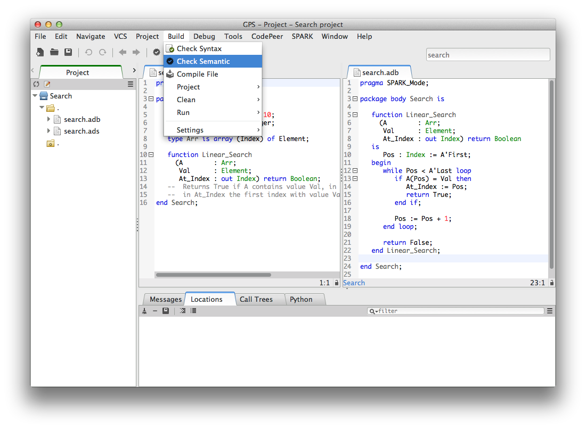

To state that this code should be valid |SPARK| code, we can add the
``SPARK_Mode`` pragma in the sources as a local pragma, or in a configuration
file as a configuration pragma. We consider here the former case, where the
following line is added on the first line of ``search.ads``:

.. code-block:: ada

    pragma SPARK_Mode (On);

Then, we run |GNATprove| in mode ``check``, using the ``Prove::Prove File``
menu and selecting mode ``check``, so that it issues errors on code that has
``SPARK_Mode=On`` but is not in SPARK:

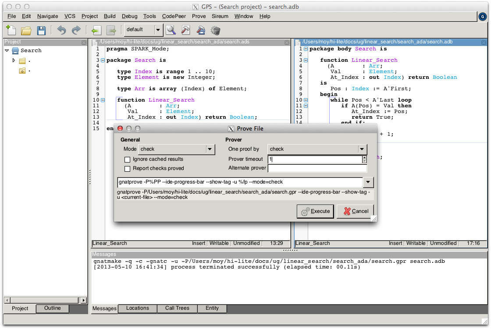

It detects here that function ``Linear_Search`` is not in SPARK, because it has
an ``out`` parameter:

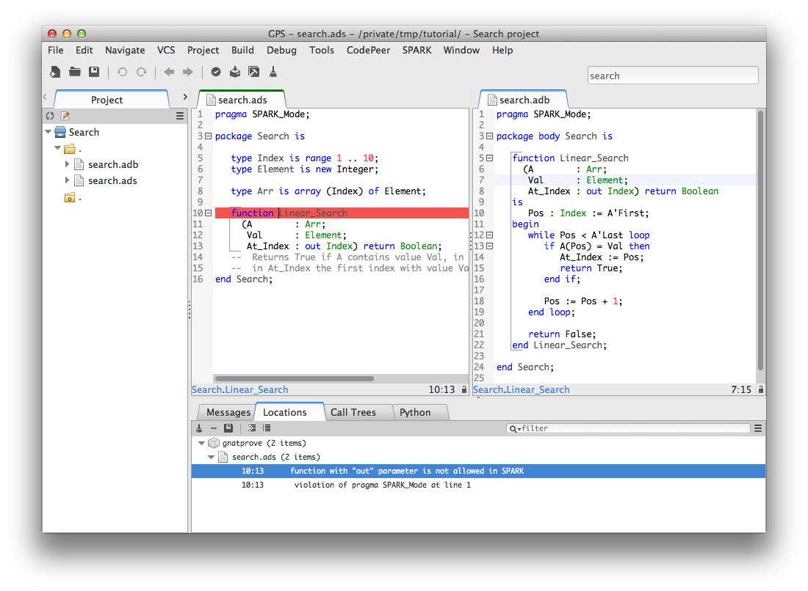

This recent permission in Ada to have ``out`` parameters in functions is not
allowed in |SPARK|, because it causes calls to have side-effects (assigning to
their ``out`` parameters), which means that various calls in the same
expression may be conflicting, yielding different results depending on the
order of evaluation of the expression.

We correct this problem by defining a record type ``Search_Result`` holding
both the boolean result and the index for cases when the value is found, and
making ``Linear_Search`` return this type:

.. code-block:: ada

    pragma SPARK_Mode (On);

    package Search is

       type Index is range 1 .. 10;
       type Element is new Integer;

       type Arr is array (Index) of Element;

       type Search_Result is record
          Found    : Boolean;
          At_Index : Index;
       end record;

       function Linear_Search
         (A   : Arr;
          Val : Element) return Search_Result;

    end Search;

The implementation of ``Linear_Search`` is modified to use this type:

.. code-block:: ada

    pragma SPARK_Mode (On);

    package body Search is

       function Linear_Search
         (A   : Arr;
          Val : Element) return Search_Result
       is
          Pos : Index := A'First;
          Res : Search_Result;
       begin
          while Pos < A'Last loop
             if A(Pos) = Val then
                Res.At_Index := Pos;
                Res.Found := True;
                return Res;
             end if;

             Pos := Pos + 1;
          end loop;

          Res.Found := False;
          return Res;
       end Linear_Search;

    end Search;

|GNATprove| runs without errors in mode ``check`` on this program, which is
thus valid |SPARK| code. It is not yet very interesting |SPARK| code though, as
it does not contain any contracts, which are necessary to be able to apply
formal verification modularly on each subprogram, independently of the
implementation of other subprograms. The precondition constrains the value of
input parameters, while the postcondition states desired properties of the
result of the function. See :ref:`Preconditions and Postconditions` for more
details. Here, we can require in the precondition that callers of
``Linear_Search`` always pass a non-negative value for parameter ``Val``, and
we can state that, when the search succeeds, the index returned points to the
desired value in the array:

.. code-block:: ada

   function Linear_Search
     (A   : Arr;
      Val : Element) return Search_Result
   with
     Pre  => Val >= 0,
     Post => (if Linear_Search'Result.Found then
                A (Linear_Search'Result.At_Index) = Val);

Notice the use of an if-expression in the postcondition to express an
implication: the search succeeds implies that the value at the returned index
is the searched one. Note also the use of ``Linear_Search'Result`` to denote
the value returned by the function.

This contract is still not very strong. Many faulty implementations of the
search would pass this contract, for example one that always fails (thus
returning with ``Linear_Search'Result.Found = False``). We could reinforce the
postcondition, but we choose here to do it through a contract by cases, which
adds further constraints to the usual contract by precondition and
postcondition. We want to consider here three cases:

* the desired value is found at the first index (1)
* the desired value is found at other indexes (2 to 10)
* the desired value is not found in the range 1 to 10

In the first case, we want to state that the index returned is 1. In the second
case, we want to state that the search succeeds. In the third case, we want to
state that the search fails. We use a helper function ``Value_Found_In_Range``
to express that a value ``Val`` is found in an array ``A`` within given bounds
``Low`` and ``Up``:

.. code-block:: ada

   function Value_Found_In_Range
     (A       : Arr;
      Val     : Element;
      Low, Up : Index) return Boolean
   is (for some J in Low .. Up => A(J) = Val);

   function Linear_Search
     (A   : Arr;
      Val : Element) return Search_Result
   with
     Pre  => Val >= 0,
     Post => (if Linear_Search'Result.Found then
                A (Linear_Search'Result.At_Index) = Val),
     Contract_Cases =>
       (A(1) = Val =>
          Linear_Search'Result.At_Index = 1,
        Value_Found_In_Range (A, Val, 2, 10) =>
          Linear_Search'Result.Found,
        (for all J in Arr'Range => A(J) /= Val) =>
          not Linear_Search'Result.Found);

Note that we express ``Value_Found_In_Range`` as an expression function, a
function whose body consists in a single expression, which can be given in a
specification file.

Note also the use of quantified expressions to express properties over
collections: ``for some`` in ``Value_Found_In_Range`` expresses an existential
property (there exists an index in this range such that ...), ``for all`` in
the third contract case expresses a universal property (all indexes in this
range satisfy are such that ...).

Each contract case consists in a guard (on the left of the arrow symbol)
evaluated on subprogram entry, and a consequence (on the right of the arrow
symbol) evaluated on subprogram exit. The special expression
``Linear_Search'Result`` may be used in consequence expressions. The three
guards here should cover all possible cases, and be disjoint. When a contract
case is activated (meaning its guard holds on entry), its consequence should
hold on exit.

The program obtained so far is a valid |SPARK| program, which |GNAT Pro|
analyzes semantically without errors or warnings.

Testing |SPARK| Programs
========================

We can compile the above program, and test it on a set of selected inputs. The
following testing program exercizes both the case where the searched value is
present or not in the array:

.. code-block:: ada

    with Search;      use Search;
    with Ada.Text_IO; use Ada.Text_IO;

    procedure Test_Search is
       A   : constant Arr := (1, 5, 3, 8, 8, 2, 0, 1, 0, 4);
       Res : Search_Result;

    begin
       Res := Linear_Search (A, 1);
       if Res.Found then
          if Res.At_Index = 1 then
             Put_Line ("OK: Found existing value at first index");
          else
             Put_Line ("not OK: Found existing value at other index");
          end if;
       else
          Put_Line ("not OK: Did not find existing value");
       end if;

       Res := Linear_Search (A, 6);
       if not Res.Found then
          Put_Line ("OK: Did not find non-existing value");
       else
          Put_Line ("not OK: Found non-existing value");
       end if;
    end Test_Search;

We can check that the implementation of ``Search`` passes this test by
compiling and running the test program:

.. code-block:: bash

   $ gnatmake test_search.adb
   $ test_search
   > OK: Found existing value at first index
   > OK: Did not find non-existing value

But only part of the program was really tested, as the contract was not checked
during execution. To check the contract at run time, we recompile with the
switch ``-gnata`` (``a`` for assertions, plus switch ``-f`` to force
recompilation of sources that have not changed):

* a check is inserted that the precondition holds on subprogram entry
* a check is inserted that the postcondition holds on subprogram exit
* a check is inserted that the guards of contract cases are disjoint on
  subprogram entry (no two cases are activated at the same time)
* a check is inserted that the guards of contract cases are complete on
  subprogram entry (one case must be activated)
* a check is inserted that the consequence of the activated contract case holds
  on subprogram exit

Note that the evaluation of the above assertions may also trigger other
run-time check failures, like an index out of bounds. With these additional
run-time checks, an error is reported when running the test program:

.. code-block:: bash

   $ gnatmake -gnata -f test_search.adb
   $ test_search
   > raised SYSTEM.ASSERTIONS.ASSERT_FAILURE : contract cases overlap for subprogram linear_search

It appears that two contract cases for ``Linear_Search`` are activated at the
same time! More information can be generated at run time if the code is
compiler with the switch ``-gnateE``:

.. code-block:: bash

   $ gnatmake -gnata -gnateE -f test_search.adb
   $ test_search
   > raised SYSTEM.ASSERTIONS.ASSERT_FAILURE : contract cases overlap for subprogram linear_search
   >   case guard at search.ads:29 evaluates to True
   >   case guard at search.ads:31 evaluates to True

It shows here that the guards of the first and second contract cases hold at
the same time. This failure in annotations can be debugged with ``gdb`` like a
failure in the code (provided the program was compiled with appropriate
switches, like ``-g -O0``). The stack trace inside GPS shows that the error
occurs on the first call to ``Linear_Search`` in the test program:

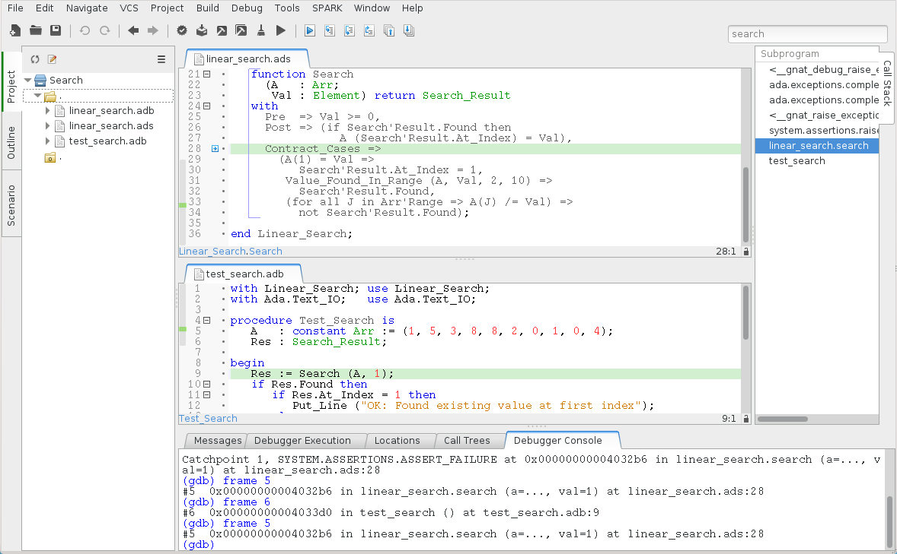

Indeed, the value 1 is present twice in the array, at indexes 1 and 8, which
makes the two guards ``A(1) = Val`` and ``Value_Found_In_Range (A, Val, 2, 10``
evaluate to ``True``. We correct the contract of ``Linear_Search`` by
strengthening the guard of the second contract case, so that it only applies
when the value is not found at index 1:

.. code-block:: ada
     :emphasize-lines: 4

     Contract_Cases =>
       (A(1) = Val =>
          Linear_Search'Result.At_Index = 1,
        A(1) /= Val and then Value_Found_In_Range (A, Val, 2, 10) =>
          Linear_Search'Result.Found,
        (for all J in Arr'Range => A(J) /= Val) =>
          not Linear_Search'Result.Found);

With this updated contract, the test passes again, but this time with
assertions checked at run time:

.. code-block:: bash

   $ gnatmake -gnata test_search.adb
   $ test_search
   > OK: Found existing value at first index
   > OK: Did not find non-existing value

The program obtained so far passes successfully a test campaign (of one test!)
that achieves 100% coverage for all the common coverage criteria, once
impossible paths have been ruled out: statement coverage, condition coverage,
the MC/DC coverage used in avionics, and even the full static path coverage.

Verifying Formally |SPARK| Programs
===================================

Formal verification of |SPARK| programs is a two-step process:

#. the first step checks that flows through the program correctly implement the
   specified flows (if any), and that all values read are initialized.
#. the second step checks that the program correctly implement its specified
   contracts (if any), and that no run-time error can be raised.

Step 1 is implemented as a static analysis pass in the tool |GNATprove|, under
the ``flow`` mode. This mode is still experimental, so many |SPARK| features
are not yet supported. Step 2 is implemented as a deductive verification pass
in the tool |GNATprove|, under the default ``prove`` mode. This mode is well
developed, but a few |SPARK| features are still not yet supported.

The difference between these two steps should be emphasized. Static analysis in
step 1 is a terminating algorithm, which typically takes 2 to 10 times the
compilation time to complete. Deductive verification in step 2 is based on the
generation of logical formulas for each check to prove, which are then passed
on to an automatic prover to decide whether the logical formula holds or
not. The generation of logical formulas is a translation phase, which typically
takes 10 times the compilation time to complete. The automatic proof of logical
formulas may take very long, or never terminate, hence the use of a timeout
(default=1s) for each call to the automatic prover. It is this last step which
takes the most time when calling |GNATprove| on a program, but it is also a
step which can be completely parallelized (using switch ``-j`` to specify the
number of parallel processes): each logical formula can be proved
independently, so the more the number of available cores, the faster it
completes.

.. note::

   The proof results presented in this tutorial may slightly vary from
   the results you obtain on your machine, as the automatic prover may take
   more or less time to complete a proof depending on the platform and machine
   used.

We start with the flow analysis of ``Search``, using the yet experimental mode
``flow`` of |GNATprove| reached through the ``Prove::Prove File`` menu:

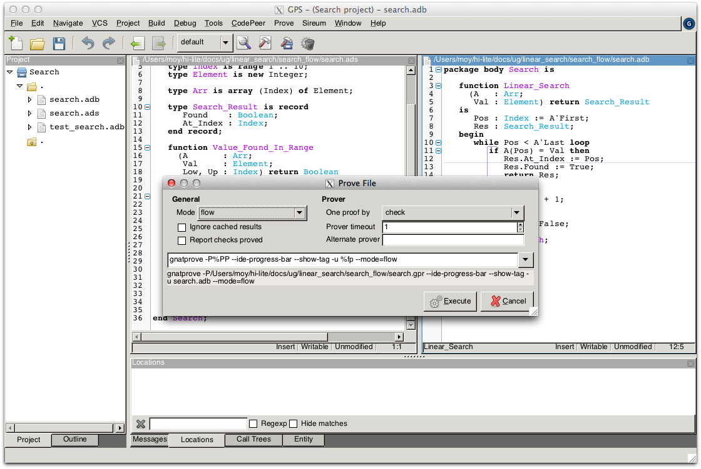

Here, it issues an error message:

.. code-block:: bash

   search.adb:21:07: use of uninitialized variable "res.at_index"

Inside the GPS editor, we can click on the path icon, either on the left of the
message, or on line 21 in file ``search.adb``, to show the path on which
``Res.At_Index`` is not initialized:

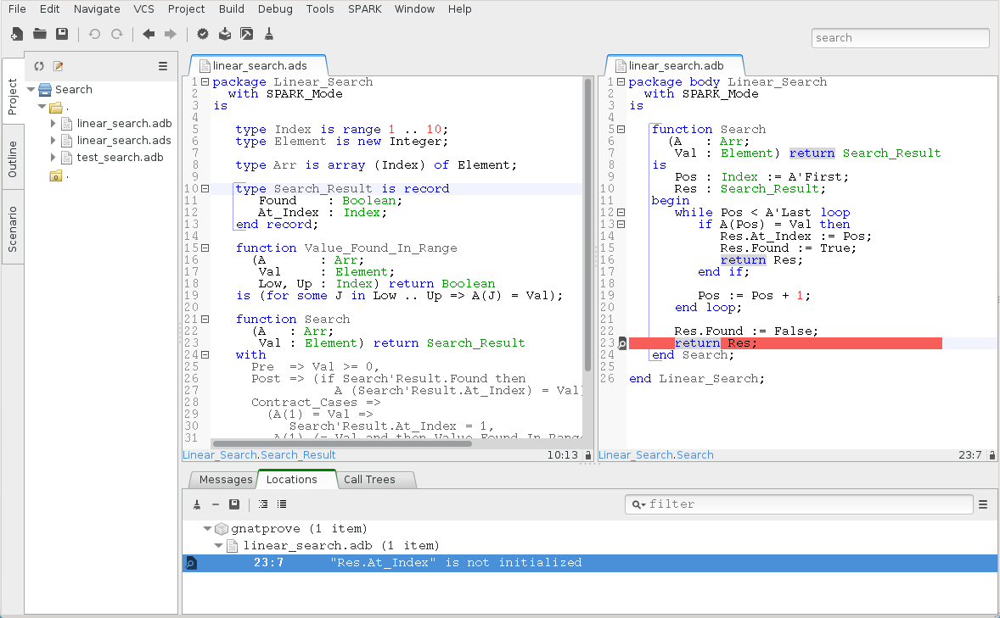

.. note::

   If you use the SPARK-HiLite GPL 2013 release, the way to display a path
   in GPS is slightly different. Instead of clicking on an icon, you need
   to right-click on the error message in the Location View, and select
   ``Prove::Show Path`` in the contextual menu that is raised. The menu
   ``Prove::Show Path`` displayed when right-clicking in the code panel
   should not be used.

This shows that, when the value is not found, indeed the component ``At_Index``
of the value returned is not initialized. Although that's allowed in Ada,
|SPARK| requires that all inputs and outputs of subprograms are completely
initialized (and the value returned by a function is such an output). Although
we could give a dummy value to component ``At_Index`` when the search fails, we
choose to turn the type ``Search_Result`` into a discriminant record, so that
the component ``At_Index`` is only usable when the search succeeds:

.. code-block:: ada

       type Search_Result (Found : Boolean := False) is record
          case Found is
             when True =>
                At_Index : Index;
             when False =>
                null;
          end case;
       end record;

Then, in the implementation of ``Linear_Search``, we change the value of the
discriminant depending on the success of the search:

.. code-block:: ada

       function Linear_Search
         (A   : Arr;
          Val : Element) return Search_Result
       is
          Pos : Index := A'First;
          Res : Search_Result;
       begin
          while Pos < A'Last loop
             if A(Pos) = Val then
                Res := (Found    => True,
                        At_Index => Pos);
                return Res;
             end if;

             Pos := Pos + 1;
          end loop;

          Res := (Found => False);
          return Res;
       end Linear_Search;

|GNATprove| runs without errors in mode ``flow`` on this program, which shows
there are no reads of uninitialized data.

We continue with the proof of contracts and absence of run-time errors, using
the main mode ``prove`` of |GNATprove|, in the ``Prove::Prove File`` menu. It
completes in a few seconds, with messages stating that 3 checks could not be
proved:

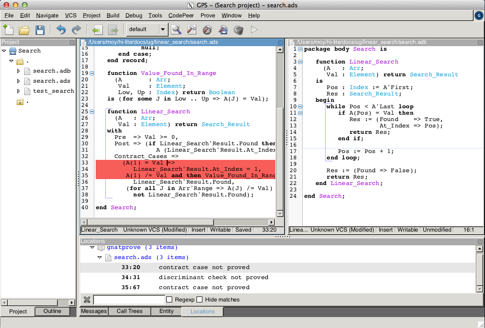

Note that there is no such message on the postcondition of ``Linear_Search``,
which means that it was proved. Likewise, there are no such messages on the
body of ``Linear_Search``, which means that no run-time errors can be raised
when executing the function.

All 3 unproved checks are checked when exiting from ``Linear_Search``. It is
expected that not much can be proved at this point, given that the body of
``Linear_Search`` has a loop but no loop invariant, so the formulas generated
for these checks assume the worst about locations modified in the loop. A loop
invariant is a special pragma ``Loop_Invariant`` stating an assertion in a
loop, which can be both executed at run-time like a regular pragma ``Assert``,
and used by |GNATprove| to summarize the effect of successive iterations of the
loop. We need to add a loop invariant stating enough properties about the
cumulated effect of loop iterations, so that the contract cases of
``Linear_Search`` become provable. Here, it should state that the value
searched was not previously found:

.. code-block:: ada

         pragma Loop_Invariant
           (not Value_Found_In_Range (A, Val, A'First, Pos));

As stated above, this invariant holds exactly between the two statements in the
loop (after the if-statement, before the increment of the index). Thus, it
should be inserted at this place. With this loop invariant, two checks
previously not proved are now proved, and a check previously proved becomes
unproved:

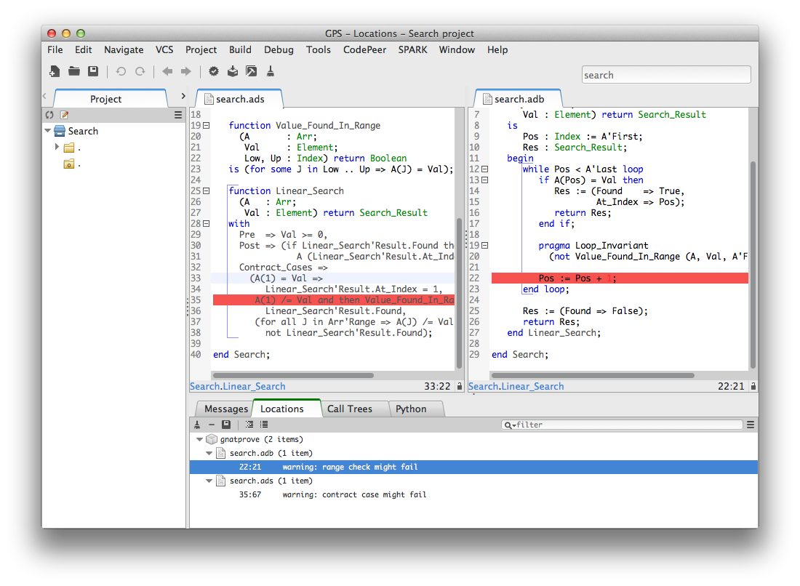

The new unproved check may seem odd, since all we did was adding information in
the form of a loop invariant. The reason is that we also removed information at
the same time. By adding a loop invariant, we require |GNATprove| to prove
iterations around the (virtual) loop formed by the following steps:

#. Take any context satisfying the loop invariant, which summarizes all
   previous iterations of the loop.
#. Execute the end of a source loop iteration (just the increment here).
#. Test whether the loop exits, and continue with values which do not exit.
#. Execute the start of a source loop iteration (just the if-statement here).
#. Check that the loop invariant still holds.

Around this virtual loop, nothing guarantees that the index ``Pos`` is not the
maximal index at step 2 (the increment), so the range check cannot be
proved. It was previously proved because, in absence of a loop invariant,
|GNATprove| proves iterations around the source loop, and then we get the
information that, since the loop did not exit, its test ``Pos < A'Last`` is
false, so the range check can be proved.

We solve this issue by setting the type of ``Pos`` to the base type of
``Index``, which ranges past the last value of ``Index``. (This may not be the
simplest solution, but we use it here for the dynamics of this tutorial.)

.. code-block:: ada

      Pos : Index'Base := A'First;

And we add the range information for ``Pos`` in the loop invariant:

.. code-block:: ada

         pragma Loop_Invariant
           (Pos in A'Range
              and then
            not Value_Found_In_Range (A, Val, A'First, Pos));

This allows to prove the range check on line 21, but the loop invariant
preservation becomes unproved:

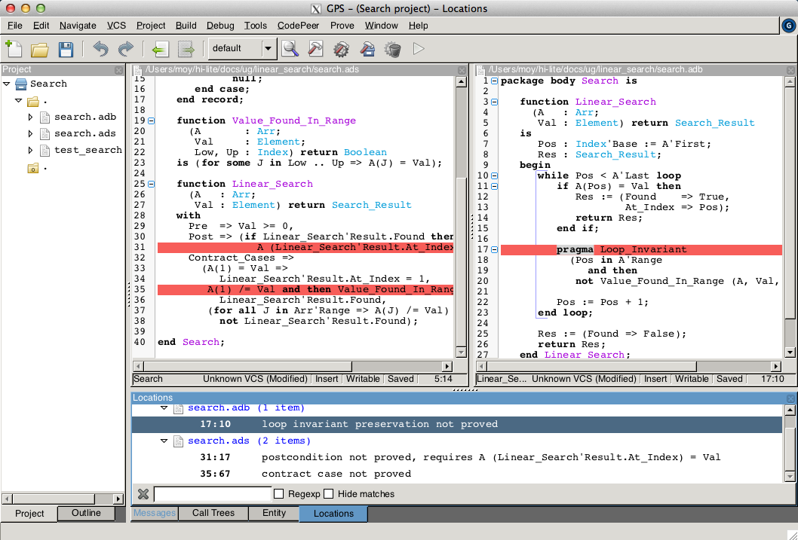

This is actually progress! Indeed, the loop invariant should be strong enough
to:

#. prove the absence of run-time errors in the loop and after the loop
#. prove that it is preserved from iteration to iteration
#. prove the postcondition and contract cases of the subprogram

So we have just achieved goal 1 above! And the currently unproved preservation
of the loop invariant is goal 2.

As we have modified the code and annotations, it is a good time to compile and
run our test program, before doing any more formal verification work. This
helps catching bugs early, and it's easy to do! In particular, the loop
invariant will be dynamically checked at each iteration through the loop.
Here, testing does not show any problems:

.. code-block:: bash

   $ gnatmake -gnata test_search.adb
   $ test_search
   > OK: Found existing value at first index
   > OK: Did not find non-existing value

The next easy thing to do is to increase the timeout of the automatic
prover. Its default of 1s is voluntarily low, to facilitate interaction with
|GNATprove| during the development of annotations, but it is not sufficient to
prove the more complex checks. Let's increase it to 10s, and rerun |GNATprove|:

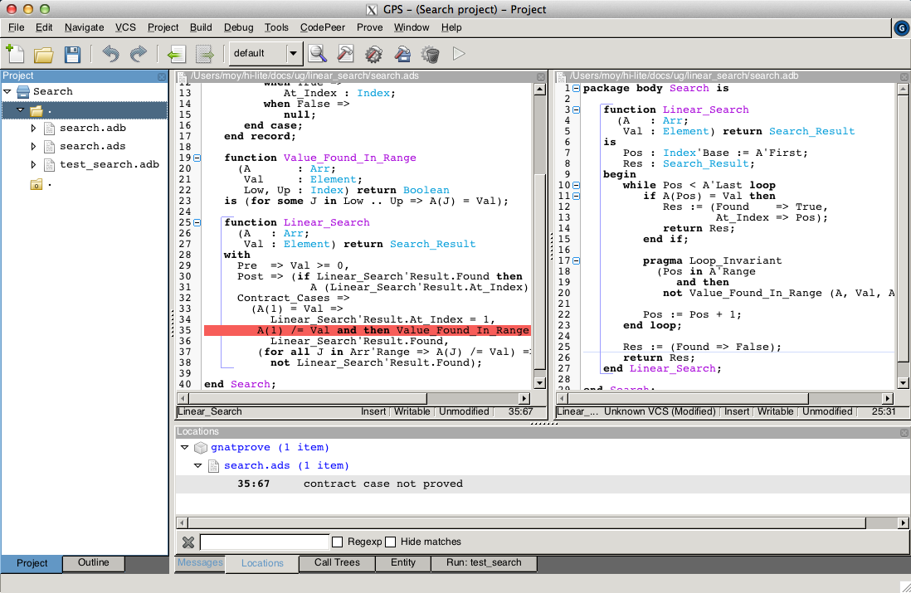

The loop invariant preservation was proved! One unproved check remains, in the
contract cases of ``Linear_Search``. We need to check that the loop invariant
is strong enough to prove the unproved contract case (goal 3 above). To help
with this assessment, we use the ``Prove Line`` contextual menu available on
line 35:

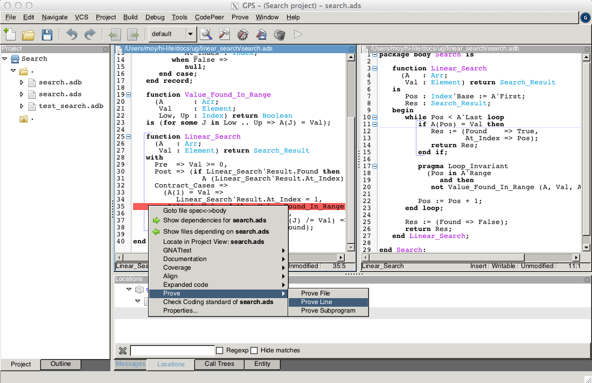

This runs |GNATprove| only on the checks that originate from line 35, in a
special mode which considers separately individual execution path if
needed. The check is still not proved, but GPS now displays an icon, either on
the left of the message, or on line 35 in file ``search.ads``, to show the path
on which the contract case is not proved:

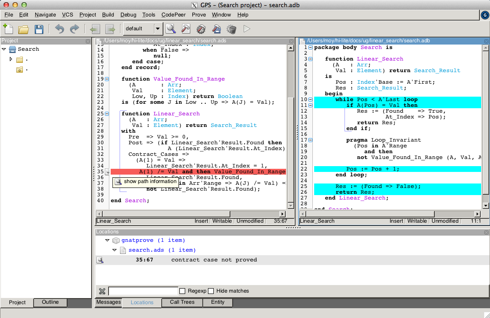

.. note::

   If you use the SPARK-HiLite GPL 2013 release, the way to display a path
   in GPS is slightly different. Instead of clicking on an icon, you need
   to right-click on the error message in the Location View, and select
   ``Prove::Show Path`` in the contextual menu that is raised. The menu
   ``Prove::Show Path`` displayed when right-clicking in the code panel
   should not be used.

This corresponds to a case where the implementation of ``Loop_Search`` does not
find the searched value, but the guard of the second contract case holds,
meaning that the value is present in the range 2 to 10. Looking more closely at
the path highlighted, we can see that the loop exits when ``Pos = A'Last``, so
the value 10 is never considered! We correct this bug by changing the loop test
from a strict to a non-strict comparison operation:

.. code-block:: ada

         while Pos <= A'Last loop

On this modified code, we rerun |GNATprove| on line 35, checking the box
``Report Proved VCs`` to get information even when a check is proved. The
reassuring green color (and the accompanying info message) show that the check
was proved this time:

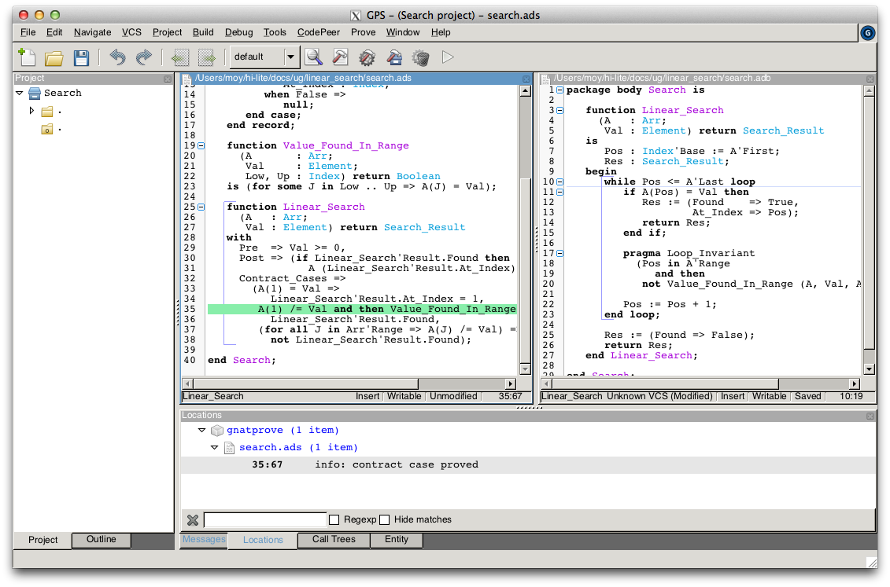

Like usual after code changes, we rerun the test program, which shows no
errors. Rerunning |GNATprove| on the complete file shows no more unproved
checks. The ``Search`` unit has been fully proved. To see all the checks that
were proved, we can rerun the tool with box ``Report Proved VCs`` checked,
which displays the results previously computed:

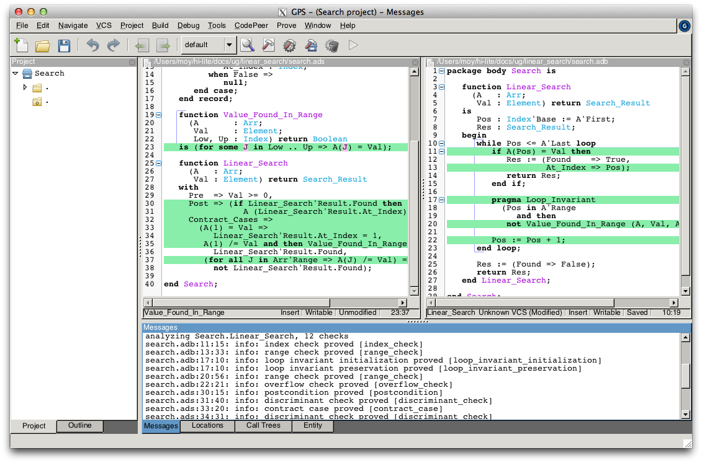

Note that one thing that was not proved is that ``Linear_Search``
terminates. As it contains a while-loop, it could loop forever. To prove that
it is not the case, we add a loop variant, which specifies a quantity varying
monotonically with each iteration. Since this quantity is bounded by its type,
and we have proved absence of run-time errors in ``Linear_Search``, proving
this monotonicity property also shows that there cannot be an infinite number
of iterations of the loop. The natural loop invariant for ``Linear_Search`` is
the index ``Pos``, which increases at each loop iteration:

.. code-block:: ada

         pragma Loop_Variant (Increases => Pos);

With this last modification, the test program still runs without errors (it
checks dynamically that the loop variant is respected), and the program is
still fully proved. Here is the final version of ``Search``, with the complete
annotations:

.. code-block:: ada

    pragma SPARK_Mode (On);

    package Search is

       type Index is range 1 .. 10;
       type Element is new Integer;

       type Arr is array (Index) of Element;

       type Search_Result (Found : Boolean := False) is record
          case Found is
             when True =>
                At_Index : Index;
             when False =>
                null;
          end case;
       end record;

       function Value_Found_In_Range
         (A       : Arr;
          Val     : Element;
          Low, Up : Index) return Boolean
       is (for some J in Low .. Up => A(J) = Val);

       function Linear_Search
         (A   : Arr;
          Val : Element) return Search_Result
       with
         Pre  => Val >= 0,
         Post => (if Linear_Search'Result.Found then
                    A (Linear_Search'Result.At_Index) = Val),
         Contract_Cases =>
           (A(1) = Val =>
              Linear_Search'Result.At_Index = 1,
            A(1) /= Val and then Value_Found_In_Range (A, Val, 2, 10) =>
              Linear_Search'Result.Found,
            (for all J in Arr'Range => A(J) /= Val) =>
              not Linear_Search'Result.Found);

    end Search;

.. code-block:: ada

    pragma SPARK_Mode (On);

    package body Search is

       function Linear_Search
         (A   : Arr;
          Val : Element) return Search_Result
       is
          Pos : Index'Base := A'First;
          Res : Search_Result;
       begin
          while Pos <= A'Last loop
             if A(Pos) = Val then
                Res := (Found    => True,
                        At_Index => Pos);
                return Res;
             end if;

             pragma Loop_Invariant
               (Pos in A'Range
                  and then
                not Value_Found_In_Range (A, Val, A'First, Pos));
             pragma Loop_Variant (Increases => Pos);

             Pos := Pos + 1;
          end loop;

          Res := (Found => False);
          return Res;
       end Linear_Search;

    end Search;

This concludes our initial tour of the |SPARK| toolset!
