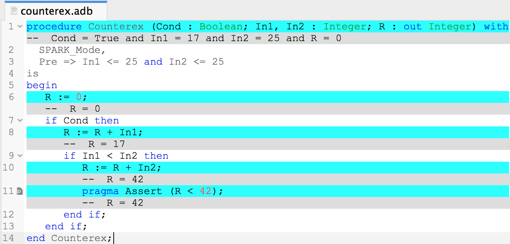

.. _Formal Verification with GNATprove:

************************************
Formal Verification with |GNATprove|
************************************

The |GNATprove| tool is packaged as an executable called ``gnatprove``. Like
other tools in |GNAT Pro| toolsuite, |GNATprove| is based on the structure of
GNAT projects, defined in ``.gpr`` files.

A crucial feature of |GNATprove| is that it interprets annotations exactly like
they are interpreted at run time during tests. In particular, their executable
semantics includes the verification of run-time checks, which can be verified
statically with |GNATprove|. |GNATprove| also performs additional verifications
on the specification of the expected behavior itself, and its correspondence to
the code.

How to Run |GNATprove|
======================

.. _Setting Up a Project File:

Setting Up a Project File
-------------------------

Basic Project Set Up
^^^^^^^^^^^^^^^^^^^^

If not already done, create a GNAT project file (`.gpr`), as documented in the
|GNAT Pro| User's Guide, section `GNAT Project Manager`. See also :ref:`Project
Attributes` for optional project attributes to specify the proof directory and
other |GNATprove| switches in the project file directly.

Note that you can use the project wizard from GPS to create a project file
interactively, via the menu :menuselection:`Project --> New...` See in
particular the first option (:menuselection:`Single Project`).

If you want to get started quickly, and assuming a standard naming scheme using
``.ads/.adb`` lower case files and a single source directory, then your project
file will look like:

.. code-block:: ada

  project My_Project is
     for Source_Dirs use (".");
  end My_Project;

saved in a file called ``my_project.gpr``.

Having Different Switches for Compilation and Verification
^^^^^^^^^^^^^^^^^^^^^^^^^^^^^^^^^^^^^^^^^^^^^^^^^^^^^^^^^^

In some cases, you may want to pass different compilation-level switches to
GNAT and |GNATprove|, for example use warning switches only for compilation, in
the same project file. In that case, you can use a scenario variable to specify
different switches for compilation and verification:

.. code-block:: ada

  project My_Project is

    type Modes is ("Compile", "Analyze");
    Mode : Modes := External ("MODE", "Compile");

    package Compiler is
       case Mode is
          when "Compile" =>
             for Switches ("Ada") use ...
          when "Analyze" =>
             for Switches ("Ada") use ...
       end case;
    end Compiler;

  end My_Project;

With the above project, compilation is done using the ``Compile`` default
mode::

  gprbuild -P my_project.gpr

while formal verification is done using the ``Analyze`` mode::

  gnatprove -P my_project.gpr -XMODE=Analyze

.. _Running GNATprove from the Command Line:

Running |GNATprove| from the Command Line
-----------------------------------------

|GNATprove| can be run from the command line as follows::

    gnatprove -P <project-file.gpr>

In the appendix, section :ref:`Command Line Invocation`, you can find an
exhaustive list of switches; here we only give an overview over the most common
uses. Note that |GNATprove| cannot be run without a project file.

When given a list of files, each of which contains a compilation unit,
|GNATprove| will analyze those units (including bodies and subunits)
plus the specifications and bodies of units on which they depend.

Two options modify this behavior:

* With option ``-u``, the bodies of dependent units are ignored, so only the
  given units and the specifications of dependent units are analyzed.

* With option ``-U``, all units of all projects are analyzed.

|GNATprove| consists of two distinct analyses, flow analysis and proof. Flow
analysis checks the correctness of aspects related to data flow (``Global``,
``Depends``, ``Abstract_State``, ``Initializes``, and refinement versions of
these), and verifies the initialization of variables. Proof verifies the
absence of run-time errors and the correctness of assertions such as ``Pre``
and ``Post`` aspects.  Using the switch ``--mode=<mode>``, whose possible
values are ``check``, ``check_all``, ``flow``, ``prove`` and ``all``, you can
choose which analysis is performed:

* In mode ``check``, |GNATprove| partially checks that the program does not
  violate |SPARK| restrictions. The benefit of using this mode prior to mode
  ``check_all`` is that it is much faster, as it does not require the results
  of flow analysis.

* In mode ``check_all``, |GNATprove| fully checks that the program does not
  violate |SPARK| restrictions, including checks not performed in mode
  ``check`` like the absence of side-effects in functions. Mode ``check_all``
  includes mode ``check``.

* In mode ``flow``, |GNATprove| checks that no uninitialized data is read in
  the program, and that the specified data dependencies and flow dependencies
  are respected in the implementation. Mode ``flow`` includes mode
  ``check_all``.  This phase is called *flow analysis*.

* In mode ``prove``, |GNATprove| checks that the program is free from run-time
  errors, and that the specified functional contracts are respected in the
  implementation. Mode ``prove`` includes mode ``check_all``, as well as the
  part of mode ``flow`` which checks that no uninitialized data is read, to
  guarantees soundness of the proof results. This phase is called *proof*.

* In the default mode ``all``, |GNATprove| does both flow analysis and proof.

Using the option ``--limit-line=`` one can limit proofs to a particular file
and line of an Ada file. For example, if you want to prove only line 12 of
file ``example.adb``, you can add the option ``--limit-line=example.adb:12`` to
the call to |GNATprove|. Using the option ``--limit-subp=`` one can limit proofs
to a subprogram declared in a particular file at a particular line.

A number of options exist to influence the behavior for proof. Internally, the
prover(s) specified with option ``--prover`` is/are called repeatedly for each
check or assertion. Using the option ``--timeout``, one can change the maximal
time that is allocated to each prover to prove each check or assertion.
Using the option ``--steps`` (default: not used explicitly but
set by default proof level, see switch ``--level`` below), one can set the
maximum number of reasoning steps that the prover is allowed to perform before
giving up. The ``steps`` option should be used when predictable results are
required, because the results with a timeout may differ depending on the
computing power or current load of the machine. The option ``-j`` activates
parallel compilation and parallel proofs.

.. note::

    When the project has a main file, or a file is passed as starting point to
    gnatprove, and the dependencies in the project are very linear (unit A
    depends only on unit B, which depends only on unit C, etc), then even when
    the ``-j`` switch is used, gnatprove may only consider one file at a time.
    This problem can be avoided by additionally using the ``-U`` switch.

The way checks are passed to the prover can also be influenced using the option
``--proof``. By default, the prover is invoked a single time for each check or
assertion (mode ``per_check``). This can be changed using mode ``per_path`` to
invoke the prover for each *path* that leads to the check. This option usually
takes much longer, because the prover is invoked much more often, but may give
better proof results. Finally, in mode ``progressive``, invoking the prover a
single time on the entire check is tried, and only if the check is not proved,
then other techniques that progressively consider each path in isolation
are tried.

The proof mode set with ``--proof`` can be extended with a qualifier ``all`` or
``lazy``, so that the entire switch may for example look like this:
``--proof=progressive:all``.  With this qualifier, one can select if proof
should stop at the first unproved formula (to save time) for a check or should
continue attempting to prove the other formulas related to the same check
(typically to identify more precisely which formulas are left unproved, which
can be then be handled with manual proof). The former is most suited for fully
automatic proof, it is the default value, and can be explicitly selected with
``lazy``. The latter is most suited for combination of automatic and manual
proof and can be selected with ``all``.

Instead of setting individually switches that influence the speed and power of
proof, one may use the switch ``--level``, which corresponds to predefined
proof levels, from the faster level 0 (the default value) to the more powerful
level 4. More precisely, each value of ``--level`` is equivalent to directly
setting a collection of other switches discussed above:

* ``--level=0`` is equivalent to
  ``--prover=cvc4 --proof=per_check --steps=100``
* ``--level=1`` is equivalent to
  ``--prover=cvc4,z3,altergo --proof=per_check --steps=100``
* ``--level=2`` is equivalent to
  ``--prover=cvc4,z3,altergo --proof=per_check --steps=1000``
* ``--level=3`` is equivalent to
  ``--prover=cvc4,z3,altergo --proof=progressive --steps=1000``
* ``--level=4`` is equivalent to
  ``--prover=cvc4,z3,altergo --proof=progressive --steps=10000``

When ``--timeout=auto`` is used, a value of timeout is set depending on the
proof level:

* At levels 0 and 1, ``--timeout=auto`` is equivalent to ``--timeout=1``
* At levels 2 and 3, ``--timeout=auto`` is equivalent to ``--timeout=10``
* At level 4, ``--timeout=auto`` is equivalent to ``--timeout=60``

If both ``--level`` is set and an underlying switch is set (``--prover``,
``--steps``, or ``--proof``), the value of the latter takes precedence over the
value set through ``--level``.

By default, |GNATprove| avoids reanalyzing unchanged files, on a
per-unit basis. This mechanism can be disabled with the option ``-f``.

By default, |GNATprove| stops at the first unit where it detect errors
(violations of Ada or |SPARK| legality rules). The option ``-k`` can be used to
get |GNATprove| to issue errors of the same kind for multiple units. If there
are any violations of Ada legality rules, |GNATprove| does not attempt any
analysis. If there are violations of |SPARK| legality rules, |GNATprove| stops
after the checking phase and does not attempt flow analysis or proof.

When an error is detected (which does not included issuing check messages),
|GNATprove| returns with a non-zero exit status. Otherwise, |GNATprove| returns
with an exit status of zero, even when warnings and check messages are issued.

Using the GNAT Target Runtime Directory
---------------------------------------

If you are using GNAT as your target compiler, and the runtime used is
not compatible with |GNATprove|'s default runtime, you can use the GNAT
runtime directory from your GNAT installation, either directly or by
copying it to the |SPARK| installation.

To find the location of the target GNAT runtime, you can use the
``<target>-gnatls -v`` command, and if you are using the ``--RTS`` switch,
specify it also when running ``gnatls``.

If the argument of the ``--RTS`` switch passed to |GNATprove| is a valid
absolute or relative directory name, then |GNATprove| will use this directory
as the runtime directory.

Otherwise, |GNATprove| will search the runtime library in predefined
locations. There are two possible cases, depending on the kind of runtime used:

* Full runtime

  For example, if you are using ``powerpc-vxworks-gnatmake`` as your builder
  and ``--RTS=kernel``, then you can use:

  .. code-block:: sh

    powerpc-vxworks-gnatls -v --RTS=kernel | grep adalib

  To find where the :file:`rts-kernel` directory is located and then copy
  this directory to the |SPARK| installation, under
  :file:`<spark-install>/share/spark/runtimes`, for example
  using `bash` syntax:

  .. code-block:: sh

    cp -pr $(dirname $(powerpc-vxworks-gnatls -v --RTS=kernel | grep adalib)) \
      <spark-install>/share/spark/runtimes

  Then if not already present in your project file, you can then add
  the following:

  .. code-block:: ada

     package Builder is
        for Switches ("Ada") use ("--RTS=kernel");
     end Builder;

  Or alternatively if you are using a recent version of GNAT and |SPARK|,
  you can specify instead the runtime via the `Runtime` project attribute:

  .. code-block:: ada

    for Runtime ("Ada") use "kernel";

* Configurable runtime

  The simplest way to use configurable runtimes in |SPARK| is to install
  both |SPARK| and your cross GNAT compiler under the same root directory.

  If you do that and have in your project file the Target and Runtime
  properties set, then |GNATprove| (starting with version 16.0.1) will find the
  runtime automatically, e.g:

  .. code-block:: ada

     for Target use "arm-eabi";
     for Runtime ("Ada") use "ravenscar-sfp-stm32f4";

  If you cannot use the above simple solution then you will first need to
  find the location of the GNAT configurable runtime using the following
  command:

  .. code-block:: sh

     <target>-gnatls -v --RTS=<runtime> | grep adalib

  which gives the path to :file:`<runtime directory>/adalib`.

  In the following example we want to use the ravenscar-sfp-stm32f4
  runtime library on arm-eabi target architecture:

  .. code-block:: sh

     arm-eabi-gnatls -v --RTS=ravenscar-sfp-stm32f4 | grep adalib

  This command gives the path to :file:`<ravenscar-sfp-stm32f4 runtime>/adalib`.

  You then need to copy (or make a symbolic link under unix) the
  <ravenscar-sfp-stm32f4 runtime> directory to the |SPARK| installation, under
  :file:`<spark-prefix>/share/spark/runtimes`, for example using `bash`
  syntax:

  .. code-block:: sh

    cp -pr $(dirname $(arm-eabi-gnatls -v --RTS=ravenscar-sfp-stm32f4 | grep adalib)) \
      <spark-prefix>/share/spark/runtimes

  Then if not already present in your project file, you need to add the
  following:

  .. code-block:: ada

    for Runtime ("Ada") use "ravenscar-sfp-stm32f4";

.. _implementation_defined:

Implementation-Defined Behavior
-------------------------------

A |SPARK| program is guaranteed to be unambiguous, so that formal verification
of properties is possible. However, some behaviors (for example some
representation attribute values like the ``Size`` attribute) may depend on the
compiler used. By default, |GNATprove| adopts the same choices as the GNAT
compiler. |GNATprove| also supports other compilers by providing special
switches:

* ``-gnateT`` for specifying the target configuration
* ``--pedantic`` for warnings about possible implementation-defined behavior

Note that, even with switch ``--pedantic``, |GNATprove| only detects some
implementation-defined behaviors. For more details, see the dedicated section
on how to :ref:`Ensure Portability of Programs`.

Note that |GNATprove| will always choose the smallest multiple of 8 bits for
the base type, which is a safe and conservative choice for any Ada compiler.

.. _Target Parameterization:

Target Parameterization
^^^^^^^^^^^^^^^^^^^^^^^

By default, |GNATprove| assumes that the compilation target is the same as the
host on which it is run, for setting target dependent values, such as
endianness or sizes and alignments of standard types.  If your target is not
the same as the host on which you run |GNATprove|, you have to tell
|GNATprove| the specificities of your target.

Note that the ``Target`` attribute of Project files is currently silently
ignored.

Instead, you need to add the following to your project file::

  project My_Project is
     [...]
     package Builder is
        for Global_Compilation_Switches ("Ada") use ("-gnateT=" & My_Project'Project_Dir & "/target.atp");
     end Builder;
  end My_Project;

where ``target.atp`` is a file stored here in the same directory as the project
file ``my_project.gpr``, which contains the target parametrization. The format
of this file is described in the |GNAT Pro| User's Guide as part of the
``-gnateT`` switch description.

Target parameterization can be used:

* to specify a target different than the host on which |GNATprove| is run, when
  cross-compilation is used. If |GNAT Pro| is the cross compiler, the
  configuration file can be generated by calling the compiler for your target
  with the switch ``-gnatet=target.atp``. Otherwise, the target file should be
  generated manually.
* to specify the parameters for a different compiler than |GNAT Pro|, even when
  the host and target are the same. In that case, the target file should be
  generated manually.

Also by default, |GNATprove| uses the host run-time library, which may not be
suitable for your target when doing cross-compilation. A different run-time
library can be specified by calling |GNATprove| with the switch ``--RTS=dir``
where ``dir`` is the default location of the run-time library. The choice of
run-time library is described in the |GNAT Pro| User's Guide as part of the
description of switch ``--RTS`` for tool ``gnatmake``.

.. _Parenthesized Arithmetic Operations:

Parenthesized Arithmetic Operations
^^^^^^^^^^^^^^^^^^^^^^^^^^^^^^^^^^^

In Ada, non-parenthesized arithmetic operations could be re-ordered by the
compiler, which may result in a failing computation (due to overflow checking)
becoming a successful one, and vice-versa. By default, |GNATprove| evaluates
all expressions left-to-right, like GNAT. When the switch ``--pedantic`` is
used, a warning is emitted for every operation that could be re-ordered:

* any operand of a binary adding operation (+,-) that is itself a binary adding
  operation;
* any operand of a binary multiplying operation (\*,/,mod,rem) that is itself a
  binary multiplying operation.

.. _Running GNATprove from GPS:

Running |GNATprove| from GPS
----------------------------

|GNATprove| can be run from GPS. When |GNATprove| is installed and found on
your PATH, a :menuselection:`SPARK` menu is available with the following
entries:

.. csv-table::
   :header: "Submenu", "Action"
   :widths: 1, 4

   "Examine All",                "This runs |GNATprove| in flow analysis mode on all mains and the units they depend on in the project."
   "Examine All Sources",        "This runs |GNATprove| in flow analysis mode on all files in the project."
   "Examine File",               "This runs |GNATprove| in flow analysis mode on the current unit, its body and any subunits."
   "Prove All",                  "This runs |GNATprove| on all mains and the units they depend on in the project."
   "Prove All Sources",          "This runs |GNATprove| on all files in the project."
   "Prove File",                 "This runs |GNATprove| on the current unit, its body and any subunits."
   "Show Report",                "This displays the report file generated by |GNATprove|."
   "Clean Proofs",               "This removes all files generated by |GNATprove|."

The three "Prove..." entries run |GNATprove| in the mode given by the project
file, or in the default mode "all" if no mode is specified.

The menus :menuselection:`SPARK --> Examine/Prove All` run |GNATprove| on all
main files in the project, and all files they depend on (recursively). Both
main files in the root project and in projects that are included in the root
project are considered. The menus :menuselection:`SPARK --> Examine/Prove All
Sources` run |GNATprove| on all files in all projects. On a project that has
neither main files nor includes other projects, menus :menuselection:`SPARK
--> Examine/Prove All` and :menuselection:`SPARK --> Examine/Prove All
Sources` are equivalent.

Keyboard shortcuts for these menu items can be set using the
:menuselection:`Edit --> Key Shortcuts` dialog in GPS.

.. note::

   The changes made by users in the panels raised by these submenus are
   persistent from one session to the other. Be sure to check that the selected
   checkboxes and additional switches that were previously added are still
   appropriate.

When editing an Ada file, |GNATprove| can also be run from a
:menuselection:`SPARK` contextual menu, which can be obtained by a right click:

.. csv-table::
   :header: "Submenu", "Action"
   :widths: 1, 4

   "Examine File",       "This runs |GNATprove| in flow analysis mode on the current unit, its body and any subunits."
   "Examine Subprogram", "This runs |GNATprove| in flow analysis mode on the current subprogram."
   "Prove File",         "This runs |GNATprove| on the current unit, its body and any subunits."
   "Prove Subprogram",   "This runs |GNATprove| on the current subprogram."
   "Prove Line",         "This runs |GNATprove| on the current line."
   "Prove Check",        "This runs |GNATprove| on the current failing condition. |GNATprove| must have been run at least once for this option to be available in order to know which conditions are failing."

Except from :menuselection:`Examine File` and :menuselection:`Prove File`, all
other submenus are also applicable to code inside generic units, in which case
the corresponding action is applied to all instances of the generic unit in the
project. For example, if a generic unit is instantiated twice, selecting
:menuselection:`Prove Subprogram` on a subprogram inside the generic unit will
apply proof to the two corresponding subprograms in instances of the generic
unit.

The menus :menuselection:`SPARK --> Prove ...` open a panel which allows
setting various switches for |GNATprove|'s analysis. By default, this panel
offers a few simple choices, like the proof level (see description of switch
``--level`` in :ref:`Running GNATprove from the Command Line`). If the user
changes its ``User profile`` for |SPARK| in :menuselection:`Edit -->
Preferences --> SPARK` from ``Basic`` to ``Advanced``, then a
more complex panel is displayed for proof, with more detailed switches.

|GNATprove| project switches can be edited from the panel ``GNATprove`` (in
:menuselection:`Project --> Edit Project Properties --> Switches`).

When proving a check fails on a specific path through a subprogram (for both
checks verified in flow analysis and in proof), |GNATprove| may generate path
information for the user to see. The user can display this path in GPS by
clicking on the icon to the left of the failed proof message, or to the left of
the corresponding line in the editor. The path is hidden again when re-clicking
on the same icon.

For checks verified in proof, |GNATprove| may also generate counterexample
information for the user to see (see :ref:`Understanding Counterexamples`). The
user can display this counterexample in GPS by clicking on the icon to the left
of the failed proof message, or to the left of the corresponding line in the
editor. The counterexample is hidden again when re-clicking on the same icon.

.. _Running GNATprove from GNATbench:

Running |GNATprove| from GNATbench
----------------------------------

|GNATprove| can be run from GNATbench. When |GNATprove| is installed and found
on your PATH, a :menuselection:`SPARK` menu is available with the following
entries:

.. csv-table::
   :header: "Submenu", "Action"
   :widths: 1, 4

   "Examine All",                "This runs |GNATprove| in flow analysis mode on all mains and the units they depend on in the project."
   "Examine All Sources",        "This runs |GNATprove| in flow analysis mode on all files in the project."
   "Examine File",               "This runs |GNATprove| in flow analysis mode on the current unit, its body and any subunits."
   "Prove All",                  "This runs |GNATprove| on all mains and the units they depend on in the project."
   "Prove All Sources",          "This runs |GNATprove| on all files in the project."
   "Prove File",                 "This runs |GNATprove| on the current unit, its body and any subunits."
   "Show Report",                "This displays the report file generated by |GNATprove|."
   "Clean Proofs",               "This removes all files generated by |GNATprove|."

The three "Prove..." entries run |GNATprove| in the mode given by the project
file, or in the default mode "all" if no mode is specified.

The menus :menuselection:`SPARK --> Examine/Prove All` run |GNATprove| on all
main files in the project, and all files they depend on (recursively). Both
main files in the root project and in projects that are included in the root
project are considered. The menus :menuselection:`SPARK --> Examine/Prove All
Sources` run |GNATprove| on all files in all projects. On a project that has
neither main files nor includes other projects, menus :menuselection:`SPARK
--> Examine/Prove All` and :menuselection:`SPARK --> Examine/Prove All
Sources` are equivalent.

.. note::

   The changes made by users in the panels raised by these submenus are
   persistent from one session to the other. Be sure to check that the selected
   checkboxes and additional switches that were previously added are still
   appropriate.

When editing an Ada file, |GNATprove| can also be run from a
:menuselection:`SPARK` contextual menu, which can be obtained by a right click:

.. csv-table::
   :header: "Submenu", "Action"
   :widths: 1, 4

   "Examine File",       "This runs |GNATprove| in flow analysis mode on the current unit, its body and any subunits."
   "Examine Subprogram", "This runs |GNATprove| in flow analysis mode on the current subprogram."
   "Prove File",         "This runs |GNATprove| on the current unit, its body and any subunits."
   "Prove Subprogram",   "This runs |GNATprove| on the current subprogram."
   "Prove Line",         "This runs |GNATprove| on the current line."

.. _GNATprove and Manual Proof:

|GNATprove| and Manual Proof
----------------------------

When automated provers fail to prove some condition that is valid, the validity
may be proved using a manual prover.

In the appendix, section :ref:`Alternative_Provers`, is explained how to use
different provers than the one |GNATprove| uses as default.

Manual Proof in Command Line
^^^^^^^^^^^^^^^^^^^^^^^^^^^^

When the prover used by |GNATprove| is configured as interactive, for each
analysed condition, either:

* It is the first time the prover is used on the condition then a file
  (containing the condition as input to the specified prover) is created in the
  project's proof directory (see :ref:`Project Attributes`). |GNATprove|
  outputs a message concerning this condition indicating the file that was
  created. The created file should be edited by the user in order to prove the
  condition.

* The prover has already been used on this condition and the editable file
  exists. The prover is run on the file and the success or failure of the proof
  is reported in the same way it is done with the default prover.

.. note::

   Once a manual proof file is created and has been edited by the user, in
   order to run the prover on the file, the same prover must be once again
   specified to |GNATprove|. Once the condition is proved, the result will be
   saved in the why3 session so |GNATprove| won't need to be specified the
   prover again to know that the condition is valid.

Analysis with |GNATprove| can be limited to a single condition with the
``--limit-line`` option::

    gnatprove -P <project-file.gpr> --prover=<prover> --limit-line=<file>:<line>:<column>:<check-kind>

Where ``check-kind`` can be deduced from the message associated to the
failing condition reported by |GNATprove|:

.. UPDATES TO THIS TABLE SHOULD ALSO BE REFLECTED IN THE TABLE UNDER SECTION
.. "Description of Messages"

.. csv-table::
   :header: "Warning", "Check kind"
   :widths: 2, 1

   **run-time checks**
   "divide by zero might fail",                            "VC_DIVISION_CHECK"
   "array index check might fail",                         "VC_INDEX_CHECK"
   "overflow check might fail",                            "VC_OVERFLOW_CHECK"
   "range check might fail",                               "VC_RANGE_CHECK"
   "predicate check might fail",                           "VC_PREDICATE_CHECK"
   "predicate check might fail on default value",          "VC_PREDICATE_CHECK_ON_DEFAULT_VALUE"
   "length check might fail",                              "VC_LENGTH_CHECK"
   "discriminant check might fail",                        "VC_DISCRIMINANT_CHECK"
   "tag check might fail",                                 "VC_TAG_CHECK"
   "ceiling priority might not be in Interrupt_Priority",  "VC_CEILING_INTERRUPT"
   "interrupt might be reserved",                          "VC_INTERRUPT_RESERRED"
   "ceiling priority protocol might not be respected",     "VC_CEILING_PRIORITY_PROTOCOL"
   "task might terminate",                                 "VC_TASK_TERMINATION"

   **assertions**
   "initial condition might fail",                      "VC_INITIAL_CONDITION"
   "default initial condition might fail",              "VC_DEFAULT_INITIAL_CONDITION"
   "call to nonreturning subprogram might be executed", "VC_PRECONDITION"
   "precondition might fail",                           "VC_PRECONDITION"
   "precondition of main program might fail",           "VC_PRECONDITION_MAIN"
   "postcondition might fail",                          "VC_POSTCONDITION"
   "refined postcondition might fail",                  "VC_REFINED_POST"
   "contract case might fail",                          "VC_CONTRACT_CASE"
   "contract cases might not be disjoint",              "VC_DISJOINT_CONTRACT_CASES"
   "contract cases might not be complete",              "VC_COMPLETE_CONTRACT_CASES"
   "loop invariant might fail in first iteration",      "VC_LOOP_INVARIANT_INIT"
   "loop invariant might fail after first iteration",   "VC_LOOP_INVARIANT_PRESERV"
   "loop variant might fail",                           "VC_LOOP_VARIANT"
   "assertion might fail",                              "VC_ASSERT"
   "exception might be raised",                         "VC_RAISE"

   **Liskov Substitution Principle**
   "precondition might be stronger than class-wide precondition",               "VC_WEAKER_PRE"
   "precondition is stronger than the default class-wide precondition of True", "VC_TRIVIAL_WEAKER_PRE"
   "postcondition might be weaker than class-wide postcondition",               "VC_STRONGER_POST"
   "class-wide precondition might be stronger than overridden one",             "VC_WEAKER_CLASSWIDE_PRE"
   "class-wide postcondition might be weaker than overridden one",              "VC_STRONGER_CLASSWIDE_POST"

Manual proof in GPS
^^^^^^^^^^^^^^^^^^^

After running |GNATprove| with proof mode, the menu
:menuselection:`SPARK --> Prove Check` is available by right-clicking on a
check message in the location tab or by right-clicking on a line that fails
because of a single condition (i.e. there is only one check in the output of
|GNATprove| concerning this line).

In the dialog box, the field "Alternate prover" can be filled to use another
prover than Alt-Ergo. If the alternative prover is configured as
"interactive", after the execution of :menuselection:`SPARK --> Prove Check`,
GPS opens the manual proof file with the editor corresponding to the prover
under the condition that an editor is specified in the configuration of the
alternative prover.

Once the editor is closed, GPS re-executes
:menuselection:`SPARK --> Prove Check`. The user should verify the same
alternative prover as before is still specified. After execution, GPS will
offer to re-edit the file if the proof fails.

How to View |GNATprove| Output
==============================

|GNATprove| produces two kinds of outputs: the one which is echoed to standard
output or displayed in your IDE (GPS or GNATbench), and the one which is
produced in a file ``gnatprove.out``, which lies in the ``gnatprove``
subdirectory of the object directory of your project.

.. _The Analysis Results Summary Table:

The Analysis Results Summary Table
----------------------------------

A summary table at the start of file ``gnatprove.out`` provides an overview of
the verification results for all checks in the project. The table may look like
this::

      ----------------------------------------------------------------------------------------------------------------
      SPARK Analysis Results      Total        Flow   Interval                          Provers   Justified   Unproved
      ----------------------------------------------------------------------------------------------------------------
      Data Dependencies               .           .          .                                .           .          .
      Flow Dependencies               .           .          .                                .           .          .
      Initialization               2100        2079          .                                .           .         21
      Non-Aliasing                    .           .          .                                .           .          .
      Run-time Checks               596           .          .    480 (altergo  31%, CVC4  69%)           .        116
      Assertions                      3           .          .      3 (altergo  33%, CVC4  67%)           .          .
      Functional Contracts          323           .          .    168 (altergo  24%, CVC4  76%)           .        155
      LSP Verification                .           .          .                                .           .          .
      ----------------------------------------------------------------------------------------------------------------
      Total                        3022  2079 (69%)          .                        651 (22%)           .   292 (9%)

The following table explains the lines of the summary table:

.. tabularcolumns:: |l|p{5in}|

.. csv-table::
   :header: "Line Description", "Explanation"
   :widths: 1, 5

   "Data Dependencies", "Verification of :ref:`Data Dependencies` and parameter modes"
   "Flow Dependencies", "Verification of :ref:`Flow Dependencies`"
   "Initialization", "Verification of :ref:`Data Initialization Policy`"
   "Non-Aliasing", "Verification of :ref:`Absence of Interferences`"
   "Run-time Checks", "Verification of absence of run-time errors (AoRTE) (except those raising ``Storage_Error``)"
   "Assertions", "Verification of :ref:`Assertion Pragmas`"
   "Functional Contracts", "Verification of functional contracts (includes :ref:`Subprogram Contracts`, :ref:`Package Contracts` and :ref:`Type Contracts`)"
   "LSP Verification", "Verification related to :ref:`Object Oriented Programming and Liskov Substitution Principle`"

We now explain the columns of the table.

* The ``Total`` column describes the total number of checks in this category.

* The ``Flow`` column describes the number of checks proved by flow analysis.

* The ``Interval`` column describes the number of checks (overflow and range
  checks) proved by a simple static analysis of bounds for floating-point
  expressions based on type bounds of sub-expressions.

* The ``Provers`` column describes the number of checks proved by automatic or
  manual provers. The column also gives information on the provers used, and
  the percentage of checks proved by each prover. Note that sometimes a check
  is proved by a combination of provers, hence the use of percentage instead of
  an absolute count. Also note that generally the prover which is run first (as
  determined by the ``--prover`` command line switch) proves the most checks,
  because each prover is called only on those checks that were not previously
  proved. The prover percentages are provided in alphabetical order.

* The ``Justified`` column contains the number of checks for which the user has
  provided a :ref:`Direct Justification with Pragma Annotate`.

* Finally, the column ``Unproved`` counts the checks which have neither been
  proved nor justified.

.. _Categories of Messages:

Categories of Messages
----------------------

|GNATprove| issues four different kinds of messages: errors, warnings,
check messages and information messages.

* Errors are issued for |SPARK| violations or other language legality problems,
  or any other problem which does not allow to proceed to analysis.  Errors
  cannot be suppressed and must be fixed to proceed with analysis.

* Warnings are issued for any suspicious situation like unused values of
  variables, useless assignements, etc. Warnings are prefixed with the text
  ``"warning: "`` and can be suppressed with ``pragma Warnings``, see section
  :ref:`Suppressing Warnings`.

* Check messages are issued for any potential problem in the code which could
  affect the correctness of the program, such as missing initialization,
  possible failing run-time checks or unproved assertions. Checks come with a
  severity, and depending on the severity the message text is prefixed with
  ``"low: "``, ``"medium: "`` or ``"high: "``. Check messages cannot be
  suppressed like warnings, but they can be individually justified with pragma
  ``Annotate``, see section :ref:`Justifying Check Messages`.

* Information messages are issued for proved checks in some modes of
  |GNATprove|.

.. _Effect of Mode on Output:

Effect of Mode on Output
------------------------

|GNATprove| can be run in four different modes, as selected with the switch
``--mode=<mode>``, whose possible values are ``check``, ``check_all``,
``flow``, ``prove`` and ``all`` (see :ref:`Running GNATprove from the Command
Line`). The output depends on the selected mode.

In modes ``check`` and ``check_all``, |GNATprove| prints on the standard output
a list of error messages for violations of |SPARK| restrictions on all the code
for which ``SPARK_Mode`` is ``On``.

In modes ``flow`` and ``prove``, this checking is done as a first phase.

In mode ``flow``, |GNATprove| prints on the standard output messages for
possible reads of uninitialized data, mismatches betwen the specified data
dependencies and flow dependencies and the implementation, and suspicious
situations such as unused assignments and missing return statements. These
messages are all based on flow analysis.

In mode ``prove``, |GNATprove| prints on the standard output messages for
possible reads of uninitialized data (using flow analysis), possible run-time
errors and mismatches between the specified functional contracts and the
implementation (using proof).

In mode ``all``, |GNATprove| prints on the standard output both messages for
mode ``flow`` and for mode ``prove``.

If switch ``--report=all``, ``--report=provers`` or ``--report=statistics`` is
specified, |GNATprove| additionally prints on the standard output information
messages for proved checks.

|GNATprove| generates global project statistics in file ``gnatprove.out``,
which can be displayed in GPS using the menu :menuselection:`SPARK --> Show
Report`. The statistics describe:

* which units were analyzed (with flow analysis, proof, or both)
* which subprograms in these units were analyzed (with flow analysis, proof, or
  both)
* the results of this analysis

Description of Messages
-----------------------

This section lists the different messages which |GNATprove| may output. Each
message points to a very specific place in the source code.  For example, if a
source file ``file.adb`` contains a division as follows::

      if X / Y > Z then ...

|GNATprove| may output a message such as::

   file.adb:12:37: medium: divide by zero might fail

where the division sign ``/`` is precisely on line 12, column 37. Looking at
the explanation in the first table below, which states that a division check
verifies that the divisor is different from zero, it is clear that the message
is about ``Y``, and that |GNATprove| was unable to prove that ``Y`` cannot be
zero. The explanations in the table below should be read with the context that
is given by the source location.

The following table shows the kinds of check messages issued by proof.

.. UPDATES TO THIS TABLE SHOULD ALSO BE REFLECTED IN THE TABLE UNDER SECTION
.. "Manual Proof in Command Line"

.. tabularcolumns:: |l|p{3in}|

.. csv-table::
   :header: "Message Kind", "Explanation"
   :widths: 1, 4

   **run-time checks**
   "divide by zero", "Check that the second operand of the division, mod or rem operation is different from zero."
   "index check", "Check that the given index is within the bounds of the array."
   "overflow check", "Check that the result of the given arithmetic operation is within the bounds of the base type."
   "range check", "Check that the given value is within the bounds of the expected scalar subtype."
   "predicate check", "Check that the given value respects the applicable type predicate."
   "predicate check on default value", "Check that the default value for the type respects the applicable type predicate."
   "length check", "Check that the given array is of the length of the expected array subtype."
   "discriminant check", "Check that the discriminant of the given discriminated record has the expected value. For variant records, this can happen for a simple access to a record field. But there are other cases where a fixed value of the discriminant is required."
   "tag check",          "Check that the tag of the given tagged object has the expected value."
   "ceiling priority in Interrupt_Priority", "Check that the ceiling priority specified for a protected object containing a procedure with an aspect Attach_Handler is in Interrupt_Priority"
   "interrupt is reserved",   "Check that the interrupt specified by Attach_Handler is not reserved"
   "ceiling priority protocol", "Check that the ceiling priority protocol is respected, i.e., when a task calls a protected operation, the active priority of the task is not higher than the priority of the protected object (ARM Annex D.3)"
   "task termination",   "Check that the task does not terminate, as required by Ravenscar"

   **assertions**
   "initial condition", "Check that the initial condition of a package is true after elaboration."
   "default initial condition", "Check that the default initial condition of a type is true after default initialization of an object of the type."
   "precondition", "Check that the precondition aspect of the given call evaluates to True."
   "call to nonreturning subprogram", "Check that the call to a subprogram called in case of error is unreachable."
   "precondition of main", "Check that the precondition aspect of the given main procedure evaluates to True after elaboration."
   "postcondition", "Check that the postcondition aspect of the subprogram evaluates to True."
   "refined postcondition", "Check that the refined postcondition aspect of the subprogram evaluates to True."
   "contract case", "Check that all cases of the contract case evaluate to true at the end of the subprogram."
   "disjoint contract cases", "Check that the cases of the contract cases aspect are all mutually disjoint."
   "complete contract cases", "Check that the cases of the contract cases aspect cover the state space that is allowed by the precondition aspect."
   "loop invariant in first iteration", "Check that the loop invariant evaluates to True on the first iteration of the loop."
   "loop invariant after first iteration", "Check that the loop invariant evaluates to True at each further iteration of the loop."
   "loop variant", "Check that the given loop variant decreases/increases as specified during each iteration of the loop. This implies termination of the loop."
   "assertion", "Check that the given assertion evaluates to True."
   "raised exception", "Check that the raise statement can never be reached."

   **Liskov Substitution Principle**
   "precondition weaker than class-wide precondition", "Check that the precondition aspect of the subprogram is weaker than its class-wide precondition."
   "precondition not True while class-wide precondition is True", "Check that the precondition aspect of the subprogram is True if its class-wide precondition is True."
   "postcondition stronger than class-wide postcondition", "Check that the postcondition aspect of the subprogram is stronger than its class-wide postcondition."
   "class-wide precondition weaker than overridden one", "Check that the class-wide precondition aspect of the subprogram is weaker than its overridden class-wide precondition."
   "class-wide postcondition stronger than overridden one", "Check that the class-wide postcondition aspect of the subprogram is stronger than its overridden class-wide postcondition."

.. insert blank line to separate more clearly the two tables in the HTML output

|

The following table shows all flow analysis messages, (E)rrors,
(W)arnings and (C)hecks.

.. tabularcolumns:: |p{3in}|l|p{3in}|

.. csv-table::
   :header: "Message Kind", "Class", "Explanation"
   :widths: 1, 1, 6

   "aliasing", "E", "Two formal or global parameter are aliased."
   "function with side effects", "E", "A function with side effects has been detected."
   "cannot depend on variable", "E", "Certain expressions (for example: discriminant specifications and component declarations) need to be variable free."
   "missing global", "E", "Flow analysis has detected a global that was not mentioned on the Global or Initializes aspects"
   "must be a global output", "E", "Flow analysis has detected an update of an in mode global."
   "pragma Elaborate_All needed", "E", "A remote state abstraction is used during the package's elaboration. Elaborate_All required for the remote package."
   "export must not depend on Proof_In", "E", "Flow analysis has detected an output of a subprogram that depends on a constant which is marked Proof_In."
   "class-wide mode must also be a class-wide mode of overridden subprogram", "E", "Miss-match between Global contracts of overridding and overridden subprograms."
   "class-wide dependency is not class-wide dependency of overridden subprogram", "E", "Miss-match between Depends contracts of overridding and overridden subprograms."
   "volatile function", E, "A nonvolatile function may not have a volatile global."
   "tasking exclusivity", E, "No two tasks may suspend on the same protected object or the same suspension object."
   "tasking exclusivity", E, "No two tasks may read and write from the same unsynchronized object."
   "missing dependency", "C", "A dependency is missing from the dependency relation."
   "dependency relation", "C", "An out parameter or global is missing from the dependency relation."
   "missing null dependency", "C", "A variable is missing from the null dependency."
   "incorrect dependency", "C", "A stated dependency is not fulfilled."
   "not initialized", "C", "Flow analysis has detected the use of an uninitialized variable."
   "initialization must not depend on something", "C", "Wrong Initializes aspect detected."
   "type is not fully initialized", "C", "A type promised to be default initialized but is not."
   "needs to be a constituent of some state abstraction", "C", "Flow analysis detected a constituent that has to be exposed through some state abstraction."
   "constant after elaboration", "C", "An object which is constant after elaboration must not be changed after elaboration and as such cannot be the output of any subprogram."
   "is not modified", "W", "The variable is declared with mode in out, but is never modified, so could be declared with mode in."
   "unused assignment", "W", "Flow analysis has detected an assignment to a variable which is not read after the assignment."
   "initialization has no effect", "W", "Flow analysis has detected an object which is initialized, but never read."
   "this statement is never reached", "W", "This statement will never be executed (dead code)."
   "statement has no effect", "W", "Flow analysis has detected a statement which has no effect."
   "unused initial value", "W", "An in or in out parameter or global has been found which does not have any effect on any out or in out parameter or global."
   "unused", "W", "A global or locally declared variable is never used."
   "missing return", "W", "A return statement seems to be missing from the function."
   "no procedure exists that can initialize abstract state", "W", "Flow analysis detected a state abstraction that is impossible to initialize."
   "subprogram has no effect", "W", "A subprogram that has no exports has been detected."
   "volatile function", E, "A volatile function that has no volatile globals does not have to be a volatile function."

.. note::

   Certain messages emitted by flow analysis are classified as errors
   and consequently cannot be suppressed or justified.

.. _Understanding Counterexamples:

Understanding Counterexamples
-----------------------------

When a check cannot be proved, |GNATprove| may generate a counterexample. A
counterexample consists in two parts:

* a path (or set of paths) through the subprogram
* an assignment of values to variables that appear on that path

The best way to look at a counterexample is to display it in GPS by clicking on
the icon to the left of the failed proof message, or to the left of the
corresponding line in the editor (see :ref:`Running GNATprove from
GPS`). |GNATprove| then displays the path in one color, and the values of
variables on the path by inserting lines in the editor only (not in the file)
which display these values. For example, consider procedure ``Counterex``:

.. literalinclude:: gnatprove_by_example/examples/counterex.adb
   :language: ada
   :linenos:

The assertion on line 11 may fail when input parameter ``Cond`` is ``True`` and
input parameters ``I1`` and ``I2`` are too big. The counterexample generated by
|GNATprove| is displayed as follows in GPS, where each line highlighted in the
path is followed by a line showing the value of variables from the previous
line:

|GNATprove| also completes the message for the failed proof with an explanation
giving the values of variables from the checked expression for the
counterexample. Here, the message issued by |GNATprove| on line 11 gives the
value of output parameter ``R``:

.. literalinclude:: gnatprove_by_example/results/counterex.prove
   :language: none
   :lines: 7

The counterexample generated by |GNATprove| does not always correspond to a
feasible execution of the program:

#. When some contracts or loop invariants are missing, thus causing the
   property to become unprovable (see details in section on :ref:`Investigating
   Unprovable Properties`), the counterexample may help point to the missing
   contract or loop invariant. For example, the postcondition of procedure
   ``Double_In_Call`` is not provable because the postcondition of the function
   ``Double`` that it calls is too weak, and the postcondition of procedure
   ``Double_In_Loop`` is not provable because its loop does not have a loop
   invariant:

   .. literalinclude:: gnatprove_by_example/examples/counterex_unprovable.ads
      :language: ada
      :linenos:

   .. literalinclude:: gnatprove_by_example/examples/counterex_unprovable.adb
      :language: ada
      :linenos:

   The counterexample generated by |GNATprove| in both cases shows that the
   prover could deduce wrongly that ``X`` on ouput is -3 when its value is 1 on
   input, due to a missing contract in the function called or a missing loop
   invariant the loop executed:

   .. literalinclude:: gnatprove_by_example/results/counterex_unprovable.prove
      :language: none

#. When some property cannot be proved due to prover shortcomings (see details
   in section on :ref:`Investigating Prover Shortcomings`), the counterexample
   may explain why the prover cannot prove the property. However, note that
   since the counterexample is always generated only using CVC4 prover, it can
   just explain why this prover cannot prove the property. Also note that if
   CVC4 is not selected and generating of a counterexample is not disabled by
   ``--no-counterexample`` switch, a counterexample is still attempted to be
   generated using CVC4, but the proof result of CVC4 is not taken into account
   in this case.

#. When using a short value of timeout or steps, the prover may hit the
   resource bound before it has produced a full counterexample. In such a case,
   the counterexample produced may not correspond to a feasible execution.

#. When the value of ``--proof`` switch is ``per_check`` (the default value),
   then the counterexample gives values to variables on all paths through the
   subprogram, not only the path which corresponds to the feasible
   execution. One can rerun |GNATprove| with value ``progressive`` or
   ``per_path`` to separate possible execution paths in the counterexample.

.. _How to Use GNATprove in a Team:

How to Use |GNATprove| in a Team
================================

The most common use of |GNATprove| is as part of a regular quality control or
quality assurance activity inside a team. Usually, |GNATprove| is run every
night on the current codebase, and during the day by developers either on their
computer or on servers. For both nightly and daily runs, |GNATprove| results
need to be shared between team members, either for viewing results or to
compare new results with the shared results. These various processes are
supported by specific ways to run |GNATprove| and share its results.

In all cases, the source code should not be shared directly (say, on a shared
drive) between developers, as this is bound to cause problems with file access
rights and concurrent accesses. Rather, the typical usage is for each user to
do a check out of the sources/environment, and use therefore her own
version/copy of sources and project files, instead of physically sharing
sources across all users.

The project file should also always specify a local, non shared, user writable
directory as object directory (whether explicitly or implicitly, as the absence
of an explicit object directory means the project file directory is used as
object directory).

Possible Workflows
------------------

Multiple workflows allow to use |GNATprove| in a team:

1. |GNATprove| is run on a server or locally, and no warnings or check messages
   should be issued. Typically this is achieved by suppressing spurious
   warnings and justifying unproved check messages.
2. |GNATprove| is run on a server or locally, and textual results are shared in
   Configuration Management.
3. |GNATprove| is run on a server, and textual results are sent to a third-party
   qualimetry tool (like GNATdashboard, SonarQube, SQUORE, etc.)
4. |GNATprove| is run on a server or locally, and the |GNATprove| session files
   are shared in Configuration Management.

In all workflows (but critically for the first workflow), messages can
suppressed or justified. Indeed, like every sound and complete verification
tool, |GNATprove| may issue false alarms. A first step is to identify the type
of message:

* warnings can be suppressed, see :ref:`Suppressing Warnings`
* check messages can be justified, see :ref:`Justifying Check Messages`

Check messages from proof may also correspond to provable checks, which require
interacting with |GNATprove| to find the correct contracts and/or analysis
switches, see :ref:`How to Investigate Unproved Checks`.

The textual output in workflow 3 corresponds to the compiler-like output
generated by |GNATprove| and controlled with switches ``--report`` and
``--warnings`` (see :ref:`Running GNATprove from the Command Line`). By default
messages are issued only for unproved checks and warnings.

The textual output in workflow 2 comprises this compiler-like output, and
possibly additional output generated by |GNATprove| in file ``gnatprove.out``
(see :ref:`Effect of Mode on Output` and :ref:`Managing Assumptions`).

Workflow 4 requires sharing session files used by |GNATprove| to record the
state of formal verification on each source package. This is achieved by
specifying in the :ref:`Project Attributes` the ``Proof_Dir`` proof directory,
and sharing this directory under Configuration Management. To avoid conflicts,
it is recommended that developers do not push their local changes to this
directory in Configuration Management, but instead periodically retrieve an
updated version of the directory. For example, a nightly run on a server, or a
dedicated team member, can be responsible for updating the proof directory with
the latest version generated by |GNATprove|.

A benefit of workflow 4 compared to other workflows is that it avoids reproving
locally properties that were previously proved, as the shared session files
keep track of which Verification Conditions were proved.

.. _Suppressing Warnings:

Suppressing Warnings
--------------------

|GNATprove| issues two kinds of warnings, which are controlled separately:

* Compiler warnings are controlled with the usual GNAT compilation switches:

  * ``-gnatws`` suppresses all warnings
  * ``-gnatwa`` enables all optional warnings
  * ``-gnatw?`` enables a specific warning denoted by the last character

    See the |GNAT Pro| User's Guide for more details. These should passed
    through the compilation switches specified in the project file.

* |GNATprove| specific warnings are controlled with switch ``--warnings``:

  * ``--warnings=off`` suppresses all warnings
  * ``--warnings=error`` treats warnings as errors
  * ``--warnings=continue`` issues warnings but does not stop analysis (default)

    The default is that |GNATprove| issues warnings but does not stop.

Both types of warnings can be suppressed selectively by the use of pragma
``Warnings`` in the source code. For example, |GNATprove| issues three warnings
on procedure ``Warn``, which are suppressed by the three pragma ``Warnings`` in
the source code:

.. literalinclude:: gnatprove_by_example/examples/warn.adb
   :language: ada
   :linenos:

Warnings with the specified message are suppressed in the region starting at
pragma ``Warnings Off`` and ending at the matching pragma ``Warnings On`` or at
the end of the enclosing scope. The ``Reason`` argument string is optional. A
regular expression can be given instead of a specific message in order to
suppress all warnings of a given form. Pragma ``Warnings Off`` can be added in
a configuration file to suppress the corresponding warnings across all units in
the project. Pragma ``Warnings Off`` can be specified for an entity to suppress
all warnings related to this entity.

Pragma ``Warnings`` can also take a first argument of ``GNAT`` or ``GNATprove``
to specify that it applies only to GNAT compiler or GNATprove. For example, the
previous example can be modified to use these refined pragma ``Warnings``:

.. literalinclude:: gnatprove_by_example/examples/warn2.adb
   :language: ada
   :linenos:

Besides the documentation benefit of using this refined version of pragma
``Warnings``, it makes it possible to detect useless pragma ``Warnings``, that
do not suppress any warning, with switch ``-gnatw.w``. Indeed, this switch can
then be used both during compilation with GNAT and formal verification with
GNATprove, as pragma ``Warnings`` that apply to only one tool can be identified
as such.

See the |GNAT Pro| Reference Manual for more details.

.. _Justifying Check Messages:

Justifying Check Messages
-------------------------

.. _Direct Justification with Pragma Annotate:

Direct Justification with Pragma Annotate
^^^^^^^^^^^^^^^^^^^^^^^^^^^^^^^^^^^^^^^^^

Check messages generated by |GNATprove|'s flow analysis or proof can be
selectively justified by adding a pragma ``Annotate`` in the source code. For
example, the check message about a possible division by zero in the return
expression below can be justified as follows:

.. code-block:: ada

    return (X + Y) / (X - Y);
    pragma Annotate (GNATprove, False_Positive,
                     "divide by zero", "reviewed by John Smith");

The pragma has the following form:

.. code-block:: ada

    pragma Annotate (GNATprove, Category, Pattern, Reason);

where the following table explains the different entries:

.. tabularcolumns:: |l|p{4.5in}|

.. csv-table::
   :header: "Item", "Explanation"
   :widths: 1, 4

    "GNATprove",   "is a fixed identifier"
    "Category",    "is one of ``False_Positive`` or ``Intentional``"
    "Pattern",     "is a string literal describing the pattern of the check messages which shall be justified"
    "Reason",      "is a string literal providing a justification for reviews"

All arguments should be provided.

The *Category* currently has no impact on the behavior of the tool but serves a
documentation purpose:

* ``False_Positive`` indicates that the check cannot fail, although |GNATprove|
  was unable to prove it.

* ``Intentional`` indicates that the check can fail but that it is not
  considered to be a bug.

*Pattern* should be a substring of the check message to justify.

*Reason* is a string provided by the user as a justification for reviews. This
reason may be present in a |GNATprove| report.

Placement rules are as follows: in a statement list or declaration list, pragma
``Annotate`` applies to the preceding item in the list, ignoring other pragma
``Annotate``. If there is no preceding item, the pragma applies to the
enclosing construct. If the preceding or enclosing construct is a subprogram
body, the pragma applies to both the subprogram body and the spec including its
contract. This allows to place a justification for a check message issued by
|GNATprove| either on the spec when it is relevant for callers:

.. literalinclude:: gnatprove_by_example/examples/justifications.ads
   :language: ada
   :lines: 4-7

or on the body when it is an implementation choice that needs not be visible
to users of the unit:

.. literalinclude:: gnatprove_by_example/examples/justifications.ads
   :language: ada
   :lines: 9-10

.. literalinclude:: gnatprove_by_example/examples/justifications.adb
   :language: ada
   :lines: 10-16

Pragmas ``Annotate`` of the form above that do not justify any check message
are useless and result in a warning by |GNATprove|. Like other warnings emitted
by |GNATprove|, this warning is treated like an error if the switch
``--warnings=error`` is set.

Indirect Justification with Pragma Assume
^^^^^^^^^^^^^^^^^^^^^^^^^^^^^^^^^^^^^^^^^

Check messages generated by |GNATprove|'s proof can alternatively be justified
indirectly by adding a :ref:`Pragma Assume` in the source code, which allows the
check to be proved. For example, the check message about a possible integer
overflow in the assignment statement below can be justified as follows:

.. literalinclude:: gnatprove_by_example/examples/assumptions.adb
   :language: ada
   :lines: 8-13

Using pragma ``Assume`` is more powerful than using pragma ``Annotate``, as the
property assumed may be used to prove more than one check. Thus, indirect
justifications with pragma ``Assume`` should be inspected with even more care
than direct justifications with pragma ``Annotate``.

.. _Managing Assumptions:

Managing Assumptions
--------------------

Because |GNATprove| analyzes separately subprograms and packages, its results
depend on assumptions about unanalyzed subprograms and packages. For example,
the verification that a subprogram is free from run-time errors depends on the
property that all the subprograms it calls implement their specified
contract. If a program is completely analyzed with |GNATprove|, cross-checking
of assumptions is mostly done automatically (with a few exceptions like
checking absence of infinite call chains). But in general, a program is partly
in |SPARK| and partly in other languages, mostly Ada, C and assembly
languages. Thus, assumptions on parts of the program that cannot be analyzed
with |GNATprove| need to be recorded for verification by other means, like
testing, manual analysis or reviews.

When switch ``--assumptions`` is used, |GNATprove| generates information about
remaining assumptions in its result file ``gnatprove.out``. These remaining
assumptions need to be justified to ensure that the desired verification
objectives are met. An assumption on a subprogram may be generated in various
cases:

* the subprogram was not analyzed (for example because it is marked
  ``SPARK_Mode => Off``)

* the subprogram was not completely verified by |GNATprove| (that is, some
  unproved checks remain)

Note that currently, only assumptions on called subprograms are output, and not
assumptions on calling subprograms.

The following table explains the meaning of assumptions and claims which
gnatprove may output:

.. tabularcolumns:: |l|p{4.5in}|

.. csv-table::
   :header: "Assumption", "Explanation"
   :widths: 2, 4

    "effects on parameters and global variables", "The subprogram does not read or write any other parameters or global variables than what is described in its spec (signature + data dependencies)."
    "absence of run-time errors", "The subprogram is free from run-time errors."
    "the postcondition", "The postconditon of the subprogram holds after each call of the subprogram."

.. _How to Write Subprogram Contracts:

How to Write Subprogram Contracts
=================================

|GNATprove| relies on contracts to perform its analysis. User-specified
subprogram contracts are assumed to analyze a subprogram's callers, and
verified when the body of the subprogram is analyzed.

But no contracts are compulsory. In the absence of user-provided contracts,
|GNATprove| internally generates default contracts, which may or not be
suitable depending on the verification objective:

* data dependencies (``Global``)

  See :ref:`Generation of Dependency Contracts`. The generated contract may be
  exact when completed from user-specified flow dependencies (Depends), or
  precise when generated from a body in SPARK, or coarse when generated from a
  body in full Ada.

* flow dependencies (``Depends``)

  See :ref:`Generation of Dependency Contracts`. The contract is generated from
  the user-specified or generated data dependencies, by considering that all
  outputs depend on all inputs.

* precondition (``Pre``)

  A default precondition of ``True`` is used in absence of a user-specified
  precondition.

* postcondition (``Post``)

  A default postcondition of ``True`` is used in absence of a user-specified
  postcondition, except for expression functions. For the latter, the body of
  the expression function is used to generate a matching postcondition. See
  :ref:`Expression Functions`.

Knowing which contracts to write depends on the specific verification
objectives to achieve.

.. _Generation of Dependency Contracts:

Generation of Dependency Contracts
----------------------------------

By default, |GNATprove| does not require the user to write data dependencies
(introduced with aspect ``Global``) and flow dependencies (introduced
with aspect ``Depends``), as it can automatically generate them from the
program.

.. note::

   |GNATprove| does not generate warning or check messages when the body of a
   subprogram does not respect a generated contract. Indeed, the generated
   contract is a safe over-approximation of the real contract, hence it is
   unlikely that the subprogram body respects it. The generated contract is
   used instead to verify proper initialization and respect of dependency
   contracts in the callers of the subprogram.

.. note::

   In absence of data dependencies, |GNATprove| does generate a contract using
   one of the techniques described in the following. To state that a subprogram
   has no data dependencies and prevent the automatic generation of data
   dependencies by |GNATprove|, a user should write an explicit ``Global =>
   null`` contract.

.. _Auto Completion for Incomplete Contracts:

Auto Completion for Incomplete Contracts
^^^^^^^^^^^^^^^^^^^^^^^^^^^^^^^^^^^^^^^^

When only the data dependencies (resp. only the flow dependencies) are given on
a subprogram, |GNATprove| completes automatically the subprogram contract with
the matching flow dependencies (resp. data dependencies).

Writing Only the Data Dependencies
~~~~~~~~~~~~~~~~~~~~~~~~~~~~~~~~~~

When only the data dependencies are given on a subprogram, |GNATprove|
completes them with flow dependencies that have all outputs depending on all
inputs. This is a safe over-approximation of the real contract of the
subprogram, which allows to detect all possible errors of initialization and
contract violation in the subprogram and its callers, but which may also lead
to false alarms because it is imprecise.

Take for example procedures ``Add`` and ``Swap`` for which data dependencies
are given, but no flow dependencies:

.. literalinclude:: gnatprove_by_example/examples/only_data_dependencies.ads
   :language: ada
   :linenos:

|GNATprove| completes the contract of ``Add`` and ``Swap`` with flow
dependencies that are equivalent to:

.. code-block:: ada

   procedure Add (X : Integer) with
     Global  => (In_Out => V),
     Depends => (V =>+ X);

   procedure Swap (X : in out Integer) with
     Global  => (In_Out => V),
     Depends => ((X, V) => (X, V));

Other flow dependencies with fewer dependencies between inputs and outputs
would be compatible with the given data dependencies of ``Add`` and
``Swap``. |GNATprove| chooses the contracts with the most dependencies. Here,
this corresponds to the actual contract for ``Add``, but to an imprecise
contract for ``Swap``:

.. literalinclude:: gnatprove_by_example/examples/only_data_dependencies.adb
   :language: ada
   :linenos:

This results in false alarms when |GNATprove| verifies the dependency contract
of procedure ``Call_Swap`` which calls ``Swap``, while it succeeds in verifying
the dependency contract of ``Call_Add`` which calls ``Add``:

.. literalinclude:: gnatprove_by_example/results/only_data_dependencies.flow
   :language: none

The most precise dependency contract for ``Swap`` would be:

.. code-block:: ada

   procedure Swap (X : in out Integer) with
     Global  => (In_Out => V),
     Depends => (V => X, X => V);

If you add this precise contract in the program, then |GNATprove| can also
verify the dependency contract of ``Call_Swap``.

Note that the generated dependency contracts are used in the analysis of
callers, but |GNATprove| generates no warnings or check messages if the body of
``Add`` or ``Swap`` have fewer flow dependencies, as seen above. That's a
difference between these contracts being present in the code or auto completed.

Writing Only the Flow Dependencies
~~~~~~~~~~~~~~~~~~~~~~~~~~~~~~~~~~

When only the flow dependencies are given on a subprogram, |GNATprove|
completes it with the only compatible data dependencies.

Take for example procedures ``Add`` and ``Swap`` as previously, expect now flow
dependencies are given, but no data dependencies:

.. literalinclude:: gnatprove_by_example/examples/only_flow_dependencies.ads
   :language: ada
   :linenos:

The body of the unit is the same as before:

.. literalinclude:: gnatprove_by_example/examples/only_flow_dependencies.adb
   :language: ada
   :linenos:

|GNATprove| verifies the data and flow dependencies of all
subprograms, including ``Call_Add`` and ``Call_Swap``, based on the completed
contracts for ``Add`` and ``Swap``.

Precise Generation for |SPARK| Subprograms
^^^^^^^^^^^^^^^^^^^^^^^^^^^^^^^^^^^^^^^^^^

When no data or flow dependencies are given on a |SPARK| subprogram,
|GNATprove| generates precise data and flow dependencies by using
path-sensitive flow analysis to track data flows in the subprogram body:

 * if a variable is written completely on all paths in a subprogram body, it is
   considered an output of the subprogram; and
 * other variables that are written in a subprogram body are considered both
   inputs and outputs of the subprogram (even if they are not read explicitly,
   their output value may depend on their input value); and
 * if a variable is only read in a subprogram body, it is considered an input
   of the subprogram; and
 * all outputs are considered to potentially depend on all inputs.

Case 1: No State Abstraction
~~~~~~~~~~~~~~~~~~~~~~~~~~~~

Take for example a procedure ``Set_Global`` without contract which initializes
a global variable ``V`` and is called in a number of contexts:

.. literalinclude:: gnatprove_by_example/examples/gen_global.ads
   :language: ada
   :linenos:

.. literalinclude:: gnatprove_by_example/examples/gen_global.adb
   :language: ada
   :linenos:

|GNATprove| generates data and flow dependencies for procedure
``Set_Global`` that are equivalent to:

.. code-block:: ada

   procedure Set_Global with
     Global  => (Output => V),
     Depends => (V => null);

Note that the above contract would be illegal as given, because it refers to
global variable ``V`` which is not visible at the point where ``Set_Global`` is
declared in ``gen_global.ads``. Instead, a user who would like to write this
contract on ``Set_Global`` would have to use abstract state.

That generated contract for ``Set_Global`` allows |GNATprove| to both detect
possible errors when calling ``Set_Global`` and to verify contracts given by
the user on callers of ``Set_Global``. For example, procedure
``Set_Global_Twice`` calls ``Set_Global`` twice in a row, which makes the first
call useless as the value written in ``V`` is immediately overwritten by the
second call. This is detected by |GNATprove|, which issues two warnings on
line 18:

.. literalinclude:: gnatprove_by_example/results/gen_global.flow
   :language: none

Note that |GNATprove| also issues a warning on subprogram ``Do_Nothing`` which
has no effect, while it correctly analyzes that ``Set_Global`` has an effect,
even if it has the same signature with no contract as ``Do_Nothing``.

|GNATprove| also uses the generated contract for ``Set_Global`` to analyze
procedure ``Set_Global_Conditionally``, which allows it to verify the contract
given by the user for ``Set_Global_Conditionally``:

.. code-block:: ada

   procedure Set_Global_Conditionally (X : Boolean) with
     Global  => (Output => V),
     Depends => (V => X)

Case 2: State Abstraction Without Dependencies
~~~~~~~~~~~~~~~~~~~~~~~~~~~~~~~~~~~~~~~~~~~~~~

If an abstract state (see :ref:`State Abstraction`)
is declared by the user but no dependencies are specified on
subprogram declarations, then |GNATprove| generates data and flow dependencies
which take abstract state into account.

For example, take unit ``Gen_Global`` previously seen, where an abstract state
``State`` is defined for package ``Gen_Abstract_Global``, and refined into
global variable ``V`` in the body of the package:

.. literalinclude:: gnatprove_by_example/examples/gen_abstract_global.ads
   :language: ada
   :linenos:

.. literalinclude:: gnatprove_by_example/examples/gen_abstract_global.adb
   :language: ada
   :linenos:

We have chosen here to declare procedure ``Set_Global_Conditionally`` in
``gen_abstract_global.ads``, and so to express its user contract abstractly. We
could also have kept it local to the unit.

|GNATprove| gives the same results on this unit as before: it issues warnings
for the possible error in ``Set_Global_Twice`` and it verifies the contract
given by the user for ``Set_Global_Conditionally``:

.. literalinclude:: gnatprove_by_example/results/gen_abstract_global.flow
   :language: none

Case 3: State Abstraction Without Refined Dependencies
~~~~~~~~~~~~~~~~~~~~~~~~~~~~~~~~~~~~~~~~~~~~~~~~~~~~~~

If abstract state is declared by the user and abstract dependencies are
specified on subprogram declarations, but no refined dependencies are specified
on subprogram implementations (as described :ref:`State Abstraction and
Dependencies`), then |GNATprove| generates refined data and flow dependencies
for subprogram implementations.

For example, take unit ``Gen_Abstract_Global`` previously seen, where only
abstract data and flow dependencies are specified:

.. literalinclude:: gnatprove_by_example/examples/gen_refined_global.ads
   :language: ada
   :linenos:

.. literalinclude:: gnatprove_by_example/examples/gen_refined_global.adb
   :language: ada
   :linenos:

|GNATprove| gives the same results on this unit as before: it issues warnings
for the possible error in ``Set_Global_Twice`` and it verifies the contract
given by the user for ``Set_Global_Conditionally``:

.. literalinclude:: gnatprove_by_example/results/gen_refined_global.flow
   :language: none

Note that although abstract and refined dependencies are the same here, this is
not always the case, and |GNATprove| will use the more precise generated
dependencies to analyze calls to subprograms inside the unit.

.. _Coarse Generation for non-SPARK Subprograms:

Coarse Generation for non-|SPARK| Subprograms
^^^^^^^^^^^^^^^^^^^^^^^^^^^^^^^^^^^^^^^^^^^^^

When no data or flow dependencies are given on a non-|SPARK| subprogram,
|GNATprove| generates coarser data and flow dependencies based on the
reads and writes to variables in the subprogram body:

 * if a variable is written in a subprogram body, it is considered both an
   input and an output of the subprogram; and
 * if a variable is only read in a subprogram body, it is considered an input
   of the subprogram; and
 * all outputs are considered to potentially depend on all inputs.

For example, take unit ``Gen_Global`` previously seen, where the body of
``Set_Global`` is marked with ``SPARK_Mode => Off``:

.. literalinclude:: gnatprove_by_example/examples/gen_ada_global.ads
   :language: ada
   :linenos:

.. literalinclude:: gnatprove_by_example/examples/gen_ada_global.adb
   :language: ada
   :linenos:

|GNATprove| generates a data and flow dependencies for procedure
``Set_Global`` that are equivalent to:

.. code-block:: ada

   procedure Set_Global with
     Global  => (In_Out => V),
     Depends => (V => V);

This is a safe over-approximation of the real contract for
``Set_Global``, which allows to detect all possible errors of initialization
and contract violation in ``Set_Global`` callers, but which may also lead to
false alarms because it is imprecise. Here, |GNATprove| generates a wrong
high message that the call to ``Set_Global`` on line 25 reads an uninitialized value
for ``V``:

.. literalinclude:: gnatprove_by_example/results/gen_ada_global.flow
   :language: none

This is because the generated contract for ``Set_Global`` is not precise
enough, and considers ``V`` as an input of the procedure. Even if the body of
``Set_Global`` is not in |SPARK|, the user can easily provide the precise
information to |GNATprove| by adding a suitable contract to ``Set_Global``,
which requires to define an abstract state ``State`` like in the previous
section:

.. code-block:: ada

   procedure Set_Global with
     Global  => (Output => State),
     Depends => (State => null);

With such a user contract on ``Set_Global``, |GNATprove| can verify the
contract of ``Set_Global_Conditionally`` without false alarms.

Writing Dependency Contracts
^^^^^^^^^^^^^^^^^^^^^^^^^^^^

Since |GNATprove| generates data and flow dependencies, you don't need
in general to add such contracts if you don't want to.

The main reason to add such contracts is when you want |GNATprove| to verify
that the implementation respects specified data dependencies and flow
dependencies. For those projects submitted to certification, verification of
data coupling and input/output relations may be a required verification
objective, which can be achieved automatically with |GNATprove| provided the
specifications are written as contracts.

Even if you write dependency contracts for the publicly
visible subprograms, which describe the services offered by the unit, there is
no need to write similar contracts on internal subprograms defined in the unit
body. |GNATprove| can generate data and flow dependencies on these.

Also, as seen in the previous section, the data and flow dependencies
generated by |GNATprove| may be imprecise, in which case it is necessary to add
manual contracts to avoid false alarms.

.. _Writing Contracts for Program Integrity:

Writing Contracts for Program Integrity
---------------------------------------

The most common use of contracts is to ensure program integrity, that is, the
program keeps running within safe boundaries. For example, this includes the
fact that the control flow of the program cannot be circumvented (e.g. through
a buffer overflow vulnerability) and that data is not corrupted (e.g. data
invariants are preserved).

Preconditions can be written to ensure program integrity, and in particular
they ensure:

* absence of run-time errors (AoRTE): no violations of language rules which
  would lead to raising an exception at run time (preconditions added to all
  subprograms which may raise a run-time error); and
* defensive programming: no execution of a subprogram from an unexpected state
  (preconditions added to subprograms in the public API, to guard against
  possible misuse by client units); and
* support of maintenance: prevent decrease in integrity (regressions, code rot)
  introduced during program evolution (preconditions added to internal
  subprograms, to guard against violations of the conditions to call these
  subprograms inside the unit itself); and
* invariant checking: ensure key data invariants are maintained throughout
  execution (preconditions added to all subprograms which may break the
  invariant).

For example, unit ``Integrity`` contains examples of all four kinds of
preconditions:

* Precondition ``X >= 0`` on procedure ``Seen_One`` ensures AoRTE, as otherwise
  a negative value for ``X`` would cause the call to ``Update`` to fail a range
  check, as ``Update`` expects a non-negative value for its parameter.
* Precondition ``X < Y`` on procedure ``Seen_Two`` ensures defensive
  programming, as the logic of the procedure is only correctly updating global
  variables ``Max`` and ``Snd`` to the two maximal values seen if parameters
  ``X`` and ``Y`` are given in strictly increasing order.
* Precondition ``X > Snd`` on procedure ``Update`` ensures support of
  maintenance, as this internal procedure relies on this condition on its
  parameter to operate properly.
* Precondition ``Invariant`` on procedure ``Update`` ensures invariant
  checking, as the property that ``Snd`` is less than ``Max`` expressed in
  ``Invariant`` should be always respected.

.. literalinclude:: gnatprove_by_example/examples/integrity.ads
   :language: ada
   :linenos:

.. literalinclude:: gnatprove_by_example/examples/integrity.adb
   :language: ada
   :linenos:

Note that ``pragma Assertion_Policy (Pre => Check)`` in ``integrity.ads``
ensures that the preconditions on the public procedures ``Seen_One`` and
``Seen_Two`` are always enabled at run time, while the precondition on internal
subprogram ``Update`` is only enabled at run time if compiled with switch
``-gnata`` (typically set only for debugging or testing). |GNATprove| always
takes contracts into account, whatever value of ``Assertion_Policy``.

|GNATprove| cannot verify that all preconditions on ``Integrity`` are
respected. Namely, it cannot verify that the call to ``Update`` inside
``Seen_One`` respects its precondition, as it is not known from the calling
context that ``Invariant`` holds:

.. literalinclude:: gnatprove_by_example/results/integrity.prove
   :language: none

Note that, although ``Invariant`` is not required to hold either on entry to
``Seen_Two``, the tests performed in if-statements in the body of ``Seen_Two``
ensure that ``Invariant`` holds when calling ``Update`` inside ``Seen_Two``.

To prove completely the integrity of unit ``Integrity``, it is sufficient to
add ``Invariant`` as a precondition and postcondition on every subprogram which
modifies the value of global variables ``Max`` and ``Snd``:

.. literalinclude:: gnatprove_by_example/examples/integrity_proved.ads
   :language: ada
   :linenos:

.. literalinclude:: gnatprove_by_example/examples/integrity_proved.adb
   :language: ada
   :linenos:

Here is the result of running |GNATprove|:

.. literalinclude:: gnatprove_by_example/results/integrity_proved.prove
   :language: none

.. _Writing Contracts for Functional Correctness:

Writing Contracts for Functional Correctness
--------------------------------------------

Going beyond program integrity, it is possible to express functional properties
of the program as subprogram contracts. Such a contract can express either
partially or completely the behavior of the subprogram. Typical simple
functional properties express the range/constraints for parameters on entry and
exit of subprograms (encoding their `type-state`), and the state of the
module/program on entry and exit of subprograms (encoding a safety or security
automaton). For those projects submitted to certification, expressing a
subprogram requirement or specification as a complete functional contract
allows |GNATprove| to verify automatically the implementation against the
requirement/specification.

For example, unit ``Functional`` is the same as ``Integrity_Proved`` seen
previously, with additional functional contracts:

* The postcondition on procedure ``Update`` (expressed as a ``Post`` aspect) is
  a complete functional description of the behavior of the subprogram. Note the
  use of an if-expression.
* The postcondition on procedure ``Seen_Two`` (expressed as a ``Post`` aspect)
  is a partial functional description of the behavior of the subprogram.
* The postcondition on procedure ``Seen_One`` (expressed as a
  ``Contract_Cases`` aspect) is a complete functional description of the
  behavior of the subprogram. There are three cases which correspond to
  different possible behaviors depending on the values of parameter ``X`` and
  global variables ``Max`` and ``Snd``. The benefit of expressing the
  postcondition as contract cases is both the gain in readability (no need to
  use ``'Old`` for the guards, as in the postcondition of ``Update``) and the
  automatic verification that the cases are disjoint and complete.

Note that global variables ``Max`` and ``Snd`` are referred to through public
accessor functions ``Max_Value_Seen`` and ``Second_Max_Value_Seen``. These
accessor functions can be declared after the contracts in which they appear, as
contracts are semantically analyzed only at the end of package declaration.

.. literalinclude:: gnatprove_by_example/examples/functional.ads
   :language: ada
   :linenos:

.. literalinclude:: gnatprove_by_example/examples/functional.adb
   :language: ada
   :linenos:

|GNATprove| manages to prove automatically almost all of these functional
contracts, except for the postcondition of ``Seen_Two`` (note in particular the
proof that the contract cases for ``Seen_One`` on line 10 are disjoint and
complete):

.. literalinclude:: gnatprove_by_example/results/functional.prove
   :language: none

The counterexample displayed for the postcondition not proved corresponds to a
case where ``Max = Snd = 2`` on entry to procedure ``Seen_Two``. By
highlighting the path for the counterexample in GPS (see :ref:`Running
GNATprove from GPS`), the values of parameters for this counterexample are also
displayed, here ``X = 0`` and ``Y = 1``. With these values, ``Max`` and ``Snd``
would still be equal to 2 on exit, thus violating the part of the postcondition
stating that ``Max_Value_Seen /= Second_Max_Value_Seen``.

Another way to see it is to run |GNATprove| in mode ``per_path`` (see
:ref:`Running GNATprove from the Command Line` or :ref:`Running GNATprove from
GPS`), and highlight the path on which the postcondition is not proved, which
shows that when the last branch of the if-statement is taken, the following
property is not proved::

  functional.ads:31:14: medium: postcondition might fail, cannot prove Max_Value_Seen /= (Second_Max_Value_Seen)

The missing piece of information here is that ``Max`` and ``Snd`` are never
equal, except when they are both zero (the initial value). This can be added to
function ``Invariant`` as follows:

.. literalinclude:: gnatprove_by_example/examples/functional_proved.adb
   :language: ada
   :lines: 7-8

With this more precise definition for ``Invariant``, all contracts are now
proved by |GNATprove|:

.. literalinclude:: gnatprove_by_example/results/functional_proved.prove
   :language: none

In general, it may be needed to further refine the preconditions of subprograms
to be able to prove their functional postconditions, to express either specific
constraints on their calling context, or invariants maintained throughout the
execution.

.. _Writing Contracts on Imported Subprograms:

Writing Contracts on Imported Subprograms
-----------------------------------------

Contracts are particularly useful to specify the behavior of imported
subprograms, which cannot be analyzed by |GNATprove|. It is compulsory to
specify in data dependencies the global variables these imported subprograms
may read and/or write, otherwise |GNATprove| assumes ``null`` data dependencies
(no global variable read or written).

.. note::

   A subprogram whose implementation is not available to |GNATprove|, either
   because the corresponding unit body has not been developed yet, or because
   the unit body is not part of the files analyzed by |GNATprove| (see
   :ref:`Specifying Files To Analyze` and :ref:`Excluding Files From
   Analysis`), is treated by |GNATprove| like an imported subprogram.

For example, unit ``Gen_Imported_Global`` is a modified version of the
``Gen_Abstract_Global`` unit seen previously in :ref:`Generation of Dependency
Contracts`, where procedure ``Get_Global`` is imported from C:

.. literalinclude:: gnatprove_by_example/examples/gen_imported_global.ads
   :language: ada
   :linenos:

Note that we added data dependencies to procedure ``Set_Global``, which can
be used to analyze its callers. We did not add flow dependencies, as
they are the same as the auto completed ones (see :ref:`Auto Completion for
Incomplete Contracts`).

.. literalinclude:: gnatprove_by_example/examples/gen_imported_global.adb
   :language: ada
   :linenos:

Note that we added an ``Address`` aspect to global variable ``V``, so that it
can be read/written from a C file.

|GNATprove| gives the same results on this unit as before: it issues warnings
for the possible error in ``Set_Global_Twice`` and it verifies the contract
given by the user for ``Set_Global_Conditionally``:

.. literalinclude:: gnatprove_by_example/results/gen_imported_global.flow
   :language: none

It is also possible to add functional contracts on imported subprograms, which
|GNATprove| uses to prove properties of their callers.  It is compulsory to
specify in a precondition the conditions for calling these imported subprograms
without errors, otherwise |GNATprove| assumes a default precondition of
``True`` (no constraints on the calling context). One benefit of these
contracts is that they are verified at run time when the corresponding
assertion is enabled in Ada (either with pragma ``Assertion_Policy`` or
compilation switch ``-gnata``).

.. note::

   A subprogram whose implementation is not in |SPARK| is treated by
   |GNATprove| almost like an imported subprogram, except that coarse data and
   flow dependencies are generated (see :ref:`Coarse Generation for non-SPARK
   Subprograms`). In particular, unless the user adds a precondition to such a
   subprogram, |GNATprove| assumes a default precondition of ``True``.

For example, unit ``Functional_Imported`` is a modified version of the
``Functional_Proved`` unit seen previously in :ref:`Writing Contracts for
Functional Correctness`, where procedures ``Update`` and ``Seen_One`` are
imported from C:

.. literalinclude:: gnatprove_by_example/examples/functional_imported.ads
   :language: ada
   :linenos:

.. literalinclude:: gnatprove_by_example/examples/functional_imported.adb
   :language: ada
   :linenos:

Note that we added data dependencies to the imported procedures, as
|GNATprove| would assume otherwise incorrectly ``null`` data dependencies.

As before, all contracts are proved by |GNATprove|:

.. literalinclude:: gnatprove_by_example/results/functional_imported.prove
   :language: none

.. _Contextual Analysis of Subprograms Without Contracts:

Contextual Analysis of Subprograms Without Contracts
----------------------------------------------------

It may be convenient to create local subprograms without necessarily specifying
a contract for these. |GNATprove| attempts to perform a contextual analysis of
these local subprograms without contract, at each call site, as if the code of
the subprograms was inlined. Thus, the analysis proceeds in that case as if it
had the most precise contract for the local subprogram, in the context of its
calls.

Let's consider as previously a subprogram which adds two to its integer input:

.. literalinclude:: gnatprove_by_example/examples/arith_with_local_subp.ads
   :language: ada
   :linenos:

And let's implement it by calling two local subprograms without contracts
(which may or not have a separate declaration), which each increment the input
by one:

.. literalinclude:: gnatprove_by_example/examples/arith_with_local_subp.adb
   :language: ada
   :linenos:

|GNATprove| would not be able to prove that the addition in
``Increment_In_Body`` or ``Increment_Nested`` cannot overflow in any
context. If it was using only the default contract for these subprograms, it
also would not prove that the contract of ``Add_Two`` is respected.  But since
it analyzes these subprograms in the context of their calls only, it proves
here that no overflow is possible, and that the two increments correctly
implement the contract of ``Add_Two``:

.. literalinclude:: gnatprove_by_example/results/arith_with_local_subp.prove
   :language: none
   :linenos:

This contextual analysis is available only for regular functions (not
expression functions) or procedures that are not externally visible (not
declared in the public part of the unit), without contracts (any of Global,
Depends, Pre, Post, Contract_Cases), and respect the following conditions:

 * does not contain nested subprogram or package declarations or instantiations
 * not recursive
 * not a generic instance
 * not defined in a generic instance
 * has a single point of return at the end of the subprogram
 * not called in an assertion or a contract
 * not called in a potentially unevaluated context
 * not called before its body is seen

If any of the above conditions is violated, |GNATprove| issues a warning to
explain why the subprogram could not be analyzed in the context of its calls,
and then proceeds to analyze it normally, using the default contract.

Note that it is very simple to prevent contextual analysis of a local
subprogram, by adding a contract to it, for example a simple ``Pre => True`` or
``Global => null``.

Otherwise, both flow analysis and proof are done for the subprogram in the
context of its calls.

.. _How to Write Object Oriented Contracts:

How to Write Object Oriented Contracts
======================================

Object Oriented Programming (OOP) may require the use of special
:ref:`Class-Wide Subprogram Contracts` for dispatching subprograms, so that
|GNATprove| can check Liskov Substitution Principle on every overriding
subprogram.

Object Oriented Code Without Dispatching
----------------------------------------

In the special case where OOP is used without dispatching, it is possible to
use the regular :ref:`Subprogram Contracts` instead of the special
:ref:`Class-Wide Subprogram Contracts`.

For example, consider a variant of the ``Logging`` and ``Range_Logging`` units
presented in :ref:`Class-Wide Subprogram Contracts`, where no dispatching is
allowed. Then, it is possible to use regular preconditions and postconditions
as contracts:

.. literalinclude:: gnatprove_by_example/examples/logging_no_dispatch.ads
   :language: ada
   :linenos:

.. literalinclude:: gnatprove_by_example/examples/range_logging_no_dispatch.ads
   :language: ada
   :linenos:

|GNATprove| correctly indicates in its output that the precondition given on
``Append_To_Log`` in both units is stronger than the default class-wide
precondition of ``True``:

.. literalinclude:: gnatprove_by_example/results/logging_no_dispatch.prove
   :language: none

.. literalinclude:: gnatprove_by_example/results/range_logging_no_dispatch.prove
   :language: none

Indeed, should the program dispatch on any of these procedures, |GNATprove|
would use the default class-wide precondition of ``True`` for the dispatching
call, which would be violating the regular precondition. Thus, this is only
safe when enforcing the absence of dispatching call, for example through GNAT
restriction ``No_Dispatching_Calls``. In such a case, the check messages above
can be ignored. There is no corresponding check message for postconditions, as
the default class-wide postcondition of ``True`` is always weaker than the
regular postcondition, so Liskov Substitution Principle is always respected for
postconditions.

Writing Contracts on Dispatching Subprograms
--------------------------------------------

Whenever dispatching is used, the contract that applies in proof to a
dispatching call is the class-wide contract, defined as the first one present
in the following list:

#. the class-wide precondition (resp. postcondition) attached to the subprogram
#. or otherwise the class-wide precondition (resp. postcondition) being
   inherited by the subprogram from the subprogram it overrides
#. or otherwise the default class-wide precondition (resp. postcondition) of
   ``True``.

For abstract subprograms (on interfaces or regular tagged types), only a
class-wide contract can be specified. For other dispatching subprograms, it is
possible to specify both a regular contract and a class-wide contract. In such
a case, |GNATprove| uses the regular contract to analyze static calls to the
subprogram and the class-wide contract to analyze dispatching calls to the
subprogram, and it checks that the specific contract is a refinement of the
class-wide contract, as explained in :ref:`Mixing Class-Wide and Specific
Subprogram Contracts`.

Let's consider the various cases that may occur when overridding a subprogram:

.. literalinclude:: gnatprove_by_example/examples/geometry.ads
   :language: ada
   :linenos:

In package ``Geometry``, a type ``Shape`` is derived in a type ``Rectangle``. A
function ``Shape.Valid`` defines what it is to be a valid shape. It is
overridden by ``Rectangle.Valid`` which defines what it is to be a valid
rectangle. Here, a valid rectangle is also a valid shape, but that needs not be
the case. Procedure ``Set_Default`` and its variants demonstrate the various
configurations that can be found in practice:

1. The overridden subprogram ``Shape.Set_Default`` defines a class-wide
   contract (here only a postcondition), which is inherited in the overriding
   subprogram ``Rectangle.Set_Default``. By the semantics of Ada, the
   postcondition of ``Shape.Set_Default`` calls ``Shape.Valid``, while the
   inherited postcondition of ``Rectangle.Set_Default`` calls
   ``Rectangle.Valid``.

2. Both the overridden subprogram ``Shape.Set_Default_Repeat`` and the
   overriding subprogram ``Rectangle.Set_Default_Repeat`` define a class-wide
   contract (here only a postcondition). Here, since the contract is simply
   repeated, this is equivalent to case 1 above of inheriting the contract: the
   postcondition of ``Shape.Set_Default_Repeat`` calls ``Shape.Valid``, while
   the postcondition of ``Rectangle.Set_Default_Repeat`` calls
   ``Rectangle.Valid``.

3. Only the overriding subprogram ``Rectangle.Set_Default_No_Post`` defines a
   class-wide contract (here only a postcondition). The default class-wide
   postcondition of ``True`` is used for the overridden
   ``Shape.Set_Default_No_Post``.

In case 1, the overriding subprogram satisfies Liskov Substitution Principle by
construction, so |GNATprove| emits no check in that case. Note that this is not
the same as saying that ``Shape.Set_Default`` and ``Rectangle.Set_Default``
have the same contract: here the two postconditions differ, as one calls
``Shape.Valid``, while the other calls ``Rectangle.Valid``.

In case 2, |GNATprove| checks that Liskov Substitution Principle is verified
between the contracts of the overridden and the overriding subprograms. Here,
it checks that the postcondition of ``Rectangle.Set_Default_Repeat`` is
stronger than the postcondition of ``Shape.Set_Default_Repeat``.

In case 3, |GNATprove| also checks that Liskov Substitution Principle is
verified between the default contract of the overridden subprogram and the
specified contract of the overriding subprograms. Here, only a postcondition is
specified for ``Rectangle.Set_Default_No_Post``, so it is indeed stronger than
the default postcondition of ``Shape.Set_Default_No_Post``.

Hence the results of |GNATprove|'s analysis on this program:

.. literalinclude:: gnatprove_by_example/results/geometry.prove
   :language: none

Let's consider now calls to these subprograms in procedure ``Use_Geometry``:

.. literalinclude:: gnatprove_by_example/examples/use_geometry.adb
   :language: ada
   :linenos:

Here are the results of |GNATprove|'s analysis on this program:

.. literalinclude:: gnatprove_by_example/results/use_geometry.prove
   :language: none

Parameter ``S`` is of class-wide type ``Shape'Class``, so it can be dynamically
of both types ``Shape`` or ``Rectangle``. All calls on ``S`` are
dispatching. In this program, |GNATprove| needs to check that the precondition
of the calls to ``Operate`` is satisfied. As procedures ``Shape.Set_Default``
and ``Shape.Set_Default_Repeat`` state precisely this condition in
postcondition, the precondition to the calls to ``Operate`` that follow can be
proved. As procedure ``Shape.Set_Default_No_Post`` has no postcondition, the
precondition to the last call to ``Operate`` cannot be proved. Note that these
proofs take into account both possible types of ``S``, for example:

* If ``S`` is dynamically a shape, then the call to ``Shape.Set_Default`` on
  line 7 ensures that ``Shape.Valid`` holds, which ensures that the
  precondition to the call to ``Shape.Operate`` is satisfied on line 8.

* If ``S`` is dynamically a rectangle, then the call to
  ``Rectangle.Set_Default`` on line 7 ensures that ``Rectangle.Valid`` holds,
  which ensures that the precondition to the call to ``Rectangle.Operate`` is
  satisfied on line 8.

Writing Contracts on Subprograms with Class-wide Parameters
-----------------------------------------------------------

Subprograms with class-wide parameters are not in general dispatching
subprograms, hence they are specified through regular :ref:`Subprogram
Contracts`, not :ref:`Class-Wide Subprogram Contracts`. Inside the regular
contract, calls on primitive subprograms of the class-wide parameters are
dispatching though, like in the code. For example, consider procedure
``More_Use_Geometry`` which takes four class-wide parameters of type
``Shape'Class``, which can all be dynamically of both types ``Shape`` or
``Rectangle``:

.. literalinclude:: gnatprove_by_example/examples/more_use_geometry.adb
   :language: ada
   :linenos:

The precondition of ``More_Use_Geometry`` specifies that ``S1.Valid`` holds,
which takes into account both possible types of ``S1``:

* If ``S1`` is dynamically a shape, then the precondition specifies that
  ``Shape.Valid`` holds, which ensures that the precondition to the call to
  ``Shape.Operate`` is satisfied on line 8.

* If ``S1`` is dynamically a rectangle, then the precondition specifies that
  ``Rectangle.Valid`` holds, which ensures that the precondition to the call to
  ``Rectangle.Operate`` is satisfied on line 8.

Similarly, the test on ``S2.Valid`` on line 10 ensures that the precondition to
the call to ``S2.Operate`` on line 11 is satisfied, and the call to
``S3.Set_Default`` on line 14 ensures through its postcondition that the
precondition to the call to ``S3.Operate`` on line 15 is satisfied. But no
precondition or test or call ensures that the precondition to the call to
``S4.Operate`` on line 17 is satisfied. Hence the results of |GNATprove|'s
analysis on this program:

.. literalinclude:: gnatprove_by_example/results/more_use_geometry.prove
   :language: none

.. _How to Write Package Contracts:

How to Write Package Contracts
==============================

Like for subprogram contracts, |GNATprove| can generate default package
contracts when not specified by a user. By default, |GNATprove| does not
require the user to write any package contracts.

The default state abstraction generated by |GNATprove| maps every internal
global variable to a different internal abstract state (which is not really
`abstract` as a result).

The default package initialization generated by |GNATprove| lists all variables
initialized either at declaration or in the package body statements. The
generated Initializes aspect is an over-approximation of the actual Initializes
aspect. All outputs are considered to be initialized from all inputs. For
example, consider package ``Init_Data`` which initializes all its global
variables during elaboration, from either constants or variables:

.. literalinclude:: gnatprove_by_example/examples/external_data.ads
   :language: ada
   :linenos:

.. literalinclude:: gnatprove_by_example/examples/init_data.ads
   :language: ada
   :linenos:

.. literalinclude:: gnatprove_by_example/examples/init_data.adb
   :language: ada
   :linenos:

|GNATprove| generates a package initialization contract on package
``Init_Data`` which is equivalent to:

.. code-block:: ada

   Initializes => (Start_From_Zero     => External_Data.Val,
                   Start_From_Zero_Bis => External_Data.Val,
                   Start_From_Val      => External_Data.Val,
                   Start_From_Val_Bis  => External_Data.Val)

As a result, |GNATprove| can check that global variables are properly
initialized when calling the main procedure ``Main_Proc``, and it does not
issue any message when analyzing this code:

.. literalinclude:: gnatprove_by_example/examples/main_proc.adb
   :language: ada
   :linenos:

The user may specify explicitly package contracts to:

* name explicitly the parts of state abstraction that can be used in subprogram
  dependency contracts, in order to :ref:`Address Data and Control Coupling`;
  or
* improve scalability and running time of |GNATprove|'s analysis, as a single
  explicit abstract state may be mapped to hundreds of concrete global
  variables, which would otherwise be considered separately in the analysis; or
* check that initialization of global data at elaboration is as specified in
  the specified package initialization contracts.

.. _How to Write Loop Invariants:

How to Write Loop Invariants
============================

As described in :ref:`loop invariants`, proving properties of subprograms
that contain loops may require the addition of explicit loop
invariant contracts. This section describes a systematic approach
for writing loop invariants.

.. _Automatically Generated Loop Invariants:

Automatically Generated Loop Invariants
---------------------------------------

In general, |GNATprove| relies on the user to manually supply the necessary
information about variables modified by loop statements in the loop invariant.
Though variables which are not modified in the loop need not be mentioned in
the invariant, it is in general necessary to state explicitly the preservation
of unmodified object parts, such as record fields or array elements. These
preservation properties form the loop's `frame condition` (see :ref:`Loop
Invariants`). As it may seem obvious to the user, the frame condition is
unfortunately often forgotten when writing a loop invariant, leading to
unprovable checks.

To alleviate this problem, the |GNATprove| tool generates automatically frame
conditions in some cases. In particular, it is able to infer the preservation of
unmodified fields of record variables. It also handles unmodified fields of
array components as long as they are preserved at every index in the array.
As an example, GNATprove does not need any loop invariant to verify the
following loop:

.. literalinclude:: gnatprove_by_example/examples/preserved_fields.adb
   :language: ada
   :linenos:

Note that despite the complete absence of a loop invariant in the above code,
|GNATprove| is able to prove that the assertions on lines 19-21 about variable
``D`` which is modified in the loop are proved, thanks to the generated loop
invariants:

.. literalinclude:: gnatprove_by_example/results/preserved_fields.prove
   :language: none
   :linenos:

Note that GNATprove will not generate a frame condition for a record field if
the record object is modified as a whole either through an assignment or
through a procedure call, and so, even if the field happens to be preserved
by the modification.

The Four Properties of a Good Loop Invariant
--------------------------------------------

A loop invariant can describe more or less precisely the behavior of a
loop. What matters is that the loop invariant allows proving absence of
run-time errors in the subprogram, that the subprogram respects its contract,
and that the loop invariant itself holds at each iteration of the loop. There
are four properties that a good loop invariant should fulfill:

#. [INIT] It should be provable in the first iteration of the loop.

#. [INSIDE] It should allow proving absence of run-time errors and local
   assertions inside the loop.

#. [AFTER] It should allow proving absence of run-time errors, local assertions
   and the subprogram postcondition after the loop.

#. [PRESERVE] It should be provable after the first iteration of the loop.

As a first example, here is a variant of the search algorithm described in
:ref:`spark tutorial`, which returns whether a collection contains a desired
value, and if so, at which index. The collection is implemented as an array.

The specification of ``Linear_Search`` is given in file ``linear_search.ads``.
The postcondition of ``Search`` expresses that, either the search returns a
result within the array bounds, in which case it is the desired index,
otherwise the array does not contain the value searched.

.. literalinclude:: examples/linear_search_final/linear_search.ads
   :language: ada
   :linenos:

The implementation of ``Linear_Search`` is given in file ``linear_search.adb``.
The loop invariant of ``Search`` expresses that, at the end of each iteration,
if the loop has not been exited before, then the value searched is not in the
range of indexes between the start of the array ``A'First`` and the current
index ``Pos``.

.. literalinclude:: examples/linear_search_final/linear_search.adb
   :language: ada
   :linenos:

With this loop invariant, |GNATprove| is able to prove all checks in
``Linear_Search``, both those related to absence of run-time errors and those
related to verification of contracts:

.. literalinclude:: examples/results/linear_search_final.prove
   :language: none
   :linenos:

In particular, the loop invariant fulfills all four properties that we listed
above:

#. [INIT] It is proved in the first iteration (message on line 2).
#. [INSIDE] It allows proving absence of run-time errors inside the loop
   (messages on lines 1 and 4).
#. [AFTER] It allows proving absence of run-time errors after the loop
   (messages on lines 6 and 7) and the subprogram postcondition (message on
   line 5).
#. [PRESERVE] It is proved after the first iteration (message on line 3).

Note that the loop invariant closely resembles the second line in the
postcondition of the subprogram, except with a different range of values in the
quantification: instead of stating a property for all indexes in the array
``A``, the loop invariant states the same property for all indexes up to the
current loop index ``Pos``. In fact, if we equate ``Pos`` to ``A'Last`` for the
last iteration of the loop, the two properties are equal. This explains here
how the loop invariant allows proving the subprogram postcondition when the
value searched is not found.

Note also that we chose to put the loop invariant at the end of the loop. We
could as easily put it at the start of the loop. In that case, the range of
values in the quantification should be modified to state that, at the start of
each iteration, if the loop has not been exited before, then the value searched
is not in the range of indexes between the start of the array ``A'First`` and
the current index ``Pos`` *excluded*:

.. code-block:: ada

         pragma Loop_Invariant (for all K in A'First .. Pos - 1 => A (K) /= I);

Indeed, the test for the value at index ``Pos`` is done after the loop
invariant in that case.

We will now demonstrate techniques to complete a loop invariant so that it
fulfills all four properties [INIT], [INSIDE], [AFTER] and [PRESERVE], on a
more complex algorithm searching in an ordered collection of elements. Like the
naive search algorithm just described, this algorithm returns whether the
collection contains the desired value, and if so, at which index. The
collection is also implemented as an array.

The specification of this ``Binary_Search`` is given in file ``binary_search.ads``:

.. literalinclude:: examples/binary_search_no_loopinv/binary_search.ads
   :language: ada
   :linenos:

The implementation of ``Binary_Search`` is given in file ``binary_search.adb``:

.. literalinclude:: examples/binary_search_no_loopinv/binary_search.adb
   :language: ada
   :linenos:

Note that, although function ``Search`` has a loop, we have not given an
explicit loop invariant yet, so the default loop invariant of ``True`` will be
used by |GNATprove|. We are running |GNATprove| with a prover timeout of 60 seconds
(switch ``--timeout=60``) to get the results presented in the rest of this
section.

Proving a Loop Invariant in the First Iteration
-----------------------------------------------

Property [INIT] is the easiest one to prove. This is equivalent to proving a
pragma Assert in the sequence of statements obtained by unrolling the loop
once. In particular, if the loop invariant is at the start of the loop, this is
equivalent to proving a pragma Assert just before the loop. Therefore, the
usual techniques for investigating unproved checks apply, see :ref:`how to
investigate unproved checks`.

Completing a Loop Invariant to Prove Checks Inside the Loop
-----------------------------------------------------------

Let's start by running |GNATprove| on program ``Binary_Search`` without loop
invariant. It generates two medium messages, one corresponding to a possible
run-time check failure, and one corresponding to a possible failure of
the postcondition:

.. literalinclude:: examples/results/binary_search_no_loopinv.prove
   :language: none

We will focus here on the message inside the loop, which corresponds to
property [INSIDE]. The problem is that variable ``Med`` varies in the loop, so
|GNATprove| only knows that its value is in the range of its type ``Index`` at
the start of an iteration (line 23), and that it is then assigned the value of
``Left + (Right - Left) / 2`` (line 24) before being used as an index into
array ``A`` (lines 26 and 28) and inside expressions assigned to ``Left`` and
``Right`` (lines 27 and 29).

As ``Left`` and ``Right`` also vary in the loop, |GNATprove| cannot use the
assignment on line 24 to compute a more precise range for variable ``Med``,
hence the message on index check.

What is needed here is a loop invariant that states that the values of ``Left``
and ``Right`` stay within the bounds of ``A`` inside the loop:

.. literalinclude:: examples/binary_search_range/binary_search.adb
   :language: ada
   :lines: 23-26

With this simple loop invariant, |GNATprove| now reports that the
check on lines 27 is now proved.
|GNATprove| computes that the value assigned to ``Med`` in the loop is also
within the bounds of ``A``.

Completing a Loop Invariant to Prove Checks After the Loop
----------------------------------------------------------

With the simple loop invariant given before, |GNATprove| still reports that the
postcondition of ``Search`` may fail, which corresponds to property [AFTER]. By
instructing |GNATprove| to prove checks progressively, as seens in
:ref:`proving spark programs`, we even get a precise message pointing to the
part of the postcondition that could not be proved:

.. literalinclude:: examples/results/binary_search_range.prove
   :language: none

Here, the message shows that the second line of the postcondition could not be
proved. This line expresses that, in the case where ``Search`` returns
``No_Index`` after the loop, the array ``A`` should not contain the value
searched ``I``.

One can very easily check that, if |GNATprove| can prove this property, it can
also prove the postcondition. Simply insert a pragma Assert after the loop
stating this property:

.. literalinclude:: examples/binary_search_post_assert/binary_search.adb
   :language: ada
   :lines: 35-38

|GNATprove| now succeeds in proving the postcondition, but it fails to prove
the assertion:

.. literalinclude:: examples/results/binary_search_post_assert.prove
   :language: none

The problem is that |GNATprove| only knows what the user specified about ``A``
in the precondition, namely that it is sorted in ascending order. Nowhere it is
said that ``A`` does not contain the value ``I``. Note that adding this
assertion is not compulsory. It simply helps identifying what is needed to
achieve property [AFTER], but it can be removed afterwards.

What is needed here is a loop invariant stating that, if ``A`` contains the
value ``I``, it must be at an index in the range ``Left..Right``, so when the
loop exits because ``Left > Right`` (so the loop test becomes false), ``A``
cannot contain the value ``I``.

One way to express this property is to state that the value of ``A`` at
index ``Left - 1`` is less than ``I``, while the value of ``A`` at index
``Right + 1`` is greater than ``I``. Taking into account the possibility that
there are no such indexes in ``A`` if either ``Left`` or ``Right`` are at the
boundaries of the array, we can express it as follows:

.. literalinclude:: examples/binary_search_naive/binary_search.adb
   :language: ada
   :lines: 23-28

|GNATprove| manages to prove these additional loop invariants, but it still
cannot prove the assertion after the loop. The reason is both simple and
far-reaching. Although the above loop invariant together with the property that
the array is sorted imply the property we want to express, it still requires
additional work for the prover to reach the same conclusion, which may prevent
automatic proof in the allocated time. In that case, it is better to express
the equivalent but more explicit property directly, as follows:

.. literalinclude:: examples/binary_search_precise/binary_search.adb
   :language: ada
   :lines: 23-31

|GNATprove| now proves the assertion after the loop. In general, it is simpler
to understand the relationship between the loop invariant and the checks that
follow the loop when the loop invariant is directly followed by the exit
statement that controls loop termination. In a "for" or "while" loop, this can
mean it is easier to place the Loop_Invariant pragmas at the *end* of the loop
body, where they precede the (implicit) exit statement.  In such cases, the loop
invariant is more likely to resemble the postcondition.

Proving a Loop Invariant After the First Iteration
--------------------------------------------------

With the loop invariant given before, |GNATprove| also proves that the loop
invariant of ``Search`` holds after the first iteration, which corresponds to
property [PRESERVE]. In fact, we have now arrived at a loop invariant which
allows |GNATprove| to prove all checks for subprogram ``Search``.

This is not always the case. In general, when the loop invariant is not proved
after the first iteration, the problem is that the loop invariant is not
precise enough. The only information that |GNATprove| knows about the value of
variables that are modified in the loop, at each loop iteration, is the
information provided in the loop invariant. If the loop invariant is missing
some crucial information about these variables, which is needed to prove the
loop invariant after N iterations, |GNATprove| won't be able to prove that the
loop invariant holds at each iteration.

In loops that modify variables of composite types (records and arrays), it is
usually necessary at this stage to add in the loop invariant some information
about those parts of the modified variables which are not modified by the loop,
or which are not modified in the first N iterations of the loop. Otherwise,
|GNATprove| assumes that these parts may also be modified, which can prevent it
from proving the preservation of the loop invariant. See :ref:`loop invariants`
for an example where this is needed.

In other cases, it may be necessary to guide the prover with intermediate
assertions. A rule of thumb for deciding which properties to assert, and where
to assert them, is to try to locate at which program point the prover does not
success in proving the property of interest, and to restate other properties
that are useful for the proof.

In yet other cases, where the difficulty is related to the size of the loop
rather than the complexity of the properties, it may be useful to factor the
loop into into local subprograms so that the subprograms' preconditions and
postconditions provide the intermediate assertions that are needed to prove the
loop invariant.

.. _How to Investigate Unproved Checks:

How to Investigate Unproved Checks
==================================

One of the most challenging aspects of formal verification is the analysis
of failed proofs. If |GNATprove| fails to prove automatically that a
run-time check or an assertion holds, there might be various reasons:

* [CODE] The check or assertion does not hold, because the code is wrong.
* [ASSERT] The assertion does not hold, because it is incorrect.
* [SPEC] The check or assertion cannot be proved, because of some missing
  assertions about the behavior of the program.
* [MODEL] The check or assertion is not proved because of current
  limitations in the model used by |GNATProve|.
* [TIMEOUT] The check or assertion is not proved because the prover
  timeouts.
* [PROVER] The check or assertion is not proved because the prover is not
  smart enough.

Investigating Incorrect Code or Assertion
-----------------------------------------

The first step is to check whether the code is incorrect [CODE] or the
assertion is incorrect [ASSERT], or both. Since run-time checks and assertions
can be executed at run time, one way to increase confidence in the correction
of the code and assertions is to test the program on representative inputs. The
following GNAT switches can be used:

* ``-gnato``: enable run-time checking of intermediate overflows
* ``-gnat-p``: reenable run-time checking even if ``-gnatp`` was used to
  suppress all checks
* ``-gnata``: enable run-time checking of assertions

.. _Investigating Unprovable Properties:

Investigating Unprovable Properties
-----------------------------------

The second step is to consider whether the property is provable [SPEC]. A
check or assertion might be unprovable because a necessary annotation is
missing:

* the precondition of the enclosing subprogram might be too weak; or
* the postcondition of a subprogram called might be too weak; or
* a loop invariant for an enclosing loop might be too weak; or
* a loop invariant for a loop before the check or assertion might be too weak.

In particular, |GNATprove| does not look into subprogram bodies, so all the
necessary information for calls should be explicit in the subprogram
contracts. A focused manual review of the code and assertions can
efficiently diagnose many cases of missing annotations. Even when an
assertion is quite large, |GNATprove| precisely locates the part that it
cannot prove, which can help figuring out the problem. It may useful to
simplify the code during this investigation, for example by adding a
simpler assertion and trying to prove it.

|GNATprove| provides path information that might help the code review. You can
display inside the editor the path on which the proof failed, as described in
:ref:`Running GNATprove from GPS`. In some cases, a counterexample is also
generated on the path, with values of variables which exhibit the problem (see
:ref:`Understanding Counterexamples`). In many cases, this is sufficient to
spot a missing assertion.

A property can also be conceptually provable, but the model used by
|GNATProve| can currently not reason about it [MODEL]. (See
:ref:`GNATProve_Limitations` for a list of the current limitations in
|GNATProve|.) In particular using the following features of the language
may yield VCs that should be true, but cannot be proved:

* Floating point arithmetic
* The content of string literals

In these cases the missing information can usually be added using ``pragma
Assume``.

.. _Investigating Prover Shortcomings:

Investigating Prover Shortcomings
---------------------------------

The last step is to investigate if the prover would find a proof given enough
time [TIMEOUT] or if another prover can find a proof [PROVER]. To that end,
|GNATprove| provides switch ``--level``, usable either from the command-line
(see :ref:`Running GNATprove from the Command Line`), inside GPS (see
:ref:`Running GNATprove from GPS`) or inside GNATbench (see :ref:`Running
GNATprove from GNATbench`). The default level of 0 is only adequate for simple
proofs. In general, one should increase the level of proof (up to level 4)
until no more automatic proofs can be obtained.

As described in the section about :ref:`Running GNATprove from the Command
Line`, switch ``--level`` is equivalent to setting directly various lower level
switches like ``--timeout`` and ``--prover``. Hence, one can also set more
powerful (and thus leading to longer proof time) values for the individual
switches rather than using the predefined combinations set through ``--level``.

Note that for the above experiments, it is quite convenient to use the
:menuselection:`SPARK --> Prove Line` or :menuselection:`SPARK --> Prove
Subprogram` menus in GPS, as described in :ref:`Running GNATprove from GPS` and
:ref:`Running GNATprove from GNATbench`, to get faster results for the desired
line or subprogram.

A common limitation of automatic provers is that they don't handle
non-linear arithmetic well. For example, they might fail to prove simple checks
involving multiplication, division, modulo or exponentiation.

In that case, a user may either:

* add in the code a call to a lemma from the SPARK lemma library (see details
  in :ref:`Manual Proof Using SPARK Lemma Library`), or
* manually review the unproved checks and record that they can be trusted
  (for example by storing the result of |GNATprove| under version control),
  or
* add an assumption in the code to help the prover, in the form of a
  ``pragma Assume``. |GNATprove| assumes it holds, so does not attempt to
  prove it, and uses it in subsequent code. The assumption can be manually
  reviewed like mentioned above, and marking it as an assumption in the
  code helps documenting it, or
* define and call a lemma which makes the missing property available.

The last is a technique which is a combination of expression functions and
``pragma Assume``. For example the below code is currently not provable
with Alt-Ergo using the default setup:

   .. literalinclude:: lemmas/example1.adb
      :language: ada
      :linenos:

This code can be made provable by using a lemma. All VCs for this function
are easily proved, showing that the lemma holds in all cases.

   .. literalinclude:: lemmas/lemmas.ads
      :language: ada
      :linenos:

Note the postcondition on the expression function ensures that VCs are
generated showing it is always valid. The lemma can then be used though an
assumption (although it is planned to extend ``pragma Assert`` to support
this pattern):

   .. literalinclude:: lemmas/example2.adb
      :language: ada
      :linenos:

In the future, |GNATprove| may provide a `user view` of the formula passed to
the prover, for advanced users to inspect. This view would express in an
Ada-like syntax the actual formula whose proof failed, to make it easier for
users to interpret it. This format is yet to be defined.

For advanced users, in particular those who would like to do manual
proof, we will provide a description of the format of the proof files
generated by |GNATprove|, so that users can understand the actual files
passed to the prover. Each individual file is stored under the
sub-directory ``gnatprove`` of the project object directory (default is the
project directory). The file name follows the convention::

  <file>_<line>_<column>_<check>_<num>.<ext>

where:

* ``file`` is the name of the Ada source file for the check
* ``line`` is the line where the check appears
* ``column`` is the column
* ``check`` is an identifier for the check
* ``num`` is an optional number and identifies different paths through the
  program, between the start of the subprogram and the location of the check
* ``ext`` is the extension corresponding to the file format chosen. The format
  of the file depends on the prover used. For example, files for Alt-Ergo are
  are in Why3 format, and files for CVC4 are in SMTLIB2 format.

For example, the proof files generated for prover Alt-Ergo for a range check at
line 160, column 42, of the file ``f.adb`` are stored in::

  f.adb_160_42_range_check.why
  f.adb_160_42_range_check_2.why
  f.adb_160_42_range_check_3.why
  ...

Corresponding proof files generated for prover CVC4 are stored in::

  f.adb_160_42_range_check.smt2
  f.adb_160_42_range_check_2.smt2
  f.adb_160_42_range_check_3.smt2
  ...

To be able to inspect these files, you should instruct |GNATprove| to keep them
around by adding the switch ``-d`` to |GNATprove|'s command line. You can also
use the switch ``-v`` to get a detailed log of which proof files |GNATprove| is
producing and attempting to prove.

|GNATprove| by Example
======================

|GNATprove| is based on advanced technology for modular static analysis and
deductive verification. It is very different both from compilers, which do very
little analysis of the code, and static analyzers, which execute symbolically
the program. |GNATprove| does a very powerful local analysis of the program,
but it generally does not cross subprogram boundaries. Instead, it uses the
:ref:`Subprogram Contracts` provided by users to analyze calls. |GNATprove|
also requires sometimes that users direct the analysis with :ref:`Assertion
Pragmas`. Thus, it is essential to understand how |GNATprove| uses contracts
and assertion pragmas. This section aims at providing a deeper insight into how
|GNATprove|'s flow analysis and proof work, through a step-by-step exploration
of small code examples.

All the examples presented in this section, as well as some code snippets
presented in the :ref:`Overview of SPARK Language`, are available in the
example called ``gnatprove_by_example`` distributed with the |SPARK|
toolset. It can be found in the ``share/examples/spark`` directory below the
directory where the toolset is installed, and can be accessed from the IDE
(either GPS or GNATBench) via the :menuselection:`Help --> SPARK --> Examples`
menu item.

.. _basic_examples:

.. include:: gnatprove_by_example/basic.rst

.. _loop_examples:

.. include:: gnatprove_by_example/loop.rst

.. _manual_proof:

.. include:: gnatprove_by_example/manual_proof.rst

.. _Examples in the Toolset Distribution:

Examples in the Toolset Distribution
====================================

Further examples of |SPARK| are distributed with the |SPARK| toolset. These are
contained in the ``share/examples/spark`` directory below the directory where
the toolset is installed, and can be accessed from the IDE (either GPS or
GNATBench) via the :menuselection:`Help --> SPARK --> Examples` menu item.

These examples range from single subprograms to demo programs with dozens of
units. In this section, we describe briefly the code in each example, the
properties specified, and the results of |GNATprove|'s analysis.

Individual Subprograms
----------------------

These examples contain usually a single subprogram, and are typically very
small (a few dozens slocs).

.. rubric:: ``binary_search`` and ``binary_search_unconstrained``

These programs search for a given value in an ordered array. The postcondition
of the main function ``Binary_Search`` expresses that the search is successful
if-and-only-if the array contains the value searched, and if so the index
returned is one at which the array contains this value. |GNATprove| proves all
checks on these programs. The version with an unconstrained array is the same
as the one presented in the section on :ref:`How to Write Loop Invariants`, and
used in a series of two articles published by Johannes Kanig in Electronic
Design to compare dynamic and static verification techniques (see
http://blog.adacore.com/testing-static-formal).

.. rubric:: ``euclidian_division``

This program implements the Euclidian division of two integers ``Dividend`` and
``Divisor``, returning their quotient and remainder in ``Quotient`` and
``Remainder`` respectively. The postcondition of procedure ``Linear_Div``
expresses the expected mathematical relation between inputs and
outputs. |GNATprove| proves all checks on this program.

.. rubric:: ``intro``

This program computes the price of a basket of items. The postcondition of the
main function ``Price_Of_Basket`` checks that the resulting price is at least
the price of the most expensive item. |GNATprove| proves all checks on this
program.

.. rubric:: ``linear_search``

This program searches for a given value in an unordered array. The
postcondition of the main function ``Linear_Search`` expresses that if the
search is successful then the index returned is one at which the array contains
the value searched. |GNATprove| proves all checks on this program. This program
is the same as the one presented in the :ref:`SPARK Tutorial`.

.. rubric:: ``longest_common_prefix``

This program computes the length of the longest common prefix between two
substrings of a common text. The postcondition of the main function ``LCP``
expresses this property. |GNATprove| proves all checks on this program. This
program was proposed as a formal verification challenge during VerifyThis
Verification Competition in 2012 (see http://fm2012.verifythis.org/).

.. rubric:: ``search_linked_list``

This program searches for a given value in an unordered linked list. The
postcondition of the main function ``Search`` expresses that the search is
successful if-and-only-if the list contains the value searched, and if so the
cursor returned is one at which the list contains this value. |GNATprove|
proves all checks on these programs.

Single Units
------------

These examples contain a single unit, and are usually small (a few hundreds
slocs at most).

.. rubric:: ``adacore_u``

This folder contains the complete source code of the small examples used in the
quiz of the SPARK 2014 course available from the AdaCore University website (at
http://university.adacore.com/courses/spark-2014/). They include unannotated
units, examples with formally verified data flow, functional, or abstraction
contracts, as well as erroneous programs, on which |GNATprove| detects failing
checks.

Opening the example in GPS or GNATbench opens the project corresponding to the
first lecture. Projects corresponding to the following lectures are available
in sibling subdirectories and can be opened manually.

.. rubric:: ``allocators``

This program demonstrates how the specification of a |SPARK| program can be
formalized using an abstract model and how the refinement relation between the
model an its implementation can be verified using |GNATprove|. It is described
in the article
`"Abstract Software Specifications and Automatic Proof of Refinement"`
published at RSSRail 2016 conference
(at http://www.spark-2014.org/uploads/rssrail.pdf).

The example contains three versions of an allocator package. They are specified
in terms of mathematical structures (sequences and sets). The refinement
relation between the mathematical model and the implementation is expressed as a
ghost function ``Is_Valid`` and enforced through contracts. It can be verified
automatically using |GNATprove|.

 * ``Simple_Allocator`` features a naive implementation of the allocator,
   storing the status (available or allocated) of each resource in a big array.
   It is specified using a ghost function ``Model`` which always returns a
   valid refinement of the allocator's data. The refinement relation is
   verified only once, as a postcondition of the ``Model`` function. The
   functional contracts on modifying procedures as well as the refinement
   relation are straightforward and can be verified easily at level 2 in
   a few seconds.

 * ``List_Allocator`` introduces a free list to access more efficiently the
   first available resource. Here not every possible state of the allocator
   data can be refined into a valid model. To work around this problem, the
   model is stored in a global ghost variable which is updated along with the
   allocator's data and the refinement relation is expressed as an invariant
   that must be verified as a postcondition of each modifying procedure. The
   functional contracts on modifying procedures are straightforward but the
   refinement relation is now more complicated, as it needs to account for the
   implementation of the free list. They can be verified at level 4 in less
   than one minute overall.

 * ``List_Mod_Allocator`` features the same implementation and contracts as
   ``List_Allocator``, but its model is returned by a ghost function like in
   ``Simple_Allocator`` instead of being stored in a global ghost variable. As
   not every possible state of the allocator can be refined into a valid model,
   the refinement relation is not expressed as a postcondition of Model, but as
   an invariant, as in ``List_Allocator`` and must be verified as a
   postcondition of each modifying procedure. The functional contracts and the
   refinement relation resemble those of ``List_Allocator``. However, as we
   don't construct explicitly the new model after each modification, the proof
   of the allocator's functional contracts requires induction, which is beyond
   the reach of automatic solvers. The induction scheme is given here manually
   in an auto-active style through calls to ghost procedures.  The whole
   program can then be verified automatically at level 4 in less than one
   minute overall on an 8-cores machine, or in a few minutes on a single core.

See the relevant sections for more details on :ref:`Ghost Code` and
:ref:`Manual Proof Using Ghost Code`.

.. rubric:: ``database``

This program implements a toy interface to a bank account database, with
procedures to deposit and withdraw money, and functions to query the account
balance and information. This program was used as running example in the paper
`"Integrating Formal Program Verification with Testing"` (at
http://www.open-do.org/wp-content/uploads/2011/12/hi-lite-erts2012.pdf). The
API is annotated with full functional contracts, as well as test cases
expressed with aspect ``Test_Case``. |GNATprove| proves all checks on this
program.

.. rubric:: ``evoting``

This program implements a toy e-voting interface, to get candidates and votes
from a file, compute the winner of the vote and print it. The API is annotated
with functional contracts, some partial and some complete. |GNATprove| proves
all checks on this program, except for initialization of an array initialized
piecewise (known limitation of flow analysis) and an array access in a string
returned by the standard library function ``Get_Line`` (which would require
using a wrapper with contracts).

.. rubric:: ``formal_queue``

This program implements a queue of integers using a doubly linked list, with
full functional contracts on the API of the queue. |GNATprove| proves all
checks on this program.

.. rubric:: ``natural``

This program implements an interface to manipulate sets of natural numbers,
stored in an array. Contracts on the interface subprograms express partial
correctness properties, for example that the set contains an element after it
has been inserted. |GNATprove| proves all checks on this program.

.. rubric:: ``n_queens``

This program implements the solution to the N queens problem, to place N queens
on an N x N chess board so that no queen can capture another one with a legal
move. The API is annotated with full functional contracts. |GNATprove| proves
all checks on this program. This program was proposed as a formal verification
challenge during VSTTE Verification Competition in 2019 (see
https://sites.google.com/a/vscomp.org/main/).

.. rubric:: ``patience``

This program implements the game of Patience Solitaire, taking cards one-by-one
from a deck of cards and arranging them face up in a sequence of stacks. The
invariant maintained when playing is a complex relation between multiple arrays
storing the current state of the game. |GNATprove| proves all checks on this
program, when using provers CVC4, Alt-Ergo and Z3. This program was proposed as
a formal verification challenge during VSTTE Verification Competition in 2014
(see http://vscomp.org/).

.. rubric:: ``prime_numbers``

This program implements two functions ``Nearest_Number`` and
``Nearest_Prime_Number`` which respectively find the closest coprime number and
prime number for a given argument value and a given searching mode among three
possibilities: above the value only, below the value only, or both. The spec of
both functions is expressed in a ``Contract_Cases`` aspect, and proved
automatically with |GNATprove|. |GNATprove| also proves automatically the
functional contract of ``Initialize_Coprime_List`` which initializes the list
of coprimes for a given argument, using Euclid's method, and returns this list
to be used with ``Nearest_Number``. The list of prime numbers is initialized at
package elaboration using the sieve of Erathosthenes, a procedure which is
currently not fully proved by |GNATprove|, due to the use of non-linear integer
arithmetic and floating-point square root function.

This program offers a nice display of many |SPARK| features in a simple setting:

* :ref:`State Abstraction`
* :ref:`Subprogram Contracts`
* :ref:`Specification Features`
* :ref:`Loop Invariants`
* :ref:`Ghost Code`

The original code was contributed by Guillaume Foliard.

.. rubric:: ``railway_signaling``

This program implements a simple signaling algorithm to avoid collision of
trains. The main procedure ``Move`` moving a given train along the railroad
should preserve the collision-free property ``One_Train_At_Most_Per_Track`` and
the correctness of signaling ``Safe_Signaling``, namely that:

* tracks that are occupied by a train are signalled in red, and
* tracks that precede an occupied track are signalled in orange.

As the algorithm in ``Move`` relies on the correctness of the signaling, the
preservation of the collision-free property depends also on the the correctness
of the signaling. :ref:`Pragma Assume` is used to express an essential property
of the railroad on which correctness depends, namely that no track precedes
itself. |GNATprove| proves all checks on this program, when using provers
CVC4, Alt-Ergo and Z3.

.. rubric:: ``ring_buffer``

This program implements a ring buffer stored in an array of fixed size, with
partial contracts on the API of the ring buffer. |GNATprove| proves all checks
on this program. This program was proposed as a formal verification challenge
during VSTTE Verification Competition in 2012 (see
https://sites.google.com/site/vstte2012/compet).

.. rubric:: ``segway``

This program implements a state machine controlling a segway states. The global
invariant maintained across states is expressed in an expression function
called from preconditions and postconditions. |GNATprove| proves all checks
on this program.

.. rubric:: ``spark_book``

This collection of examples comes from the book `Building High Integrity
Applications with SPARK` written by Prof. John McCormick from University of
Northern Iowa and Prof. Peter Chapin from Vermont Technical College, published
by Cambridge University Press:

The examples follow the chapters of the book:

1. Introduction and overview
2. The basic SPARK language
3. Programming in the large
4. Dependency contracts
5. Mathematical background
6. Proof
7. Interfacing with SPARK
8. Software engineering with SPARK
9. Advanced techniques

Opening the example in GPS or GNATbench opens a project with all
sources. Projects corresponding to individual chapters are available in
subdirectories and can be opened manually.

The original source code is available from the publisher's website at http://www.cambridge.org/us/academic/subjects/computer-science/programming-languages-and-applied-logic/building-high-integrity-applications-spark

.. rubric:: ``tetris``

This program implements a simple version of the game of Tetris. An invariant of
the game is stated in function ``Valid_Configuration``, that all procedures of
the unit must maintain. This invariant depends on the state of the game which
if updated by every procedure. Both the invariant and the state of the game are
encoded as :ref:`Ghost Code`. The invariant expresses two properties:

#. A falling piece never exits the game board, and it does not overlap with
   pieces that have already fallen.

#. After a piece has fallen, the complete lines it may create are removed from
   the game board.

|GNATprove| proves all checks on the full version of this program found in
``tetris_functional.adb``. Intermediate versions of the program show the
initial code without any contracts in ``tetris_initial.adb``, the code with
contracts for data dependencies in ``tetris_flow.adb`` and the code with
contracts to guard against run-time errors in ``tetris_integrity.adb``. The
complete program, including the BSP to run it on the ATMEL SAM4S board, is
available online (see
http://blog.adacore.com/tetris-in-spark-on-arm-cortex-m4).

.. rubric:: ``traffic_light``

This program implements two small simulators of traffic lights:

* Unit ``Road_Traffic`` defines safety rules for operating traffic lights over
  a crossroads. All procedures that change the state of the lights must
  maintain the safety property.

* Unit ``Traffic_Lights`` defines a concurrent program for operating traffic
  lights at a pedestian crossing, using two tasks that communicate over a
  protected object, where the invariant maintained by the protected data is
  expressed using a type predicate.

|GNATprove| proves all checks on this program, including the safe usage of
concurrency (absence of data races, absence of deadlocks).

Multi-Units Demos
-----------------

These examples contain larger demo programs (of a few hundreds or thousands
slocs).

.. rubric:: ``autopilot``

This program was originally a case study written in SPARK 2005 by John Barnes,
presented in section 14.3 of his book `"High Integrity Software, The SPARK
Approach to Safety and Security"` (2003) and section 15.1 of the updated book
`"SPARK: The Proven Approach to High Integrity Software"` (2012). For details on
this case study, see one of the above books. The program in the toolset
distribution is the SPARK 2014 version of this case study.

The program considers the control system of an autopilot controlling both
altitude and heading of an aircraft. The altitude is controlled by manipulating
the elevators and the heading is controlled by manipulating the ailerons and
rudder.

The values given by instruments are modelled as :ref:`External State
Abstraction` with asynchronous writers (the sensors) in package
``Instruments``. The states of controllers are modelled as a :ref:`State
Abstraction` called ``State`` in package ``AP``, which is successively refined
into finer-grain abstractions in the child packages of ``AP`` (for example
``AP.Altitude`` and ``AP.Altitude.Pitch``). The actions on the mobile surfaces
of the plane are modelled as :ref:`External State Abstraction` with
asynchronous readers (the actuators) in package ``Surfaces``.

Data and flow dependency contracts are given for all subprograms. |GNATprove|
proves all checks on this program, except for 4 runtime checks related to
scaling quantities using a division (a known limitation of automatic provers).

.. rubric:: ``bitwalker``

This example introduces a toplevel function that reads (resp. a toplevel
procedure that writes) a word of bits of a given length from (resp. to) a
stream of bytes at a given position. It heavily uses bitwise arithmetic and is
fully specified with contracts and automatically proved by |GNATprove|. In
addition, two test procedures call read-then-write (resp. write-then-read) and
GNATprove is able to prove the expected properties on the interplay between
reading and writing.

In this example we use an external axiomatization in order to lift
some operators from the underlying Why3 theory of bitvectors to
|SPARK|. In particular the ``Nth`` function, at the core of the
specification of the example, lets us check if a specific bit in a
modular value is set or not. Note that while such a function could be
easily implemented in |SPARK|, using the one defined in the Why3 theory
leads to more automatic proofs because it
lets the provers use the associated axioms and lemmas.

.. rubric:: ``crazyflie``

This program is a translation of the stabilization system of the Crazyflie 2.0,
a tiny drone released by Bitcraze AB in 2013 and originally based on an
open-source firmware written in C.

This SPARK code interfaces with the other parts of the firmware (ST peripheral
libraries, FreeRTOS libraries, Crazyflie sensors and actuators), which
remained in C, by using Ada capabilities for multi-language programs.

The goal was to prove absence of runtime errors on the most critical code parts
of the drone's firmware. The techniques used to achieve this aim were presented
in a post on the AdaCore Blog:
http://blog.adacore.com/how-to-prevent-drone-crashes-using-spark

Data dependency contracts are given for most subprograms, specially in the
``Stabilizer_Pack`` package which uses :ref:`State Abstraction` to specify
this type of contracts.

|GNATprove| proves all the checks of the program using the default timeout of
one second, except for three unproved checks in ``sensfusion6_pack.adb`` which
involve multiplications between floating-point values and need to be checked
manually.

.. rubric:: ``heatingsystem``

This program is a standard example of controller, turning on and off the
heating depending on the value of the current temperature read by a thermostat
and the current mode of operation. Interfaces to the physical world are
modelled as :ref:`External State Abstraction` for sensors and actuators. Data
and flow dependency contracts are given for all subprograms. |GNATprove| proves
all checks on this program.

.. rubric:: ``ipstack``

This program is an implementation of a TCP/IP stack targeted at bare-board
embedded applications in certifiable systems. The API is an event driven
architecture (based on LWIP design), with an application interface based on
callbacks. The protocols supported are:

  * IPv4
  * ARP
  * UDP
  * TCP
  * ICMP

This TCP/IP stack can be used either on a PowerPC bare-board system or on a
Linux host as a native process. In the latter case, the TAP device is used for
communication between the stack and the host system. For more details, see the
corresponding README file.

Data dependency contracts are given for most subprograms. These contracts are
proved by |GNATprove| flow analysis, which also proves the absence of reads of
uninitialized data.

.. rubric:: ``openETCS``

This program is a case study performed by David Mentré in the context of the
openETCS European project aiming at making an open-source, open-proof reference
model of ETCS (European Train Control System). ETCS is a radio-based train
control system aiming at unifying train signaling and control over all European
countries. The results of this case study are described in the paper `"Rail,
Space, Security: Three Case Studies for SPARK 2014"`.

Package ``Section_4_6`` models a subset of the transitions allowed in the
overall state automaton that the system should follow. Guards for transitions
are expressed by using :ref:`Expression Functions`, and the disjointness of
these guards is expressed by using :ref:`Contract Cases`. |GNATprove| proves
all checks on this part of the program.

Package ``Step_Function`` implements piecewise constant functions used to model
for example speed restrictions against distance. Full functional contracts are
given for all the services of this package. |GNATprove| proves all checks on
this part of the program, except the more complex postcondition of procedure
``Restrictive_Merge``.

.. rubric:: ``sparkskein``

This program is an implementation of the Skein cryptographic hash algorithm
(see http://www.skein-hash.info/). This implementation is readable, completely
portable to a wide-variety of machines of differing word-sizes and
endianness. This program was originally written in SPARK 2005 by Rod Chapman as
a case study for the applicability of SPARK to cryptographic code. For details
on this case study, see the paper `"SPARKSkein: A Formal and Fast Reference
Implementation of Skein"` (at
http://www.adacore.com/knowledge/technical-papers/sparkskein/). The program in
the toolset distribution is the SPARK 2014 version of this case study.

Compared to the original version written for the previous generation of the
SPARK toolset, this version requires much less work to obtain complete
assurance of the absence of run-time errors. In the following, we call a
`precondition element` a conjunct in a precondition, `postcondition element` a
conjunct in a postcondition and `loop invariant element` a conjunct in a loop
invariant. The number of such elements in a verified program is directly
related (usually proportional) to the verification effort, as each such element
requires the user to write it, to debug it, and finally to prove it.

* Contrary to |GNATprove|, the previous toolset did not include
  :ref:`Generation of Dependency Contracts`. This required writing 17 non-trivial
  ``global`` contracts and 24 non-trivial ``derives`` contracts. With |GNATprove|,
  no data dependency or flow dependency is needed at all. We have kept 17 trivial
  null data dependency contracts and a single non-trivial data dependency contract
  for documentation purposes. Similarly, we have kept 11 trivial null flow
  dependency contracts for documentation purposes.

* SPARK naturally supports nesting of subprograms, which allows a natural
  top-down decomposition of the main operations into local procedures. This
  decomposition aids readability and has a negligible impact on performance,
  assuming the compiler is able to inline the local procedures, but it
  previously had a very costly impact on formal verification. The previous
  toolset required the user to write functional contracts on all local
  subprograms to be able to prove absence of run-time errors in these
  subprograms. On the contrary, |GNATprove| performs :ref:`Contextual Analysis
  of Subprograms Without Contracts`, which allows us to save the effort of
  writing 19 precondition elements and 12 postcondition elements that were
  needed in the original version.

* The previous toolset required the insertion of lengthy :ref:`Loop
  Invariants`, totalling 43 loop invariant elements (some of them quite
  complex), while |GNATprove| currently requires only 1 simple loop invariant
  stating which components of a record are not modified in the loop.
  This is partly due to |GNATprove| now being able to generate loop invariants
  for unmodified record components (see
  :ref:`Automatically Generated Loop Invariants`).

* The previous toolset generated a Verification Condition for each path leading
  to a run-time check or an assertion. This lead to the generation of 367 VCs
  overall on the original version, almost 5 times more than the 78 checks
  generated by |GNATprove| on the new version. This difference is impressive,
  given that everything was done in the original version to control the
  explosion of the number of VCs, with the insertion of 24 special annotations
  in the source code similar to :ref:`Pragma Assert_And_Cut` in SPARK 2014,
  while no such work was needed in the new version. Despite this and other
  differences in efficiency between the two toolsets, the analysis time to
  ensure complete absence of run-time errors is similar between the two
  toolsets: 5 min with the previous toolset, half of that with |GNATprove|.

* Out of the 367 generated VCs, 29 were not proved automatically with the
  previous toolset: 6 VCs required the insertion of user-defined lemmas in the
  theorem prover, and 23 VCs required manual proof in a proof assistant. With
  |GNATprove| and provers CVC4, Z3 and Alt-Ergo, all checks are proved
  automatically.

.. rubric:: ``spark_io``

This program is an example wrapping of Ada standard input output library in a
SPARK compatible library interface. For example, the standard unit
``Ada.Text_IO`` is wrapped in a unit called ``SPARK.Text_IO`` that provides the
same services, but uses normal control flow to signal errors instead of
exceptions. A type ``File_Status`` decribes either a normal status for a file
(``Unopened`` or ``Success``) or an error status (``Status_Error``,
``Mode_Error``, etc.). The standard type for a file ``Ada.Text_IO.File_Type``
is wrapped into a record type ``SPARK.Text_IO_File_Type`` together with the
status described above.

Wrapper units are also given for most children of the Ada standard input output
library ``Ada.Text_IO``, for example the generic unit
``SPARK.Text_IO.Integer_IO`` wraps the services of the standard unit
``Ada.Text_IO.Integer_IO``. Partial function contracts are expressed on all
subprograms. |GNATprove| proves all checks on the implementation of these
wrapper units.

.. rubric:: ``text_io_get_line``

This program is a simplified extracted version of the standard library function
``Ada.Text_IO.Get_Line``, which reads a line of text from an input file. The
various versions of ``Ada.Text_IO.Get_Line`` (procedures and functions) are
specified with respect to a simplified model of the file system, with a single
file ``The_File`` opened at a location ``Cur_Location``. The low-level
functions providing an efficient implementation (``fgets``, ``memcpy``, etc.)
are also specified with respect to the same model of the file system.

|GNATprove| proves automatically that the code is free of run-time errors
(apart from a few messages that are either intentional or related to the ghost
code instrumentation) and that subprogram bodies respect their functional
contracts. The story behind this work was presented in a post on the AdaCore
Blog: http://blog.adacore.com/formal-verification-of-legacy-code

.. rubric:: ``thumper``

This program is a secure time stamp client/server system that implements
RFC-3161 (see https://www.ietf.org/rfc/rfc3161.txt). It allows clients to
obtain cryptographic time stamps that can be used to later verify that certain
documents existed on or before the time mentioned in the time stamp. Thumper is
written in a combination of Ada 2012 and SPARK 2014 and makes use of an
external C library. Thumper was developed as a SPARK technology demonstration
by Prof. Peter Chapin from Vermont Technical College and his students. It is
used as a case study in the book `Building High Integrity Applications with
SPARK` written by Prof. John McCormick from University of Northern Iowa and
Prof. Peter Chapin, published by Cambridge University Press (see section 8.5).

The program in the toolset distribution is a snapshot of the Thumper project
and a supporting project providing ASN.1 support named Hermes, whose up-to-date
sources can be obtained separately from GitHub:

* Thumper at https://github.com/pchapin/thumper
* Hermer at https://github.com/pchapin/hermes

The verification objectives pursued in both projects are currently to
:ref:`Address Data and Control Coupling` with a focus on ensuring secure
information flows (especially important for a cryptographic application) and to
:ref:`Prove Absence of Run-Time Errors (AoRTE)`.

.. rubric:: ``tokeneer``

This program is a highly secure biometric software system that was originally
developed by Altran. The system provides protection to secure information held
on a network of workstations situated in a physically secure enclave. The
Tokeneer project was commissioned by the US National Security Agency (NSA) to
demonstrate the feasibility of developing systems to the level of rigor
required by the higher assurance levels of the Common Criteria. The
requirements of the system were captured using the Z notation and the
implementation was in SPARK 2005. The original development artifacts, including
all source code, are publicly available (see
http://www.adacore.com/sparkpro/tokeneer).

The program in the toolset distribution is a translation of the original
Tokeneer code into SPARK 2014. The core system now consists of approximately
10,000 lines of SPARK 2014 code. There are also approximately 3,700 lines of
supporting code written in Ada which mimick the drivers to peripherals
connected to the core system.

Data and flow dependency contracts are given for all subprograms. Partial
functional contracts are also given for a subset of subprograms. |GNATprove|
currently proves automatically 90% of all checks in Tokeneer.
