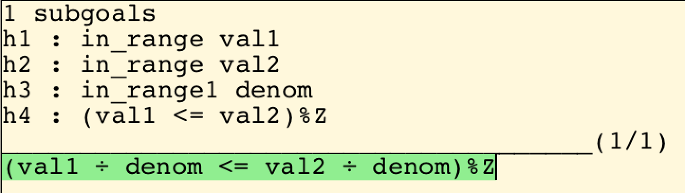

|SPARK| Libraries
=================

.. _Formal Containers Library:

Formal Containers Library
-------------------------

Containers are generic data structures offering a high-level view of
collections of objects, while guaranteeing fast access to their content to
retrieve or modify it. The most common containers are lists, vectors, sets and
maps, which are defined as generic units in the Ada Standard Library. In
critical software where verification objectives severely restrict the use of
pointers, containers offer an attractive alternative to pointer-intensive data
structures.

The Ada Standard Library defines two kinds of containers:

* The controlled containers using dynamic allocation, for example
  ``Ada.Containers.Vectors``. They define containers as controlled tagged
  types, so that memory for the container is automatic reallocated during
  assignement and automatically freed when the container object's scope ends.
* The bounded containers not using dynamic allocation, for example
  ``Ada.Containers.Bounded_Vectors``. They define containers as discriminated
  tagged types, so that the memory for the container can be reserved at
  initialization.

Although bounded containers are better suited to critical software development,
neither controlled containers nor bounded containers can be used in |SPARK|,
because their API does not lend itself to adding suitable contracts (in
particular preconditions) ensuring correct usage in client code.

The formal containers are a variation of the bounded containers with API
changes that allow adding suitable contracts, so that |GNATprove| can prove
that client code manipulates containers correctly. There are 7 formal
containers, which are part of the |GNAT Pro| standard library:

* ``Ada.Containers.Formal_Vectors``
* ``Ada.Containers.Formal_Indefinite_Vectors``
* ``Ada.Containers.Formal_Doubly_Linked_Lists``
* ``Ada.Containers.Formal_Hashed_Sets``
* ``Ada.Containers.Formal_Ordered_Sets``
* ``Ada.Containers.Formal_Hashed_Maps``
* ``Ada.Containers.Formal_Ordered_Maps``

Lists, sets and maps are always bounded. Vectors can be bounded or unbounded
depending on the value of the formal parameter ``Bounded`` when instantiating
the generic unit. Bounded containers do not use dynamic allocation. Unbounded
vectors use dynamic allocation to expand their internal block of memory.

Lists, sets and maps can only be used with definite objects (objects for which
the compiler can compute the size in memory, hence not ``String`` nor
``T'Class``). Vectors come in two flavors for definite objects
(``Formal_Vectors``) and indefinite objects (``Formal_Indefinite_Vectors``).

Modified API of Formal Containers
^^^^^^^^^^^^^^^^^^^^^^^^^^^^^^^^^

The visible specification of formal containers is in |SPARK|, with suitable
preconditions on subprograms to ensure correct usage, while their private part
and implementation is not in |SPARK|. Hence, |GNATprove| can be used to prove
correct usage of formal containers in client code, but not to prove that formal
containers implement their specification.

Procedures ``Update_Element`` or ``Query_Element`` that iterate over a
container are not defined on formal containers. Specification and analysis of
such procedures that take an access-to-procedure in parameter is beyond the
capabilities of |SPARK| and |GNATprove|. See :ref:`Excluded Ada Features`.

Procedures and functions that query the content of a container take the
container in parameter. For example, function ``Has_Element`` that queries if a
container has an element at a given position is declared as follows:

.. code-block:: ada

   function Has_Element (Container : T; Position : Cursor) return Boolean;

This is different from the API of controlled containers and bounded containers,
where it is sufficient to pass a cursor to these subprograms, as the cursor
holds a reference to the underlying container:

.. code-block:: ada

   function Has_Element (Position : Cursor) return Boolean;

Cursors of formal containers do not hold a reference to a specific container,
as this would otherwise introduce aliasing between container and cursor
variables, which is not supported in |SPARK|. See :ref:`Absence of
Interferences`. As a result, the same cursor can be applied to multiple
container objects.

Three :ref:`Ghost Functions` are defined on formal containers:

* ``Current_To_Last`` returns a copy of a container from a given position (included)
* ``First_To_Previous`` returns a copy of a container up to a given position (excluded)
* ``Strict_Equal`` returns whether two containers are equal in their content and cursors

The purpose of these ghost functions is to facilitate specifying properties of
programs that manipulate formal containers. The linear order of positions is
given by the underlying structure allowing iteration over a container, which
corresponds to the natural order for vectors, lists, ordered sets and ordered
maps.

For example, consider a variant of the ``List.Find`` function defined in the
API of formal containers, which returns a cursor holding the value searched if
there is one, and the special cursor ``No_Element`` otherwise:

.. literalinclude:: ../gnatprove_by_example/examples/my_find.ads
   :language: ada
   :linenos:

The ghost functions mentioned above are specially useful in :ref:`Loop
Invariants` to refer to parts of containers. For example, here, ghost function
``First_To_Previous`` is used in the loop invariant to specify that the value
searched is not contained in the part of the container already traversed
(otherwise the loop would have exited):

.. literalinclude:: ../gnatprove_by_example/examples/my_find.adb
   :language: ada
   :linenos:

|GNATprove| proves that function ``My_Find`` implements its specification:

.. literalinclude:: ../gnatprove_by_example/results/my_find.prove
   :language: none

Function ``Strict_Equal`` is mostly useful to state which parts of a container
have not changed in a loop invariant or a postcondition. For example, it is
used in the postcondition of function ``My_Prepend`` below to state that
``My_Prepend`` does not modify the tail of the list:

.. code-block:: ada
   :linenos:

   procedure My_Prepend (L : in out List; E : Element_Type) with
     Pre  => L.Capacity > Length (L),
     Post => Length (L) = 1 + Length (L'Old) and then
             First_Element (L) = E and then
             Strict_Equal (Current_To_Last(L, First (L'Old)), L'Old);

.. note::

   The behavior of formal containers is defined through :ref:`External
   Axiomatizations`, to facilitate automation of proofs. In this model, the
   behavior of ``Strict_Equal`` is specified based on the logical equality of
   elements instead of the formal parameter ``=`` of the generic in |SPARK|, a
   stronger interpretation made to facilitate automation of proofs. But the
   implementation of ``Strict_Equal`` uses the operation ``=`` on elements
   passes as formal parameter to the generic unit. Thus, an assertion involving
   ``Strict_Equal`` may always hold at run time but not be provable.

Quantification over Formal Containers
^^^^^^^^^^^^^^^^^^^^^^^^^^^^^^^^^^^^^

:ref:`Quantified Expressions` can be used over the content of a formal
container to express that a property holds for all elements of a container
(using ``for all``) or that a property holds for at least one element of a
container (using ``for some``).

For example, we can express that all elements of a formal list of integers are
prime as follows:

.. code-block:: ada

   (for all Cu in My_List => Is_Prime (Element (My_List, Cu)))

On this expression, the |GNAT Pro| compiler generates code that iterates over
``My_List`` using the functions ``First``, ``Has_Element`` and ``Next`` given
in the ``Iterable`` aspect applying to the type of formal lists, so the
quantified expression above is equivalent to:

.. code-block:: ada

   declare
      Cu     : Cursor_Type := First (My_List);
      Result : Boolean := True;
   begin
      while Result and then Has_Element (My_List, Cu) loop
         Result := Is_Prime (Element (My_List, Cu));
         Cu     := Next (My_List, Cu);
      end loop;
   end;

where ``Result`` is the value of the quantified expression. See |GNAT Pro|
Reference Manual for details on aspect ``Iterable``.

.. _SPARK Lemma Library:

SPARK Lemma Library
-------------------

As part of the |SPARK| product, a library of lemmas is available through the
project file :file:`<spark-install>/lib/gnat/spark_lemmas.gpr`. To use this
library in a program, you need to add a corresponding dependency in your
project file, for example:

.. code-block:: gpr

  with "spark_lemmas";
  project My_Project is
     ...
  end My_Project;

You may need to update the environment variable ``GPR_PROJECT_PATH`` for the
lemma library project to be found by GNAT compiler, as described in
:ref:`Installation of GNATprove`.

You also need to set the environment variable ``SPARK_LEMMAS_OBJECT_DIR`` to
the absolute path of the object directory where you want compilation and
verification artefacts for the lemma library to be created. This should be an
absolute path (not a relative one) otherwise these artefacts will be created
inside you |SPARK| install.

This library consists in a set of ghost null procedures with contracts (called
`lemmas`). Here is an example of such a lemma:

.. code-block:: ada

   procedure Lemma_Div_Is_Monotonic
     (Val1  : Int;
      Val2  : Int;
      Denom : Pos)
   with
     Global => null,
     Pre  => Val1 <= Val2,
     Post => Val1 / Denom <= Val2 / Denom;

whose body is simply a null procedure:

.. code-block:: ada

   procedure Lemma_Div_Is_Monotonic
     (Val1  : Int;
      Val2  : Int;
      Denom : Pos)
   is null;

This procedure is ghost (as part of a ghost package), which means that the
procedure body and all calls to the procedure are compiled away when producing
the final executable without assertions (when switch `-gnata` is not set). On
the contrary, when compiling with assertions for testing (when switch `-gnata`
is set) the precondition of the procedure is executed, possibly detecting
invalid uses of the lemma. However, the main purpose of such a lemma is to
facilitate automatic proof, by providing the prover specific properties
expressed in the postcondition. In the case of ``Lemma_Div_Is_Monotonic``, the
postcondition expresses an inequality between two expressions. You may use this
lemma in your program by calling it on specific expressions, for example:

.. code-block:: ada

   R1 := X1 / Y;
   R2 := X2 / Y;
   Lemma_Div_Is_Monotonic (X1, X2, Y);
   --  at this program point, the prover knows that R1 <= R2
   --  the following assertion is proved automatically:
   pragma Assert (R1 <= R2);

Note that the lemma may have a precondition, stating in which contexts the
lemma holds, which you will need to prove when calling it. For example, a
precondition check is generated in the code above to show that ``X1 <=
X2``. Similarly, the types of parameters in the lemma may restrict the contexts
in which the lemma holds. For example, the type ``Pos`` for parameter ``Denom``
of ``Lemma_Div_Is_Monotonic`` is the type of positive integers. Hence, a range
check may be generated in the code above to show that ``Y`` is positive.

All the lemmas provided in the SPARK lemma library have been proved either
automatically or using Coq interactive prover. The Why3 session file recording
all proofs, as well as the individual Coq proof scripts, are available as part
of the |SPARK| product under directory
:file:`<spark-install>/lib/gnat/proof`. For example, the proof of lemma
``Lemma_Div_Is_Monotonic`` is a Coq proof of the mathematical property (in Coq
syntax):

Currenly, the SPARK lemma library provides the following lemmas:

* Lemmas on signed integer arithmetic in file ``spark-arithmetic_lemmas.ads``,
  that are instantiated for 32 bits signed integers (``Integer``) in file
  ``spark-integer_arithmetic_lemmas.ads`` and for 64 bits signed integers
  (``Long_Integer``) in file ``spark-long_integer_arithmetic_lemmas.ads``.

* Lemmas on modular integer arithmetic in file
  ``spark-mod_arithmetic_lemmas.ads``, that are instantiated for 32 bits
  modular integers (``Interfaces.Unsigned_32``) in file
  ``spark-mod32_arithmetic_lemmas.ads`` and for 64 bits modular integers
  (``Interfaces.Unsigned_64``) in file ``spark-mod64_arithmetic_lemmas.ads``.

* Lemmas on unconstrained arrays in file
  ``spark-unconstrained_array_lemmas.ads``, that need to be instantiated by the
  user for her specific type of index and element, and specific ordering
  function between elements.

To apply lemmas to signed or modular integers of different types than the ones
used in the instances provided in the library, just convert the expressions
passed in arguments, as follows:

.. code-block:: ada

   R1 := X1 / Y;
   R2 := X2 / Y;
   Lemma_Div_Is_Monotonic (Integer(X1), Integer(X2), Integer(Y));
   --  at this program point, the prover knows that R1 <= R2
   --  the following assertion is proved automatically:
   pragma Assert (R1 <= R2);
