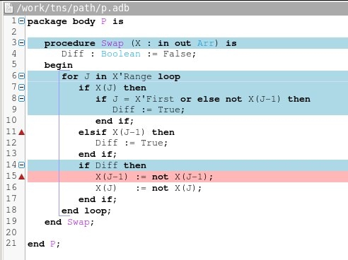

.. _formal verification with gnatprove:

************************************
Formal Verification with |GNATprove|
************************************

The |GNATprove| tool is packaged as an executable called ``gnatprove``. Like
other tools in |GNAT Pro| Toolsuite, |GNATprove| is based on the structure of
GNAT projects, defined in ``.gpr`` files.

How to Run |GNATprove|
======================

Running |GNATprove| from the Command Line
-----------------------------------------

|GNATprove| can be run from the command line as follows::

    gnatprove -P <project-file.gpr>

In the appendix, section :ref:`command line`, you can find an exhaustive list
of switches; here we only give an overview over the most common uses. Note that
|GNATprove| cannot be run without a project file.

When given a list of files, |GNATprove| will consider them as entry points of
the program and analyze these units and all units on which they depend. With
option ``-u``, the dependencies are not considered, only the given files
themselves are analyzed. With option ``-U``, all files of all projects are
proved.

|GNATprove| consists of two distinct analyses, flow analysis and proof. Flow
analysis checks the correctness of ``Globals`` and ``Depends`` aspects, and
verifies the initialization of variables. Proof verifies the absence of runtime
errors and the correctness of assertions such as ``Pre`` and ``Post`` aspects.
Using the switch ``--mode=<mode>``, whose possible values are ``prove``,
``flow`` and ``all``, you can choose to perform only one or both of these
analyses. Today, flow analysis is experimental, so ``prove`` is the default. In
the future, ``all`` will be the default.

Using the option ``--limit-line=`` one can limit proofs to a particular file
and line of an Ada file. For example, if you want to prove only the file 12 of
file ``example.adb``, you can add the option ``--limit-line=example.adb:12`` to
the call to |GNATprove|. Using the option ``--limit-subp=`` one can limit proofs
to a subprogram declared in a particular file at a particular line.

A number of options exist to influence the behavior for proof. Internally, the
prover Alt-Ergo is called repeatedly for each check or assertion. Using the
option ``--timeout``, one can change the maximal time that is allocated to prove
each check or assertion (default: 1s). Using the option ``--steps`` (default:
not used), one can set the maximum number of reasoning steps that Alt-Ergo is
allowed to perform before giving up. The ``steps`` option should be used when
predictable results are required, because the results with a timeout may differ
depending on the computing power or current load of the machine. The option
``-j`` activates parallel compilation and parallel proofs.

The way checks are passed to Alt-Ergo can also be influenced using the option
``--proof``. By default, Alt-Ergo is invoked a single time for each check or
assertion (mode ``no_split``). This can be changed using mode ``path_wp`` to
invoke Alt-Ergo for each *path* that leads to the check. This option usually
takes much longer, because Alt-Ergo is invoked much more often, but may give
better proof results. Using mode ``all-split``, in addition, conjunctions (such
as ``and`` and ``and then``) in assertions are split and passed seperately to
Alt-Ergo. Finally, in mode ``then-split``, invoking Alt-Ergo a single time on
the entire check is tried, and only if the check is not proved, the other
techniques (splitting conjunctions and trying each path separately) are tried.

By default, |GNATprove| avoids reanalyzing unchanged files, on a
per-unit basis. This mechanism can be disabled with the option ``-f``.

.. _implementation_defined:

Implementation-Defined Behavior
-------------------------------

A |SPARK| program is guaranteed to be unambiguous, so that formal verification
of properties is possible. However, some behaviors may depend on the compiler
used. By default, |GNATprove| adopts the same choices as the GNAT
compiler. |GNATprove| also supports other compilers by providing special
switches:

* ``-gnateT`` for specifying the target configuration
* ``--pedantic`` for warning about possible implementation-defined behavior

With option ``--pedantic``, some compiler choices are forced to a worst-case
interpretation of the Ada standard. For example, ranges for integer base types
are reduced to the minimum guaranteed, not to the matching machine
integer type as done in practice on all compilers.

Target Parametrization
^^^^^^^^^^^^^^^^^^^^^^

Target parametrization consists in passing to |GNATprove| a file which defines
the parameters for the target on which the program will be run. These include
the size and alignment of standard integer types, endianness, the kinds of
floating-point numbers, etc. The format of this file should match the format of
the file generated by calling |GNAT Pro| with switch ``-gnatet``.

Target parametrization can be used:

* to specify a target different than the host on which |GNATprove| is run, when
  cross-compilation is used. If |GNAT Pro| is the cross compiler, the
  configuration file can be generated by calling it with the switch
  ``-gnatet=?``. Otherwise, the target file should be generated manually.
* to specify the parameters for a different compiler than |GNAT Pro|, even when
  the host and target are the same. In that case, the target file should be
  generated manually.

Parenthesized Arithmetic Operations
^^^^^^^^^^^^^^^^^^^^^^^^^^^^^^^^^^^

In Ada, non-parenthesized arithmetic operations could be re-ordered by the
compiler, which may result in a failing computation (due to overflow checking)
becoming a successful one, and vice-versa. By default, |GNATprove| evaluates
allexpressions left-to-right, like GNAT. When the switch ``--pedantic`` is
used, a warning is emitted for every operation that could be re-ordered:

* any operand of a binary adding operation (+,-) that is itself a binary adding
  operation;
* any operand of a binary multiplying operation (\*,/,mod,rem) that is itself a
  binary multiplying operation.

Compiler Permissions
^^^^^^^^^^^^^^^^^^^^

Ada standard defines various ways in which a compiler is allowed to compute a
correct result for a computation instead of raising a run-time error. By
default, |GNATprove| adopts the choices made by GNAT on the platform.  When the
switch ``--pedantic`` is used, |GNATprove| interprets all computations with the
strictest meaning guaranteed by Ada Reference Manual.

For example, the bounds of base types for user-defined types, which define
which computations overflow, may vary depending on the compiler and host/target
architectures. With option ``--pedantic``, all bounds should be set to their
minimum range guaranteed by the Ada standard (worst case). For example, the
following type should have a base type ranging from -10 to 10 (standard
requires a symmetric range with a possible extra negative value)::

    type T is 1 .. 10;

This other type should have a base type ranging from -10 to 9::

    type T is -10 .. 1;

.. _GPS integration:

Running |GNATprove| from GPS
----------------------------

|GNATprove| can be run from GPS. There is a menu ``Prove`` with the following
entries:

.. csv-table::
   :header: "Submenu", "Action"
   :widths: 1, 4

   "Prove All",                  "This runs |GNATprove| on all files in the project."
   "Prove Root Project",         "This runs |GNATprove| on the entire project."
   "Prove File",                 "This runs |GNATprove| on the current unit."
   "Clean Proofs",               "This removes all files generated by |GNATprove|."
   "Remove Editor Highlighting", "This removes highlighting generated by using |GNATprove|."

.. note::

   The changes made by users in the panels raised by these submenus are
   persistent from one session to the other. Be sure to check that the selected
   checkboxes and additional switches that were previously added are still
   appropriate.

When editing an Ada file, |GNATprove| can also be run from the context menu,
which can be obtained by a right click:

.. csv-table::
   :header: "Submenu", "Action"
   :widths: 1, 4

   "Prove File",       "This runs |GNATprove| on the current unit."
   "Prove Line",       "This runs proofs on the checks of the current line of the current file."
   "Prove Subprogram", "This runs proofs on the checks of the current subprogram."

.. note::

   If you use the SPARK-HiLite GPL 2013 release, a fourth submenu ``Show Path``
   is present in the contextual menu, that displays a path in the editor
   corresponding to the current error message. This submenu should only be
   used when displayed after right-clicking in the Location View, not after
   right-clicking in the code panel. The path highlighting can be removed
   by selecting ``Prove --> Remove Editor Highlighting``.

|GNATprove| project switches can be edited from the panel ``GNATprove`` (in
``Project --> Edit Project Properties --> Switches``).

In some proof modes (``--proof=then_split`` or ``--proof=path_wp``),
|GNATprove| attempts to prove checks separately for the possible paths leading
to a check. If the proof fails on a specific path, the user can display this
path in GPS by clicking on the icon to the left of the failed proof message, or
to the left of the corresponding line in the editor. The path is hidden again
when re-clicking on the same icon.

.. note::

   If you use the SPARK-HiLite GPL 2013 release, the way to display a path
   in GPS is slightly different. Instead of clicking on an icon, you need
   to right-click on the error message in the Location View, and select
   ``Prove::Show Path`` in the contextual menu that is raised.

We recommend that you enable the option ``Draw current line as a thin line``
(in ``Edit --> Preferences --> Editor --> Fonts & Colors``) so that GPS does not
hide the status of the checks on the current line (all proved in green /
otherwise in red). This is the default on recent versions of GPS.

How to View |GNATprove| Output
==============================

In mode ``check``, |GNATprove| prints on the standard output error messages
for |SPARK| subset violations, and warning messages for unimplemented
features, on all the code for which ``SPARK_Mode`` is ``On``.

In mode ``prove`` and report ``fail``, |GNATprove| prints on the standard
output error messages for unproved VCs.

In mode ``prove`` and report ``all`` or ``statistics``, |GNATprove| prints on
the standard output error messages for unproved VCs, and information messages
for proved VCs.

In mode ``flow``, GNATprove prints on the standard output error
messages and warnings for incorrect ``Globals`` and ``Depends``
contracts, unitialized variables, and suspicious situations such as
unused assignments, missing return statements and so on.

In mode ``all``, GNATprove behaves just as if both modes ``prove`` and
``flow`` were activated.

|GNATprove| always generates :ref:`project statistics` in file
``gnatprove.out``.

For each unit ``<name>``, |GNATprove| generates a :ref:`summary file`
``<name>.alfa`` in the sub-directory ``gnatprove`` of the corresponding
object directory.

.. _project statistics:

Project Statistics
------------------

Based on the automatic detection of which subprograms are in |SPARK|,
|GNATprove| generates global project statistics in file ``gnatprove.out``. The
statistics describe:

* what percentage and number of subprograms are in |SPARK|
* what percentage and number of |SPARK| subprograms are not yet supported
* what are the main reasons for subprograms not to be in |SPARK|
* what are the main reasons for subprograms not to be yet supported in |SPARK|
* units with the largest number of subprograms in |SPARK|
* units with the largest number of subprograms not in |SPARK|

.. _summary file:

Summary File
------------

The information of which subprogram specs and bodies are in |SPARK| is stored
in a file with extension ``.alfa`` for review by the user, and to produce
global :ref:`project statistics`. |GNATprove| outputs the reasons for which a
subprogram is not in |SPARK| (using parentheses):

* access: access types and dereferences;
* assembly language: assembly language;
* deallocation: unchecked deallocation;
* dynamic allocation: dynamic allocation;
* exception: raising and catching exceptions;
* forward reference: forward reference to an entity;
* goto: use of *goto*;
* indirect call: indirect call;
* tasking: tasking;
* unchecked conversion: use of ``Unchecked_Conversion``;
* impure function: functions which write to variables other than parameters;
* recursive call: forbidden types of recursive calls, e.g. in contracts;
* uninitialized logic expr: expression which should be fully initialized;
* unsupported construct: any other unsupported construct.

As an example, consider the following code:

.. code-block:: ada
   :linenos:

    package P is
       X : access Boolean;
       procedure P0;
    end P;

.. code-block:: ada
   :linenos:

    package body P is
       procedure Set is
       begin
	  X.all := True;
       end Set;

       procedure P0 is
	  Y : Boolean;

	  function Get return Boolean is
	  begin
	     return X.all;
	  end Get;

	  procedure P1 is
	  begin
	     if not Get then
		return;
	     end if;
	     Y := True;
	  end P1;
       begin
	  Set;
	  P1;
       end P0;
    end P;

On this code, |GNATprove| outputs the following information in file p.alfa::

   -+ set p.adb:2 (access)
   -+ get p.adb:10 (access)
   ++ p1 p.adb:15
   -+ p0 p.ads:3 (access)

The first character denotes whether the subprogram body is in |SPARK| (+), not
in |SPARK| (-) or not yet implemented (*). The second character follows the
same categories for the subprogram spec. The name that follows is a unique name
for the subprogram. The location of the subprogram is given next with its file
and line. Non-|SPARK| features used are given in parentheses. Features not yet
implemented are given in brackets.

In the example above, ``Set`` and ``Get`` have a spec in |SPARK|, but not their
body, because it contains a pointer dereference.  Since ``Set`` is a local
subprogram of ``P0``, the body of ``P0`` is not in |SPARK| either. ``P1`` body
is in |SPARK|.

Error Messages
==============

This section lists the different error messages and warnings which |GNATprove|
may output. Each message points to a very specific place in the source code.
For example, if a source file ``file.adb`` contains a division as follows::

      if X / Y > Z then ...

|GNATprove| may output a message such as::

   file.adb:12:37: division check not proved

where the division sign ``/`` is precisely on line 12, column 37. Looking at
the explanation in the first table below, which states that a division check
verifies that the divisor is different from zero, it is clear that the message
is about ``Y``, and that |GNATprove| was unable to prove that ``Y`` cannot be
zero. The explanations in the table below should be read with the context that
is given by the source location.

The left column of the table contains the *tag* for each error message. Using
option ``--show-tag``, |GNATprove| prints the tag for each error message at the
end of the message, in brackets.

The following table shows the proof messages.

.. csv-table::
   :header: "Message Tag", "Explanation"
   :widths: 1, 4

   "division_check", "Check that the second operand of the division, mod or rem operation is different from zero."
   "index_check", "Check that the given index is within the bounds of the array."
   "overflow_check", "Check that the result of the given arithmetic operation is within the bounds of the base type."
   "range_check", "Check that the given value is within the bounds of the expected scalar subtype."
   "length_check", "Check that the given array is of the length of the expected array subtype."
   "discriminant_check", "Check that the discriminant of the given discriminant record has the expected value. For variant records, this can happen for a simple access to a record field. But there are other cases where a fixed value of the discriminant is required."
   "precondition", "Check that the precondition aspect of the given call evaluates to True."
   "postcondition", "Check that the postcondition aspect of the subprogram evaluates to True."
   "contract_case", "Check that all cases of the contract case evaluate to true at the end of the subprogram."
   "disjoint_contract_cases", "Check that the cases of the contract cases aspect are all mutually disjoint."
   "complete_contract_cases", "Check that the cases of the contract cases aspect cover the state space that is allowed by the precondition aspect."
   "loop_invariant_initialization", "Check that the loop invariant evaluates to True on the first iteration of the loop."
   "loop_invariant_preservation", "Check that the loop invariant evaluates to True at each further iteration of the loop."
   "loop_variant", "Check that the given loop variant decreases/increases as specified during each iteration of the loop. This implies termination of the loop."
   "assertion", "Check that the given assertion evaluates to True."

The following table shows serious flow messages which prevent the
further analysis of a subprogram.

.. csv-table::
   :header: "Message Tag", "Explanation"
   :widths: 1, 4

   "flow_aliasing", "Flow analysis has detected aliasing between two or more procedure call parameters or globals."
   "missing_global", "A subprogram refers to a global which is missing from the ``Globals`` aspect or which the automatic global detection has failed to pick up."
   "non_manifest_default", "Default initializations for record fields may only be manifest constants."

The following table shows all remaining flow analysis messages, which
come in three classes: I(nitialization) error are the most serious
flow errors, not fixing them might result in a program which can raise
a constraint error at runtime which proof may not be able to
detect. F(low) errors indicate a serious problem with a dependency
relation, if such an error is not fixed, the dependency relations
cannot be relied on. All other unclassified messages are warnings
about questionable code constructs.

.. csv-table::
   :header: "Message Tag", "Class", "Explanation"
   :widths: 1, 1, 6

   "depends_missing", "F", "A dependency is missing from the dependency relation."
   "depends_missing_clause", "F", "An out parameter or global is missing from the dependency relation."
   "depends_null", "F", "A variable is missing from the null dependency."
   "depends_wrong", "F", "A stated dependency is not fulfilled."
   "illegal_update", "I", "Flow analysis has detected an update of a in mode global."
   "ineffective",, "Flow analysis has detected an ineffective statement, such as an unused assignment."
   "ineffective_import",, "An in or in out parameter or global has been found which does not have any effect on any out or in out parameter or global."
   "stable",, "A questionable loop construct where a variable is assigned the same value on each loop iteration."
   "uninitialized", "I", "Flow analysis has detected the use of an uninitialized variable."
   "unused",, "A global or locally declared variable is never used."

How to Write Loop Invariants
============================

.. todo:: Add section on how to write loop invariants

How to Investigate Unproved Checks
==================================

One of the most challenging aspects of formal verification is the analysis of
failed proofs. If |GNATprove| fails to prove automatically that a run-time
check or an assertion holds, there might be various reasons:

* [CODE] The check or assertion does not hold, because the code is wrong.
* [ASSERT] The assertion does not hold, because it is incorrect.
* [SPEC] The check or assertion cannot be proved, because of some missing
  assertions about the behavior of the program.
* [TIMEOUT] The check or assertion is not proved because the prover timeouts.
* [PROVER] The check or assertion is not proved because the prover is not smart
  enough.

Investigating Incorrect Code or Assertion
-----------------------------------------

The first step is to check whether the code is incorrect [CODE] or the
assertion is incorrect [ASSERT], or both. Since run-time checks and assertions
can be executed at run time, one way to increase confidence in the correction
of the code and assertions is to test the program on representative inputs. The
following GNAT switches can be used:

* ``-gnato``: enable run-time checking of intermediate overflows
* ``-gnat-p``: reenable run-time checking even if ``-gnatp`` was used to
  suppress all checks
* ``-gnata``: enable run-time checking of assertions

Investigating Unprovable Properties
-----------------------------------

The second step is to consider whether the property is provable [SPEC].  A
check or assertion might be unprovable because a necessary annotation is
missing:

* the precondition of the enclosing subprogram might be too weak; or
* the postcondition of a subprogram called might be too weak; or
* a loop invariant for an enclosing loop might be too weak; or
* a loop invariant for a loop before the check or assertion might be too weak.

In particular, |GNATprove| does not look into subprogram bodies, so all the
necessary information for calls should be explicit in the subprogram
contracts. A focused manual review of the code and assertions can efficiently
diagnose many cases of missing annotations. Even when an assertion is quite
large, |GNATprove| precisely locates the part that it cannot prove, which can
help figuring out the problem. It may useful to simplify the code during this
investigation, for example by adding a simpler assertion and trying to prove
it.

|GNATprove| provides path information that might help the code review. Select
``Prove --> Show Path`` as described in :ref:`GPS integration` to display
inside the editor the path on which the proof failed. In many cases, this is
sufficient to spot a missing assertion. To further assist the user, we plan to
add to this path some information about the values taken by variables from a
counterexample.

         the background of those lines in the path.

   Path displayed in GPS for an unproved property

Investigating Prover Shortcomings
---------------------------------

The last step is to investigate if the prover would find a proof given enough
time [TIMEOUT] or if another prover can find a proof [PROVER]. To that end,
|GNATprove| provides options ``-timeout`` and ``-prover``, usable either from
the command-line (see :ref:`command line`) or inside GPS (see :ref:`GPS
integration`).

Note that for the above experiments, it is quite convenient to use the ``Prove
Line`` or ``Prove Subprogram`` features in GPS, as described in :ref:`GPS
integration`, to get faster results for the desired line or subprogram.

A common limitation of automatic provers is that they don't handle well
non-linear arithmetic. For example, they might fail to prove simple checks
involving multiplication, division, modulo or exponentiation.

In that case, a user may either:

* manually review the unproved checks and record that they can be trusted (for
  example by storing the result of |GNATprove| under version control), or
* add an assumption in the code to help the prover, in the form of a ``pragma
  Assume``. |GNATprove| handles it like an assertion, so it both attempts to
  prove it, and uses it in subsequent code. If the assumption is not proved, it
  can be manually reviewed like mentioned above, and marking it as an assumption
  in the code helps documenting it.

We plan to provide a `user view` of the formula passed to the prover, for
advanced users to inspect. This view will express in an Ada-like syntax the
actual formula whose proof failed, to make it easier for users to interpret it.
This format is yet to be defined.

For very advanced users, in particular those who would like to do manual proof
of VCs, we will provide a description of the format of the VCs generated by
|GNATprove|, so that users can understand the actual VCs passed to the
prover. Each VC is stored in an individual file under the sub-directory
``gnatprove`` of the project object directory (default is the project
directory). The file name follows the convention::

  <file>_<line>_<column>_<check>_<num>.why

where:

* ``file`` is the name of the Ada source file for the check or assertion
* ``line`` is the line where the check or assertion appears
* ``column`` is the column
* ``check`` is an identifier for the check or assertion
* ``num`` is an optional number and identifies different paths through the
  program, between the start of the subprogram and the location of the check or
  assertion

For example, the VCs for a range check at line 160, column 42, of the file
``f.adb`` are stored in::

  f.adb_160_42_range_check.why
  f.adb_160_42_range_check_2.why
  f.adb_160_42_range_check_3.why
  ...

The syntax of these files depend on the prover that was used. By default, it is
Alt-Ergo, so these files are in Why3 proof syntax.

To be able to inspect these files, you should instruct |GNATprove| to keep them
around by adding the switch ``-d`` to |GNATprove|'s command line. You can also
use the switch ``-v`` to get a detailed log of which VCs |GNATprove| is
producing and attempting to prove.

|GNATprove| by Example
======================

|GNATprove| is based on advanced technology for modular static analysis and
deductive verification. It is very different both from compilers, which do very
little analysis of the code, and static analyzers, which execute symbolically
the program. |GNATprove| does a very powerful local analysis of the program,
but it does not cross subprogram boundaries. Instead, it uses the subprogram
contracts provided by users to interpret the effect of calls.  Thus, it is
essential to understand how |GNATprove| uses contracts, as well as other forms
of annotations. This section aims at providing a deeper insight into how
|GNATprove| formal verification works, through a step-by-step exploration of
simple code examples.

.. _basic_examples:

.. include:: gnatprove_by_example/basic.rst

.. _call_examples:

.. include:: gnatprove_by_example/call.rst

.. _loop_examples:

.. include:: gnatprove_by_example/loop.rst

.. _flow_examples:

.. include:: gnatprove_by_example/flow.rst

.. .. _advanced_examples:

.. .. include:: gnatprove_by_example/advanced.rst
